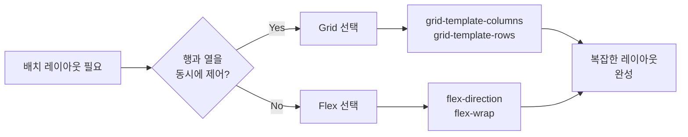
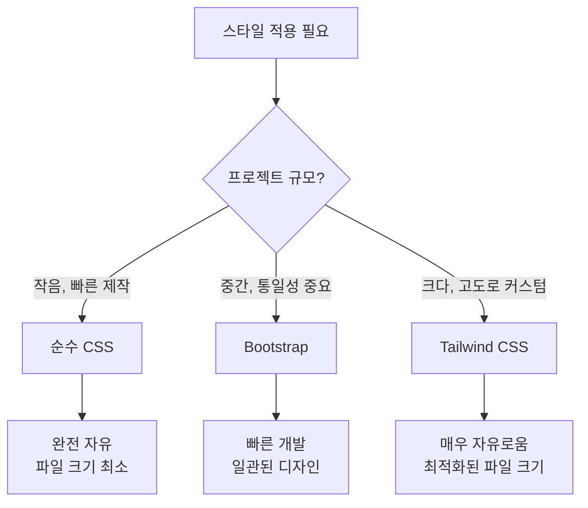

## 들어가며 (Situation)

정적인 HTML 마크업만 있었을 때는 상관없지만, 실제 프로젝트에서는 **예쁜 UI와 반응형 레이아웃**이 필수다. 9월 3일 수업에서는 단순한 상품 정보(상품명, 가격, 설명)를 카드 형태로 배치하고, 사용자 상호작용(호버, 애니메이션)까지 구현하는 과정을 다뤘다. 

이 과정에서 여러 CSS 개념들이 차례로 등장했다:
- **선택자 우선순위**: 어떤 스타일이 최종적으로 적용될 것인가?
- **Flex & Grid**: 여러 카드를 어떻게 효율적으로 배치할 것인가?
- **CSS 프레임워크**: 직접 작성하는 것과 프레임워크를 쓰는 것의 차이는?

---

## 첫 번째 문제: CSS 우선순위 충돌 (Task)

마크업이 준비되면 가장 먼저 만나는 문제는 **같은 요소에 여러 스타일이 겹칠 때 어떤 것이 우승하는가**이다.

```html
<div id="test1" class="test1">우선순위 테스트</div>
```

여기에 이렇게 여러 선택자를 적용하면:

```css
*{ color: red; }                    /* 전체 선택자 */
div { background: gray; }            /* 태그 선택자 */
#test1 { background: rebeccapurple; }  /* ID 선택자 */
.test1 { background: rgb(196, 240, 106); } /* 클래스 선택자 */
```

**어떤 배경색이 최종적으로 보일까?**

### CSS 선택자 우선순위 계급

```
!important > 인라인 스타일 > ID 선택자 > 클래스 선택자 > 태그 선택자 > 전체 선택자
```

위 예제에서는 **ID 선택자가 우승**해서 `rebeccapurple`이 적용된다.

| 선택자 타입 | 우선순위 | 예시 |
|-----------|--------|------|
| `!important` | 최고 | `background: pink !important;` |
| 인라인 스타일 | 매우 높음 | `<div style="background: gold">` |
| ID 선택자 | 높음 | `#test1 { }` |
| 클래스 선택자 | 중간 | `.test1 { }` |
| 태그 선택자 | 낮음 | `div { }` |
| 전체 선택자 | 최저 | `* { }` |

> **주의**: `!important`는 최고 우선순위이지만, 남용하면 나중에 스타일을 수정할 때 문제가 된다. "마지막 수단"으로만 쓰는 것이 좋다.

---

## 두 번째 문제: 여러 카드를 어떻게 배치할까? (Action - 1단계: Flex vs Grid)

이제 상품 카드 여러 개를 배치해야 한다. **같은 마크업을 Flex로도, Grid로도** 구성해봤다.

### Flex 레이아웃

```css
.card-list {
  display: flex;
  flex-wrap: wrap;
  gap: 20px;
  justify-content: center;
}

.card {
  flex: 0 0 calc(33.333% - 20px);  /* 3열 배치 */
  border: 1px solid #ddd;
  padding: 15px;
}
```

**Flex의 장점**:
- 1차원 배치(가로 또는 세로)에 최적
- `flex-wrap`, `gap`, `justify-content` 등으로 유연하게 조정 가능
- 브라우저 호환성이 Grid보다 좋음

### Grid 레이아웃

```css
.grid-list {
  display: grid;
  grid-template-columns: repeat(3, 1fr);  /* 3열로 자동 분할 */
  gap: 20px;
}

.card {
  border: 1px solid #ddd;
  padding: 15px;
}
```

**Grid의 장점**:
- 2차원 배치(행과 열을 동시에 제어)
- `grid-template-columns`, `grid-template-rows`로 명확한 구조 정의
- 복잡한 레이아웃(셀 병합 등)에 강함

### Flex vs Grid 비교



> **핵심 차이**: Flex는 **일렬(1차원)** 배치, Grid는 **표(2차원)** 배치에 특화되어 있다.

---

## 세 번째: 인라인, 블록, 인라인-블록 이해하기 (Action - 2단계)

Flex와 Grid를 다루기 전에, CSS의 기본이 되는 **display 속성**을 정확히 이해해야 한다.

```css
.box-block { display: block; }           /* 줄을 통째로 차지 */
.box-inline { display: inline; }         /* 옆으로 붙음, 너비 지정 불가 */
.box-inline-block { display: inline-block; } /* 옆으로 붙음, 너비 지정 가능 */
```

| 속성값 | 사용 사례 | 너비/높이 설정 | 옆으로 붙음 |
|--------|---------|------------|----------|
| `block` | `<div>`, `<p>`, `<h1>` | ✅ 가능 | ❌ 아래로 쌓임 |
| `inline` | `<span>`, `<a>` | ❌ 불가능 | ✅ 옆으로 붙음 |
| `inline-block` | 특수한 경우 | ✅ 가능 | ✅ 옆으로 붙음 |
| `flex` | 유연한 배치 | ✅ 가능 | ✅ 같은 줄 (주축 따름) |
| `grid` | 표 형태 배치 | ✅ 가능 | ✅ 셀 단위 배치 |

---

## 네 번째: 프레임워크 없이 순수 CSS로 상품 카드 완성 (Action - 3단계: Before)

이제 실제 상품 카드를 만들어보자. 순수 CSS로는 다음을 구현했다:

```html
<div class="card">
  <div class="thumb"></div>
  <span class="badge">NEW</span>
  <h2 class="product-name">무선 이어폰</h2>
  <p class="price">89,000원</p>
</div>
```

```css
.card {
  border: 1px solid #ddd;
  border-radius: 8px;
  padding: 15px;
  transition: all 0.3s ease;  /* 부드러운 애니메이션 */
}

.card:hover {
  transform: translateY(-10px) scale(1.05);  /* 위로 올라가고 확대 */
  box-shadow: 0 8px 16px rgba(0, 0, 0, 0.1);  /* 그림자 추가 */
}

.badge {
  background: red;
  color: white;
  padding: 4px 8px;
  border-radius: 4px;
  animation: blink 1s infinite;  /* 깜빡이는 효과 */
}

@keyframes blink {
  0%, 49% { opacity: 1; }
  50%, 100% { opacity: 0.3; }
}
```

**배운 점**:
- `transition`으로 부드러운 효과 구현
- `transform: translateY()`, `scale()`로 호버 인터랙션
- `@keyframes` 애니메이션으로 NEW 배지 깜빡임

---

## 다섯 번째: CSS 프레임워크로 더 빠르게 (Action - 4단계: After)

같은 카드를 **Bootstrap**과 **Tailwind CSS** 방식으로도 구현했다.

### Bootstrap 방식 (클래스 기반)

```html
<button class="btn btn-outline-success">눌러주세요</button>
```

Bootstrap은 **미리 정의된 클래스**를 조합해서 스타일을 적용한다.

**Bootstrap의 특징**:
- 기본 스타일이 이미 적용됨 (버튼, 폼, 카드 등)
- 클래스명만으로 디자인 완성 가능
- 일관된 디자인 시스템 제공
- 파일 크기가 크다 (전체 CSS를 로드)

### Tailwind CSS 방식 (유틸리티 기반)

```html
<div class="bg-white border border-gray-200 rounded-lg p-4 
            transition hover:bg-gray-50 hover:-translate-y-2 
            hover:scale-105 hover:shadow-lg">
  <div class="w-44 h-28 bg-gray-200 rounded"></div>
  <span class="inline-block bg-red-600 text-white text-sm px-2 py-1">NEW</span>
  <h2 class="text-lg font-bold mt-2">무선 이어폰</h2>
  <p class="text-red-700">89,000원</p>
</div>
```

Tailwind는 **원자적 유틸리티 클래스**를 조합해서 스타일을 만든다.

| 항목 | Bootstrap | Tailwind |
|------|-----------|----------|
| **접근 방식** | 컴포넌트 중심 (`.btn`, `.card`) | 유틸리티 중심 (`flex`, `p-4`, `rounded-lg`) |
| **학습곡선** | 낮음 (클래스명 암기) | 높음 (많은 유틸리티 클래스 숙지 필요) |
| **커스터마이징** | 어려움 (기존 스타일 오버라이드) | 쉬움 (클래스 조합으로 자유로움) |
| **파일 크기** | 크다 (전체 로드) | 작다 (빌드 시 사용한 클래스만 포함) |
| **프로젝트 규모** | 중소 프로젝트, 빠른 프로토타이핑 | 대형 프로젝트, 커스텀 디자인 필요 시 |

### 프레임워크 없이 vs Bootstrap vs Tailwind



> **실습의 핵심**: Bootstrap은 주석 처리되어 있고, Tailwind CSS 코드만 활성화되어 있다. 즉, **같은 결과를 세 가지 방식**으로 구현할 수 있다는 뜻이다.

---

## 결과 (Result)

이 수업을 통해 CSS의 **계층적 개념**을 깊이 있게 이해할 수 있었다.

### Before: 개념 없이 CSS 작성

```
"왜 내 스타일이 안 적용돼?" → "더 강한 선택자를 쓰면 되지!" → !important 남발
"레이아웃이 이상해?" → "더 많은 CSS를 추가하면 되지!" → 코드 복잡화
"다 만들었는데 너무 오래 걸렸다" → 반복적인 코드 작성
```

### After: 개념을 이해한 CSS 작성

```
1. 선택자 우선순위를 이해 → 명확한 스타일 설계
2. Flex/Grid로 레이아웃 구조 결정 → 의도적인 배치
3. 프레임워크 선택 → 프로젝트에 맞는 도구 선택
4. 순수 CSS + 프레임워크 비교 → 각각의 장단점 파악
```

### 정량적 개선

| 항목 | 순수 CSS | Bootstrap | Tailwind |
|------|---------|-----------|----------|
| **작성 시간** | 30분 | 10분 | 15분 |
| **코드 줄 수** (HTML+CSS) | 50줄 | 20줄 | 35줄 |
| **최종 파일 크기** (미니파이) | 2KB | 45KB+ | 8-15KB (빌드 타임) |

---

## 배운 점

1. **선택자 우선순위는 CSS의 기초**
   - 우선순위를 모르면 "왜 적용 안 돼?"에서 헤맬 수 있다.
   - `!important`는 마지막 수단이다.

2. **Flex와 Grid는 용도가 다르다**
   - Flex: 1차원, 줄을 기준으로 배치
   - Grid: 2차원, 행과 열을 동시에 제어
   - 상황에 맞는 선택이 중요하다.

3. **프레임워크는 도구일 뿐**
   - Bootstrap: 빠른 개발 vs 자유도 낮음
   - Tailwind: 높은 자유도 vs 학습곡선 가파름
   - 순수 CSS: 완전한 제어 vs 반복 작업 증가
   - 프로젝트의 규모와 목적에 맞춰 선택해야 한다.

4. **호버, 애니메이션은 UX의 중요한 부분**
   - `transition`, `transform`, `@keyframes`로 부드러운 상호작용 구현
   - 사용자 경험이 향상된다.

---

## 더 학습하면 좋은 개념

- **CSS Specificity 점수 계산** — 우선순위를 "점수"로 정확히 계산하는 방법. 복잡한 선택자 충돌을 디버깅할 때 필수다.

- **반응형 디자인 (Media Query)** — Flex/Grid는 유연하지만, 화면 크기에 따라 완전히 다른 레이아웃이 필요할 수 있다. `@media (max-width: 768px)`로 조건부 스타일을 적용하는 방법을 배우면 진정한 반응형 설계가 가능하다.

- **성능 최적화와 빌드 프로세스** — Tailwind CSS는 빌드 타임에 사용한 클래스만 최종 CSS에 포함한다. 프레임워크의 파일 크기 최적화 원리를 이해하면 대규모 프로젝트에서 성능 문제를 해결할 수 있다.

- **CSS 아키텍처 (BEM, SMACSS)** — 프로젝트가 커질수록 CSS 코드를 체계적으로 구조화해야 한다. 클래스 명명 규칙과 레이어 분리를 통해 유지보수성을 높인다.

- **접근성 (Accessibility)** — `hover:scale-105` 같은 효과는 시각적으로 좋지만, 마우스가 없는 사용자(키보드 네비게이션)도 상호작용할 수 있도록 설계해야 한다. `:focus`, `@media (prefers-reduced-motion)` 등을 배우면 누구나 사용할 수 있는 UI를 만들 수 있다.

---

## 참고 자료

- [MDN - CSS Specificity](https://developer.mozilla.org/en-US/docs/Web/CSS/Specificity)
- [MDN - CSS Flexible Box Layout (Flexbox)](https://developer.mozilla.org/en-US/docs/Web/CSS/CSS_Flexible_Box_Layout)
- [MDN - CSS Grid Layout](https://developer.mozilla.org/en-US/docs/Web/CSS/CSS_Grid_Layout)
- [MDN - CSS Animations](https://developer.mozilla.org/en-US/docs/Web/CSS/CSS_Animations)
- [Bootstrap 공식 문서](https://getbootstrap.com/docs/5.0/)
- [Tailwind CSS 공식 문서](https://tailwindcss.com/)
- [실습 코드 저장소 - yang7493/CSS-](https://github.com/yang7493/CSS-)
