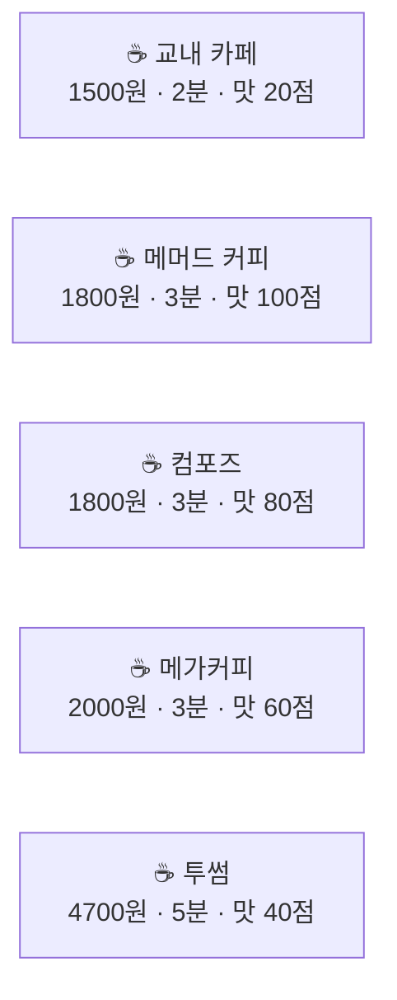
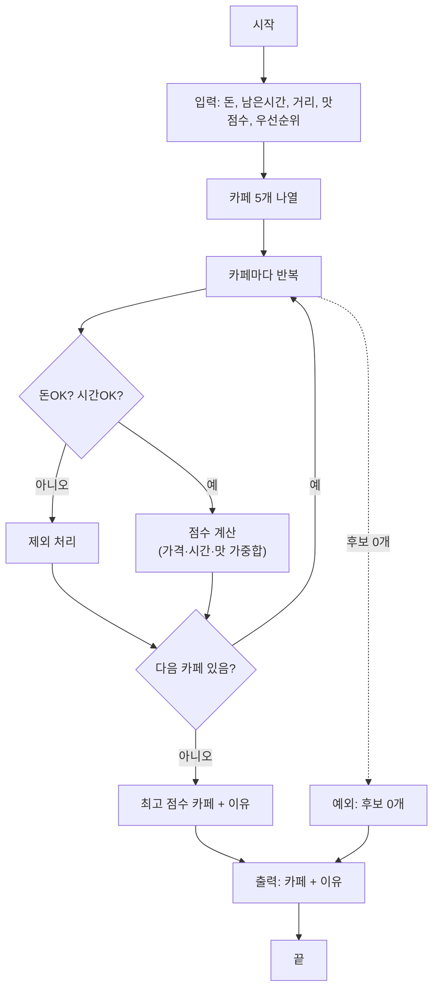
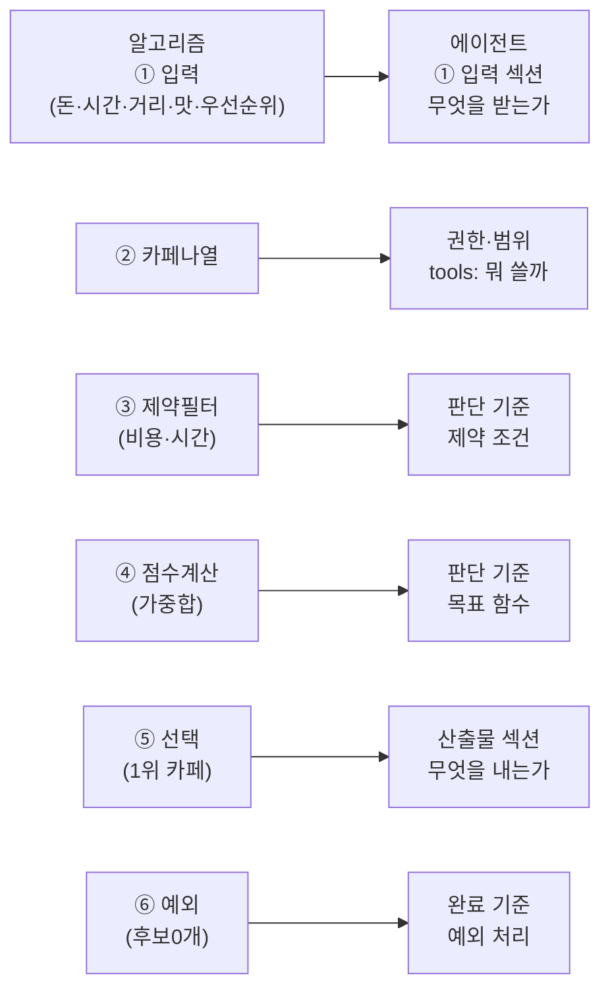

## 들어가며 (Situation)


**그 머릿속 과정을 종이에 적을 수 있는 형태로 바꾸는 것이 프로그래밍적 사고**이고, **그 형태 자체가 알고리즘**입니다. 그리고 **그 알고리즘을 Claude에게 읽히는 문서 형태로 쓰는 것이 에이전트 설계**입니다.


---

## 문제: "어디서 커피 마실까?" (Task)

### 왜 이 문제가 어려운가

누군가 "을지대 주변에서 제일 좋은 아메리카노 카페 알려 줘"라고 물으면, 여러분은 무엇을 먼저 할까요?

아마 이렇게 물을 겁니다:
- "지갑에 돈이 몇 원 있어?"
- "지금 시간이 몇 시야? 수업까지 정말 몇 분 남았어?"
- "여기서 카페까지 거리가 얼마야?"
- "그 카페 아메리카노 맛은 어떻던데?"
- "그리고... 너는 뭘 제일 중요하게 생각해? 돈? 시간? 맛?"

**이 모든 질문들이 사실은 "최적의 정의"를 하려는 것입니다.** 우선순위가 바뀌면 답이 완전히 달라집니다.

- **돈을 제일 중요하게 여기면**: 1,500원 교내 카페 (2분 소요, 맛 20점)
- **시간을 제일 중요하게 여기면**: 1,800원 메머드 커피 (3분 소요, 맛 100점)
- **둘의 균형을 맞추려면**: 1,500원 지하철역 카페 (4분 소요, 맛 70점)

### 프로그래밍적 사고의 4단계

이 문제를 풀기 위해 여러분이 자동으로 하는 사고를 **프로그래밍적 사고의 4가지 요소**로 나누면:

| 요소 | 의미 | 카페 추천 예시 |
|------|------|---------|
| **🧩 분해** | 큰 문제를 작은 문제로 나눈다 | "최적 카페 찾기" → "예산 확인" · "시간 확인" · "거리 확인" · "맛 수준" · "가중치 설정" |
| **🔁 패턴** | 반복되는 규칙을 찾는다 | "5분 이상 걸리면 안 감", "1,000원 초과하면 빼", "메머드는 항상 맛있다" |
| **🎯 추상화** | 중요한 것만 남기고 나머지는 버린다 | 카페 분위기·좌석·주차는 무시 → "가격, 도착시간(=거리/속도), 맛 점수" 3개 숫자만 남김 |
| **📋 알고리즘** | 순서대로 적어 누가 해도 같은 결과가 나오게 한다 | 친구가 읽어도, Claude가 읽어도 같은 카페가 추천되는 순서 |

---

## 입력과 제약, 그리고 목표 정의하기 (Action - 1단계)

### 입력 변수 (What we need to know)

알고리즘을 짜려면 먼저 **"뭘 받을 건지"를 명확히**해야 합니다.

```
💰 지갑에 남은 돈 (원 단위)
⏰ 수업까지 남은 시간 (분 단위)
📍 현재 위치 → 카페까지 거리 (미터 단위, 또는 도보/자전거 시간)
👅 각 카페의 아메리카노 맛 점수 (0~100)
🎯 우선순위 (가격 / 시간 / 맛 / 균형)
```

**여기가 핵심입니다**: 우선순위를 입력으로 받는 순간, "최적"이 정의됩니다.

### 제약 조건 (Constraints - 필터)

제약은 **어기면 무조건 탈락**하는 조건입니다.

- ✅ 수업 시작 전에 복귀해야 한다 (`도착시간 + 음료준비시간 ≤ 남은시간`)
- ✅ 가진 돈으로 낼 수 있어야 한다 (`아메리카노 가격 ≤ 돈`)
- ✅ (선택사항) 특정 거리 이상은 안 간다 (`도착시간 ≤ 5분`)

### 목표 함수 (Objective - 점수 매기기)

제약을 통과한 후보 카페들 중에서 **무엇을 1위로 할 것인가**를 정하는 함수입니다.

```
우선순위가 "가격"이면: 가격이 낮을수록 점수 ↑
우선순위가 "시간"이면: 도착시간이 짧을수록 점수 ↑
우선순위가 "맛"이면: 맛 점수가 높을수록 점수 ↑
우선순위가 "균형"이면: 가격 40% + 시간 30% + 맛 30%의 가중합
```

### 후보 나열 (All options)



---

## 알고리즘 설계하기 (Action - 2단계: 순서도)

이제 네 단계를 명확한 순서로 적습니다.



---

## 의사코드로 정리하기 (Action - 3단계)

순서도를 더 자세히 쓴 것이 의사코드입니다. 이것이 **실제 에이전트 파일의 "작업 순서" 섹션**이 됩니다.

```python
# 입력 받기
money, time_left, distance, taste_scores, priority = 입력값

# ① 나열
cafes = [교내카페, 메머드, 컴포즈, 메가커피, 투썸]
scored = []
WALKING_SPEED = 84  # m/분

# ② 제외 + ③ 점수 (반복)
for cafe in cafes:
    cost = cafe.가격
    arrival_mins = (cafe.거리 / WALKING_SPEED)  # 도보로 몇 분
    taste = cafe.맛점수
    
    # 제약 조건 확인 (하나라도 위반하면 제외)
    if cost > money:
        continue  # 제외 — 돈 부족
    if arrival_mins > time_left:
        continue  # 제외 — 시간 부족
    
    # 통과한 후보만 점수 계산
    # 우선순위에 따라 가격·시간·맛을 가중합
    score = 점수함수(cost, arrival_mins, taste, priority)
    scored.append((cafe, score))

# ④ 선택 + 예외 처리
if scored가 비어있으면:
    return "조건에 맞는 카페 없음. 예산 늘리거나 시간 더 남기기"

winner = scored 중 score가 가장 큰 것
return f"{winner.이름} — {winner.가격}원, {winner.소요시간}분 소요. 
         우선순위 {priority}로 {winner.score}점"
```

**이 의사코드가 정확히 에이전트 파일의 "판단 기준" 섹션입니다.**

---

## 시뮬레이터로 실행해보기 (Action - 4단계)

<aside>
💡 실제 수업에서는 위 HTML의 대화형 카페 추천 시뮬레이터를 돌려봤습니다. 여기서는 한 가지 예시를 들겠습니다.

**시나리오**: 돈 3,000원, 남은시간 15분, 현재 위치에서 각 카페까지 거리, 우선순위 "균형"

**실행**:
- 교내 카페 (1,500원, 2분): ✓ 모든 조건 통과 → 점수 계산
- 메머드 (1,800원, 3분): ✓ 통과 → 점수 계산
- 컴포즈 (1,800원, 3분): ✓ 통과 → 점수 계산
- 메가커피 (2,000원, 3분): ✓ 통과 → 점수 계산
- 투썸 (4,700원, 5분): ✕ 4,700원 > 3,000원 → 제외 (돈 부족)

**점수 계산** (균형 = 가격 40% + 시간 30% + 맛 30%):
- 교내 카페: 가격 100점, 시간 100점, 맛 20점 → (100×0.4 + 100×0.3 + 20×0.3) = **76점**
- 메머드: 가격 83점, 시간 100점, 맛 100점 → (83×0.4 + 100×0.3 + 100×0.3) = **93점**
- 컴포즈: 가격 83점, 시간 100점, 맛 80점 → (83×0.4 + 100×0.3 + 80×0.3) = **89점**
- 메가커피: 가격 75점, 시간 100점, 맛 60점 → (75×0.4 + 100×0.3 + 60×0.3) = **80점**

**④ 선택**: 메머드 93점 우승 → "☕ 메머드 커피 — 1,800원, 3분 소요. 균형 우선순위로 93점, 4개 후보 중 1위."

</aside>

---

## 그런데 왜 이걸 배웠나: 에이전트 설계로의 연결 (Result - 1단계)

**프로그래밍적 사고 = 에이전트 설계도**

지난 시간(09-03)에 배운 "에이전트 파일의 4슬롯" 기억하나요?

| 슬롯 | 에이전트 파일에 들어가는 것 |
|------|--------------------------|
| **① 입력** (input) | 무엇을 받는가? → 파일, 범위, 변수 |
| **② 산출물** (output) | 무엇을 내는가? → 문서, 코드, 분석 |
| **③ 권한·범위** (tools) | 해도 되는 것 / 안 되는 것 → `tools: Read, Write` |
| **④ 완료 기준** (done_when) | 언제까지 할 건가? → 체크리스트 |

그리고 **판단 기준**이 따로 있습니다. 이게 핵심입니다.

```markdown
---
name: cafe-recommender
description: 을지대 근처 카페를 최적 기준으로 추천한다
tools: Read
---

# 역할
카페 추천 알고리즘을 실행하는 조언자. 입력된 조건(돈, 시간, 거리, 맛, 우선순위)으로 후보를 필터링하고 점수를 매긴다.

# 입력
- 지갑에 남은 돈 (원)
- 수업까지 남은 시간 (분)
- 현재 위치 → 각 카페까지 거리 (미터 또는 소요시간)
- 각 카페의 아메리카노 맛 점수 (0~100)
- 우선순위 (가격 / 시간 / 맛 / 균형)

# 판단 기준 = 의사코드
1. **입력 검증**: 돈이 음수거나 시간이 음수면 "입력 오류" 보고
2. **후보 나열**: 5개 카페를 목록화
3. **제약 조건 적용**: 비용 초과는 제외, 시간 초과는 제외
4. **점수 계산**: 우선순위에 따라 가격·시간·맛 가중합
5. **선택**: 최고 점수 카페와 이유 제시 + 점수 표시
6. **예외**: 후보 0개면 "돈을 더 쓰거나" 또는 "교내 카페 가기" 권고

# 산출물
```
☕ 메머드 커피
- 가격: 1,800원
- 도착시간: 3분
- 맛 평점: 100점 / 100
- 이유: 균형 우선순위로 93점, 4개 후보 중 1위
```

# 완료 기준
- 후보가 1개 이상: 최고 점수 카페 제시 + 이유 포함 + 종합점수 표시
- 후보가 0개: 탈락 이유와 해결 방법 제시 (돈 더 들기 / 시간 더 내기 / 교내 카페)
- 예외: 입력 값이 불충분하면 부족한 것만 물음 (지어내지 않음)
```

**보세요 — 의사코드가 정확히 에이전트 파일의 "판단 기준" 섹션이 됩니다!**

---

## 알고리즘과 에이전트의 대응 관계 (Result - 2단계)



---

## 혼동하기 쉬운 부분들 (Result - 3단계)

### ❌ 오해 1: "최적의 답은 하나다"

**틀렸습니다.** 우선순위(가중치)가 바뀌면 답이 바뀝니다.

- 우선순위 "돈": 도보 또는 킥보드
- 우선순위 "시간": 택시
- 우선순위 "균형": 지하철 또는 버스

**실무에서의 의미**: 요구사항을 정할 때 PM과 디자이너가 싸우는 이유입니다. 그래서 요구사항 정의가 가장 중요합니다.

### ❌ 오해 2: "모든 경우를 다 계산해야 한다"

**틀렸습니다.** 후보가 5개면 다 계산해도 되지만, 후보가 5만 개(전국 경로)면 불가능합니다. 그때는 **경험 규칙(휴리스틱)**으로 먼저 줄입니다.

"평일 아침이면 항상 지하철" — 이것이 패턴 인식입니다.

### ❌ 오해 3: "알고리즘은 코드다"

**틀렸습니다.** 코드는 알고리즘을 컴퓨터 언어로 옮긴 것일 뿐입니다. 

**알고리즘은**:
- 순서도 ✓
- 의사코드 ✓
- 에이전트 마크다운 파일 ✓
- 잘 쓴 프롬프트 ✓

바이브코딩에서 여러분이 쓰는 것은 **코드가 아니라 알고리즘**입니다.

### ❌ 오해 4: "예외는 나중에 생각하면 된다"

**가장 위험한 오해.** 버스 파업, 킥보드 없음, 늦잠.

예외를 안 적으면 에이전트는 **멈추지 않고 그럴싸한 거짓 답**을 냅니다.

"안 되면 이렇게 보고해"는 **처음부터** 알고리즘에 넣어야 합니다.

---

## 배운 점 (Result - 4단계)

### 한 문장으로 요약

> **프로그래밍적 사고는 "뭘 보고(입력)" "뭘 기준으로(판단)" "어떤 순서로(알고리즘)" 결정하는지 적는 습관이다. 그 문서가 곧 에이전트다.**

### 구체적인 깨달음

1. **우선순위를 정하는 순간 "최적"이 정의된다**
   - 같은 상황도 목표가 다르면 다른 답이 나온다
   - 요구사항이 모호하면 에이전트가 멈추거나 지어낸다

2. **분해와 추상화는 프로그래밍의 기초**
   - "학교 가기"라는 큰 문제를 5단계로 쪼갠 순간, 에이전트가 따라 할 수 있는 형태가 됨
   - 불필요한 세부사항(버스 번호, 기사님)은 없애고 본질만 남김(돈, 시간)

3. **제약과 목표는 다르다**
   - 제약: 필터 (하나라도 위반하면 탈락)
   - 목표: 점수 (남은 것 중 최고를 선택)
   - 이 둘을 혼동하면 알고리즘이 꼬인다

4. **예외 처리가 프로그램의 진정한 품질을 결정한다**
   - 행복한 경로(모든 후보 가능)는 프로그래밍이 쉽다
   - 어두운 경로(후보 0개, 돈 부족, 지각)에서 지어내지 않고 정직하게 보고하는 게 진짜다

5. **알고리즘 = 에이전트의 뼈대**
   - 마크다운 파일에 의사코드를 쓰면 그게 에이전트의 판단 기준이 된다
   - 좋은 에이전트의 뒤에는 항상 명확한 알고리즘이 있다

---

## 더 학습하면 좋은 개념

- **자료 구조 (Data Structure)** — 후보들을 표로 정리하는 방식이 다르면 계산 속도가 달라진다. 배열, 딕셔너리, 트리의 차이를 배우면 "왜 어떤 데이터 형식을 선택하는가"를 이해하게 된다.

- **복잡도 분석 (Time Complexity)** — 후보 5개면 빠르지만 500만 개면? O(n), O(n²) 같은 표기법을 배우면 "이 알고리즘은 언제까지 쓸 수 있는가"를 판단할 수 있다.

- **탐욕 알고리즘 (Greedy Algorithm)** — "매 순간 최고를 고른다" = 후보 중 최고 점수를 고르는 우리 방식. 이게 항상 정답인지, 반례가 있는지를 배우면 알고리즘 설계의 깊이가 생긴다.

- **동적 계획법 (Dynamic Programming)** — "이미 계산한 걸 또 할까?" 같은 효율화. 지하철 노선처럼 중간에 환승하는 최단 경로 문제에 쓰인다.

- **휴리스틱과 메타휴리스틱** — 정확한 최적을 포기하고 "충분히 좋은" 답을 빨리 찾는 방법. 현실의 모든 AI 서비스는 이것을 쓴다.

---

## 참고 자료

- [Computational Thinking — Wikipedia](https://en.wikipedia.org/wiki/Computational_thinking)
- [Algorithms and Problem Solving — Khan Academy](https://www.khanacademy.org/computing/ap-computer-science-principles/ap-algorithms)
- [The Art of Computer Programming — Donald Knuth](https://en.wikipedia.org/wiki/The_Art_of_Computer_Programming) (고전, 난이도 높음)
- [을지대 성남 캠퍼스 카페 추천 도구 — 실습 결과물](https://claude.ai/code/artifact/a81d0bb9-5865-4ef2-a8d3-594898a8db67) 직접 가서 슬라이더를 움직이며 알고리즘이 작동하는 모습을 확인할 수 있습니다
