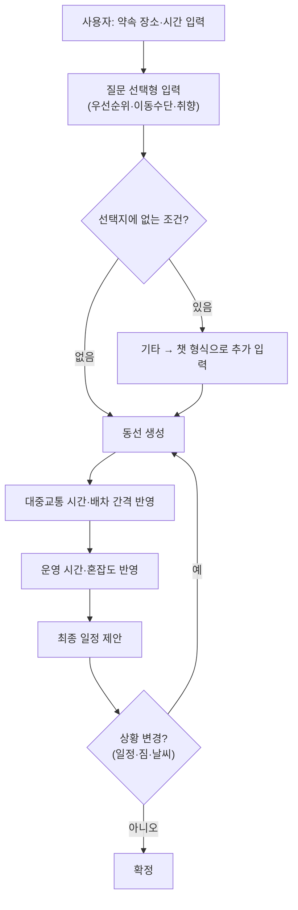
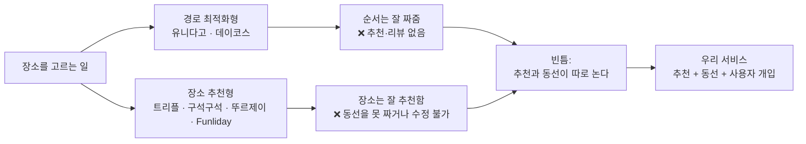

## 들어가며 (Situation)

팀 프로젝트 주제를 정하기 위해 **문제 정의 → 유사 서비스 분석** 순서로 진행했다.
"무엇을 만들까"부터 고민하면 기술만 남고 쓸 사람이 없는 서비스가 나오기 쉬워서, **우리가 실제로 불편했던 순간**을 먼저 모으는 것부터 시작했다.

이 글은 그 과정에서 나온 아이디어 목록과, 팀원 4명이 각자 기존 서비스를 써 보고 정리한 조사 결과를 남긴 기록이다.

---

## Step 1. 문제 정의 (Task)

### 1-1. 아이디어 브레인스토밍

먼저 주제를 좁히지 않고, 각자 겪은 불편을 전부 꺼냈다.

| 문제 상황 | 대상 | 아이디어 |
|-----------|------|----------|
| 309호가 너무 시끄러움 | — | 욽트론을 만들어서 제거 |
| 해야 할 일을 적어두고 까먹음 | — | 주기적으로 리마인드 |
| 점심 뭐 먹을지 모르겠음 | — | 추천 기능 |
| 길찾기 시간이 1~2분씩 차이 나서 지하철을 눈앞에서 놓침 (배달 앱도 예상 시간이 들쭉날쭉) | — | — |
| 거주자 우선 주차 구역이 낮에 비어 있는데도 불법 주차를 하거나, 잠깐 댈 곳이 없어 골목을 헤맴 | 거주자·운전자 | **공유형 골목길 주차 마켓** — 자리를 비우는 시간 동안 주차 면을 등록하면, 이웃이 분 단위로 저렴하게 예약·결제하는 매칭 플랫폼 |
| 리모컨 실종사건 | me.. | 리모컨에 위치 추적 기능 |
| 좁은 길에서 큰 우산을 든 사람과 마주침 | — | 우산에 작살 기능을 내포하여 자칫하면 제거 |
| 집에 혼자 있는 동물이 걱정됨 | 동물, 키우는 주인(양다연) | — |
| 분리수거 구분이 어려움 | 자취생·주부 | **바코드 기반 분리수거 내비게이터** (분리수거 스캐너) |
| 냉장고에 재료는 많은데 뭘 만들지 모르겠고, 유통기한을 놓쳐 버려짐 | — | 냉장고 내부를 찍으면 **컴퓨터 비전 AI**가 식재료를 인식하고 유통기한을 추적, **LLM**이 남은 재료로 만들 수 있는 레시피를 추천 |
| 가계부 항목 분류(식비·교통비 등)가 귀찮고, 어디에 많이 썼는지 직관적으로 모르겠음 | — | **OCR + GPT**로 영수증에서 날짜·금액·품목을 추출해 자동 분류, "이번 달에 커피 너무 많이 마셨어!" 같은 한 줄 평 추가 |
| 갈 곳을 정하고 동선을 짜기 어려움 | — | **동선 짜주는 AI** ← 최종 선정 |

### 1-2. 선정한 문제

| 항목 | 내용 |
|------|------|
| **문제** | 약속 장소는 정해졌는데 동선을 고려하기 어렵거나, 익숙하지 않은 장소에서 효율적으로 움직이기 어려움 |
| **대상** | 국내에서 이동하거나 일정이 있는 사람들 |
| **현재 해법** | 네이버 지도, 캐치테이블, 생성형 AI |
| **불편** | ① 약속 장소는 정해졌는데 일정을 못 정함 ② 생소한 지역에서 비효율적으로 움직임 ③ 이동에 막막함을 느낌 |

### 1-3. 개발할 부분

| 우선순위 | 기능 | 설명 |
|:---:|------|------|
| **1** | **동선 생성** | 가장 메인 기능 |
| 2 | 대중교통 시간·배차 간격 안내 | 실시간이 아니라 시간대 설정 기반 |
| 3 | 우선순위 반영 | 식사부터 / 더 가고 싶은 곳 등 — 네이버 지도의 최소 도보·최소 환승 옵션 참고 |
| 4 | 유동적인 일정 변경 | 운영 시간, 사람 몰림 정도 반영 |
| 5 | 장소 추천 | 음식점·관광지 등 카테고리 분류 |
| 6 | 상황 고려 | 일정 변경, 짐 추가, 기상 상황 등 유연하게 대응 |

입력 방식은 **질문 선택 형식**으로 하되, "기타" 항목에서는 챗 형식으로 추가 입력할 수 있게 한다.

---

## Step 3. 유사 서비스 분석 (Action)

조사 대상은 **유니다고, 데이코스, 트리플, 대한민국 구석구석, 뚜르제이, Funliday AI 여행 플래너** 6개다.
팀원 4명이 각자 직접 사용해 보고 좋았던 점과 불편했던 점을 정리했다.

### 김예린

| 사이트/앱 | 사용한 기능 | 좋았던 점 | 불편했던 점 / 추가 요구사항 |
|-----------|-------------|-----------|------------------------------|
| 유니다고 | 경로 탐색 | 클릭으로 위치 지정 — 상호명이 없는 곳도 추가할 수 있을 것 같아서 좋음 | 카카오내비로 이동 |
| 데이코스 | — | — | — |
| 트리플 | — | — | — |
| 대한민국 구석구석 | AI 탐색 | 자동으로 관광지를 추천해 줌 | 관광지가 너무 밋밋함 |
| 뚜르제이 | — | — | 핵심 기능이 유료 |
| Funliday AI 여행 플래너 | AI 자동 일정 생성 | 간단한 문답만으로 일정을 추천함 백지 상태에서 장소 뽑기 좋음 | 관광지가 자동으로 설정되어 가고 싶은 곳을 못 감 |

### 양다연

| 사이트/앱 | 사용한 기능 | 좋았던 점 | 불편했던 점 / 추가 요구사항 |
|-----------|-------------|-----------|------------------------------|
| 유니다고 | 경로 방식 설정 | 최적 경로 계산 가능 경로 방식을 설정할 수 있음 | 상호명이 아닌 주소를 직접 입력해야 함 |
| 데이코스 | 내비 앱 설정 최적화 동선 결과 | 기본 내비 앱 설정 가능 로그인 안 해도 됨 동선 최적화 결과가 나옴 저장 가능 기본 이동수단 설정 가능 | 근처 가게 추천 기능 없음 가게 리뷰 기능 없음 |
| 트리플 | 동선 표시 여행 매거진(카드 뉴스) | AI 일정 추천을 받을 수 있음 투어·체험·입장권 쇼핑 + 항공권 장소 리뷰를 볼 수 있음 | 로그인하는 게 귀찮음 |
| 대한민국 구석구석 | — | 지역별로 볼 수 있음 지역별 이벤트를 볼 수 있음 | 메리트 없음 우리 주제에 맞지 않음 |
| 뚜르제이 | AI 기능 사용 투어·체험·입장권 쇼핑 친구 추가 가능 | AI 기능 사용 투어·체험·입장권 쇼핑 친구 추가 가능 | 제미나이 사용 필요 없는 기능이 너무 많음 |
| Funliday AI 여행 플래너 | 예산 기반 AI 동선 생성 | 자유롭게 편집 가능 원클릭으로 동선 생성 AI 기능 사용 ChatGPT 이용 가능 | — |

### 박유수

| 사이트/앱 | 사용한 기능 | 좋았던 점 | 불편했던 점 / 추가 요구사항 |
|-----------|-------------|-----------|------------------------------|
| 유니다고 | 경로 방식(순환/편도/출발·도착 고정) 경로 추천 후 카카오내비 연결 방문 순서 드래그로 변경 | 조작이 어렵지 않고 한눈에 잘 보이는 UI 순환·편도·출발/도착 고정 카카오내비 연결 | 주소를 따로 찾아 텍스트 상자에 넣는 방식이라 입력이 번거로움 지도에서 장소 선택도 되지만 정확도가 낮거나 헷갈릴 수 있음 |
| 트리플 | 여행 기간 선택 여행 일행 선택 여행 스타일 선택(힐링·액티비티 등) 주변 장소 카드 장소 정보·리뷰 | 야놀자 연동(주변 숙소 추천) 주변 장소 데이터가 많음 장소별 카테고리에 배낭톡(커뮤니티) 화면에 D-3 같은 표시 | 사용할 때 복잡함을 느낄 수 있음 **일정 동선을 추천해 주지는 않음** (내가 선택한 장소 순서 그대로) |
| 대한민국 구석구석 | AI콕콕 / AI콕콕 플래너 | 공연·여행 코스·맛집 차트 등 기능이 다양함 좋아하는 카테고리를 정하면 추천해서 경로를 만들어 줌 | 로그인을 해야만 사용 가능 재미없는 곳을 선택해 줌 |
| Funliday AI 여행 플래너 | AI 여행 플랜 짜기 | 친절함 / 사용하기 쉬움 / 한눈에 들어오는 UI | 정해진 선택지 안에서만 고를 수 있음(기타 불가) → 선택의 폭이 좁음 추천 없이 정해져 있어 수정이 안 됨 |

### 류다연

| 사이트/앱 | 사용한 기능 | 좋았던 점 | 불편했던 점 / 추가 요구사항 |
|-----------|-------------|-----------|------------------------------|
| 유니다고 | — | — | — |
| 트리플 | — | — | — |
| 대한민국 구석구석 | AI 콕콕 플래너 (코스 생성) | 원하는 여행 테마를 골라 그 기반으로 추천해 주는 형태 | 개인이 고른 장소가 반영되지 않고, 선택지에 맞는 후보 몇 개만 출력되는 형식 |
| 뚜르제이 | — | — | — |
| Funliday AI 여행 플래너 | — | — | — |

---

## 종합 (Result)

### 기존 서비스는 두 갈래로 나뉜다

조사 결과를 모아 보니, 6개 서비스가 정확히 두 부류로 갈렸다.

| 유형 | 해당 서비스 | 잘하는 것 | 못하는 것 |
|------|-------------|-----------|-----------|
| **경로 최적화형** | 유니다고, 데이코스 | 내가 고른 장소들의 **최적 순서 계산** | 장소 추천·리뷰가 없음, 주소를 직접 입력해야 함 |
| **장소 추천형** | 트리플, 대한민국 구석구석, 뚜르제이, Funliday | 장소·테마 **추천**, 리뷰·쇼핑 연동 | 동선을 짜주지 않거나, 추천 장소를 **내가 바꿀 수 없음** |

### 공통적으로 지적된 불편

팀원별 조사표에서 **반복해서 나온 불만**을 뽑으면 이렇다.

| 불편 | 언급한 서비스 |
|------|---------------|
| **내가 가고 싶은 곳을 못 넣는다** | Funliday(김예린), 대한민국 구석구석(류다연), Funliday(박유수) |
| **추천 장소가 별로다** | 대한민국 구석구석(김예린·박유수) |
| **동선을 짜주지 않는다** | 트리플(박유수) |
| **입력이 번거롭다** (주소 직접 입력) | 유니다고(양다연·박유수) |
| **로그인 강제** | 트리플(양다연), 대한민국 구석구석(박유수) |
| **필요 없는 기능이 많다 / 복잡하다** | 뚜르제이(양다연), 트리플(박유수) |

### 그래서 우리가 만들 것

위 불편을 뒤집으면 그대로 요구사항이 된다.

| 기존 불편 | 우리 서비스의 대응 |
|-----------|---------------------|
| 가고 싶은 곳을 못 넣음 | **질문 선택 + 기타(챗) 입력**으로 사용자 의도를 받음 |
| 추천만 하고 동선은 안 짬 | **동선 생성을 메인 기능**으로 둠 |
| 주소를 직접 입력해야 함 | 상호명·지도 클릭 기반 입력 |
| 로그인 강제 | 로그인 없이 사용 (데이코스의 장점) |
| 상황이 바뀌면 대응 불가 | 일정 변경·짐·기상 상황을 반영한 **유동적 재계산** |

핵심은 **"추천"과 "동선"이 지금은 따로 놀고 있다**는 점이었다.
장소를 잘 추천하는 앱은 순서를 안 짜주고, 순서를 잘 짜는 앱은 장소를 추천하지 않는다. 이 둘을 잇는 것이 우리 서비스의 자리다.

## 참고 자료

- [유니다고 (unidago.com)](https://unidago.com)
- [데이코스 - App Store](https://apps.apple.com/kr/app/id6791603038)
- [대한민국 구석구석 - 한국관광공사](https://korean.visitkorea.or.kr)
- [Funliday AI Trip Planner](https://www.funliday.com/ai)
