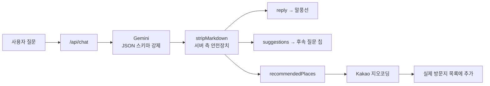

> p:nder 개발 4일차 기록. 이날 커밋 21개.

## 들어가며 (Situation)

동선을 짜주는 서비스에 **대화로 일정을 바꿀 수 있는 AI 도우미**를 붙이는 날이었다.
그런데 AI를 붙이는 것보다 **모델이 말을 안 듣는 것**을 길들이는 데 시간이 더 들었고, 하루 끝에는 전혀 다른 곳에서 **권한 상승 취약점**을 발견해 구조를 갈아엎었다.

---

## 문제 상황 (Task)

| 영역 | 문제 |
|------|------|
| AI 응답 | 답변이 중간에 잘리고, 무료 티어 한도에 막히고, 마크다운 기호가 말풍선에 그대로 노출됨 |
| AI 활용 | 대화만 되고 **실제 동선에는 아무 영향이 없음** |
| 보안 | 보기 전용 링크의 URL 파라미터만 고쳐도 **편집 권한을 얻을 수 있음** |

---

## 해결 과정 (Action)

### 1. Gemini 모델을 세 번 갈아탄 이유

처음 붙인 모델이 **무료 티어 일일 요청 한도 20건**이라 대화 몇 번 만에 `429 RESOURCE_EXHAUSTED`가 떴다.

| 시도 | 모델 | 결과 |
|:---:|------|------|
| 1 | `gemini-3.8-flash` | 무료 티어 **하루 20건** → 몇 번 만에 429 |
| 2 | `gemini-2.5-flash` | 하루 1,500건 허용 → 교체. 그러나 **404**, 신규 사용자에게 제공 종료 |
| 3 | `gemini-3.6-flash` | Google API가 직접 안내한 모델로 최종 정착 |

교훈은 단순하다. **모델 이름은 코드가 아니라 설정에 가깝다.** 한도와 제공 여부가 언제든 바뀌므로 갈아끼울 수 있게 두어야 한다.

### 2. 답변이 중간에 끊긴 진짜 이유 — thinking 토큰

모델을 바꾸자 이번엔 **답변이 완결되기 전에 잘리는** 현상이 생겼다.

원인은 `gemini-3.6-flash`가 기본적으로 사용하는 **thinking(추론) 토큰**이었다. 이 토큰이 `maxOutputTokens` 예산을 **답변 본문과 나눠 쓰면서**, 질문에 따라 본문에 쓸 예산이 모자랐던 것이다.

```text
maxOutputTokens (예산)
├── thinking 토큰  ← 여기서 먼저 먹고
└── 답변 본문      ← 남은 걸로 쓰다가 잘림
```

`thinkingBudget`을 **0으로 비활성화**하고 `maxOutputTokens`를 **2000으로** 올려 해결했다.

### 3. 자유 텍스트 응답을 구조화 출력으로

대화만 되는 챗봇은 쓸모가 없다. Gemini 응답을 **JSON 스키마로 구조화**해 화면 요소로 바로 쓸 수 있게 바꿨다.

| 필드 | 쓰임 |
|------|------|
| `reply` | 말풍선 본문 |
| `suggestions` | 모든 답변마다 따라붙는 **후속 질문 칩** |
| `recommendedPlaces` | AI가 구체적 장소를 추천하면 **동선에 추가** |



여기에 UX 두 가지를 더했다. 응답 생성 중 **점 3개 타이핑 인디케이터**, 새 메시지가 오면 **자동 스크롤**.

### 4. "마크다운 쓰지 마"를 두 번 말하기

`reply`에 마크다운 기호(`**`, `#`, `-`)가 그대로 섞여 말풍선에 노출됐다.

- **프롬프트**에 마크다운을 쓰지 말라고 명시했다
- 그래도 **모델이 지시를 어길 수 있으므로**, 서버에서 `stripMarkdown`으로 한 번 더 걸렀다
- 말풍선 CSS에 `white-space: pre-wrap`을 넣어 줄바꿈이 실제로 줄 단위로 보이게 했다

> **LLM에 지시할 때의 기본기** — 프롬프트는 요청이지 보장이 아니다. 형식이 깨지면 안 되는 지점에는 **코드로 된 안전장치**를 반드시 같이 둔다.

### 5. AI가 동선을 재구성하게 만들기

"변수 추가"에 **자유 텍스트 입력**을 넣고, 부상·폭우 같은 상황을 설명하면 AI가 방문 순서와 구간별 이동수단을 다시 짜도록 했다. (`/api/route-adjust`)

문제는 **AI가 이상한 값을 돌려줄 때**다. 그래서 서버에 검증을 넣었다.

| 검증 | 실패 시 |
|------|---------|
| 반환된 `order`가 기존 place id의 **순열인가** | 원본 순서로 폴백 |
| `segments` 값이 **유효한 이동수단인가** | 원본으로 대체 |

텍스트를 비워 두면 기존 프리셋(짐/날씨/지연/교통) 규칙 기반 로직을 그대로 쓰고, 방문지가 2곳 미만이면 버튼 자체를 비활성화했다.

### 6. AI 일정 생성 마법사

`/api/route-generate`와 `AiGenerateWizard`를 만들어 **지역 → 스타일 → 관심사(다중) → 동행 → 이동수단** 순으로 고르면 AI가 방문지 후보를 뽑아 주도록 했다.

- 같은 지역 밖 장소를 추천하는 사례가 있어 **프롬프트를 강화하고 temperature를 낮춰** 지역 준수를 개선했다
- 지역에서 "기타"를 고르면 직접 입력할 수 있게 하되, **Kakao 키워드 검색으로 실존 여부를 검증**해 오타·없는 지역이면 재입력을 요구했다
- 결과는 `ai-route-handoff` 유틸로 세션 저장소에 담아 플래너에서 **한 번만 소비**하도록 했다

### 7. 🚨 초대 링크의 권한 상승 취약점

이날 가장 중요한 작업이다. 기존 구조에는 **보기 전용 링크를 편집 링크로 바꿀 수 있는 구멍**이 있었다.

```text
[취약]  /join?token=abc&role=viewer
                              ↑ 이 값을 editor로 바꾸면 편집 권한 획득
        두 링크가 같은 토큰을 공유하고 role 파라미터만 달랐다
```

| 이전 | 이후 |
|------|------|
| 토큰 1개 공유 + URL의 `role` 파라미터로 권한 구분 | `invite_token_viewer` / `invite_token_editor` **두 컬럼으로 토큰 자체를 분리** |
| 서버가 URL의 `role`을 그대로 신뢰 | **토큰이 어느 컬럼과 일치했는지**로 권한 결정 |

> **URL 파라미터는 사용자가 마음대로 고칠 수 있는 값이다.** 권한처럼 중요한 정보를 거기서 읽으면 안 된다. 서버가 **이미 알고 있는 사실(어느 토큰인가)** 로 판단해야 한다.

이미 발급됐던 취약한 링크 2개는 이 변경으로 더 이상 동작하지 않게 됐다.

### 8. 권한 흐름 정리와 덤으로 잡은 버그

- 편집 링크로 들어와도 **바로 editor가 되지 않고**, 일단 viewer로 참여한 뒤 제작자 승인을 거치도록 했다
- 보기 전용 링크는 공개 API(`/api/schedules/invite/[token]`)로 **로그인 없이 조회 가능**하게 하고, "저장"을 누를 때 로그인으로 보냈다
- 알림 종 드롭다운에서 **편집 권한 요청을 바로 승인/거절**할 수 있게 연결했다 (플래너의 권한 관리 모달을 열 필요가 없어짐)

작업 중 별개의 버그도 발견했다. **`PlaceCard`의 우선순위·카테고리·메모·체류시간·삭제 버튼이 `canEdit` 여부와 무관하게 항상 클릭 가능**했다. 보기 전용 사용자가 로컬에서라도 방문지를 고칠 수 있던 것이라 함께 고쳤다.

---

## 결과 (Result)

| 항목 | Before | After |
|------|--------|-------|
| AI 응답 | 한도 초과·중간 잘림·마크다운 노출 | 모델 교체 + `thinkingBudget:0` + `stripMarkdown` |
| AI 역할 | 대화만 가능 | JSON 스키마로 **동선에 직접 반영** |
| 초대 링크 | URL 파라미터 변조로 **권한 상승 가능** | 역할별 토큰 분리, 서버가 토큰으로 판단 |
| 보기 전용 사용자 | 방문지 편집·삭제 버튼이 눌림 | `canEdit` 기준으로 차단 |

가장 크게 배운 건 두 가지다.

**AI를 붙이는 일의 대부분은 "모델이 이상한 걸 줬을 때 어떻게 할까"를 정하는 일이었다.** 순열 검증·폴백·`stripMarkdown`이 전부 그 대비였다.

그리고 **권한은 클라이언트가 보내온 값이 아니라 서버가 아는 사실로 판단해야 한다.** 토큰을 나누는 것만으로 취약점이 통째로 사라졌다.

---

## 더 학습하면 좋은 개념

- **LLM 구조화 출력(Structured Output / JSON Schema)** — 자유 텍스트를 파싱하는 대신 스키마를 강제하면 UI에 바로 꽂을 수 있다. 그래도 검증은 서버가 해야 한다는 점까지 함께 이해하면 좋다.
- **Reasoning / thinking 토큰과 출력 예산** — 추론 토큰이 출력 예산을 나눠 쓴다는 사실을 모르면 "답변이 잘린다"를 영원히 못 고친다. 모델별 토큰 회계를 알아 둘 것.
- **권한 상승(Privilege Escalation)과 신뢰 경계** — 클라이언트가 보내는 값은 전부 조작 가능하다는 전제에서 설계하는 훈련. OWASP의 접근 제어 취약점 항목과 함께 보면 좋다.
- **Capability URL(비밀 토큰 링크)의 설계** — 링크 자체가 권한이 되는 방식의 장단점, 만료·재발급·폐기를 어떻게 다룰지.
- **프롬프트 인젝션과 출력 정제** — 사용자 입력이 프롬프트에 섞여 들어가는 구조에서 어떤 공격면이 생기는지.

---

## 참고 자료

- [Google AI - Gemini API 모델 목록](https://ai.google.dev/gemini-api/docs/models)
- [Google AI - Structured output](https://ai.google.dev/gemini-api/docs/structured-output)
- [Google AI - Thinking](https://ai.google.dev/gemini-api/docs/thinking)
- [OWASP - Broken Access Control](https://owasp.org/Top10/A01_2021-Broken_Access_Control/)
- [MDN - white-space](https://developer.mozilla.org/en-US/docs/Web/CSS/white-space)
- [Kakao Developers - 로컬 API(키워드 검색)](https://developers.kakao.com/docs/latest/ko/local/dev-guide)
