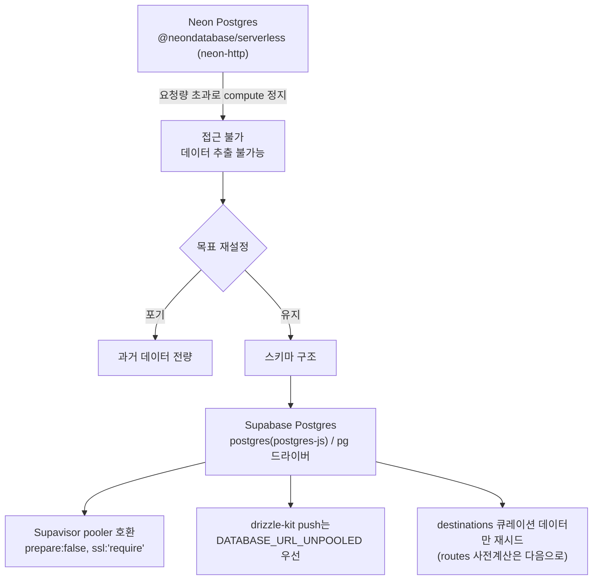

## 들어가며 (Situation)

15일차부터 실제 데이터를 쌓기 시작한 Neon Postgres가, 실사용이 늘면서 요청량 초과로 완전히 정지되는 사태를 맞았다.
DB 자체에 접속이 안 되는 상황이었다.

---

## 문제 상황 (Task)

### 🚨 원본에 접근할 수 없는 마이그레이션

Neon 계정이 요청량 초과로 compute 자체가 정지되어, 기존 데이터를 꺼낼 수조차 없는 상태였다.
보통의 DB 마이그레이션이라면 "기존 데이터를 새 DB로 옮기고 트래픽을 전환"하는 순서를 밟지만, 이번엔 원본에 접근할 수 없으니 데이터 이전이라는 선택지 자체가 없었다.

---

## 해결 과정 (Action)

### A. Neon에서 Supabase로 — "스키마만 옮기고 데이터는 새로 쌓기"

> 💡 데이터를 꺼낼 수 없으니, 목표를 **"무중단 이전"에서 "스키마 구조는 그대로 유지한 채 새 DB에서 다시 시작"** 으로 조정했다.
> 과거 데이터 소실은 감수하는 대신 서비스를 계속 이어갈 수 있는 쪽을 택한 것이다.

작업한 내용은 네 가지다.

1. 드라이버를 `@neondatabase/serverless`(neon-http)에서 **`postgres`(postgres-js) / `pg`** 로 교체했다.
2. Supabase의 커넥션 풀러(**Supavisor**)와 호환되도록 `prepare:false`, `ssl:'require'` 옵션을 적용했다.
3. 스키마를 실제로 반영하는 `drizzle-kit push`는 풀링된 연결 대신 **`DATABASE_URL_UNPOOLED`(non-pooling 연결)를 우선** 쓰도록 했다 — 스키마 변경(DDL)은 풀러를 거치면 예기치 않게 실패하는 경우가 있어서다.
4. 데이터 중에서 서비스 운영에 꼭 필요한 **`destinations`(여행지 큐레이션)** 만 새로 시드했고, 경로 사전계산(`routes`) 데이터는 서비스 필수 요소가 아니라고 판단해 다음으로 미뤘다 — 전부를 한 번에 복구하려 하지 않고 **우선순위를 나눈 것**이다.

### 실수로 커밋된 배포 설정 제거, README를 실측 기반으로

- `vercel-deployments.json`이 저장소에 올라가 있던 것을 발견하고 제거한 뒤 `.gitignore`에 추가했다. 배포 관련 설정 파일이 저장소에 남아 있으면 안 된다는 걸 **실제 사례로 확인**한 셈이다.
- README의 "협업 방식"·"데모" 섹션을 그동안 말로만 채워뒀던 부분에서 벗어나, `pinder`·`hello-planning` 두 저장소의 **`git log`·diff와 GitHub Issues/PR API를 직접 조회한 값**으로 다시 채웠다.
  브랜치 전략·이슈·PR·역할 분담·충돌 사례를 실제 데이터 기반으로 서술했고, 데모 섹션도 Vercel 배포 링크와 `vercel env pull` 기반 로컬 실행 방법, 실제 기능 흐름 순서로 다시 썼다.

---

## 결과 (Result)

| 항목 | Before | After |
|------|--------|-------|
| DB | Neon compute 정지 → 접속 불가 | Supabase로 이전, 서비스 재개 |
| 과거 데이터 | — | **전량 소실**(감수), 스키마와 `destinations`는 유지 |
| 삭제된 계정 세션 | FK 제약 위반 **500 에러** | 쿠키 삭제 후 **401** |
| 배포 설정 파일 | 저장소에 커밋됨 | 제거 + `.gitignore` 등록 |
| README 협업·데모 | 말로만 쓴 설명 | `git log`·PR API로 **검증한 설명** |

- Neon에서 완전히 막혔던 DB를 Supabase로 옮겨 **서비스를 다시 운영할 수 있는 상태로 되돌렸다.** 과거 데이터 전량은 소실됐지만, 스키마와 서비스 필수 데이터(`destinations`)는 유지했다.
- 탈퇴한 유저의 세션으로 인한 500 에러를 401로 정상 처리되도록 바꿔, **삭제된 계정과 관련된 예외 상황을 명확히 구분**했다.
- 실수로 커밋된 배포 설정 파일을 제거하고 `.gitignore`로 재발을 막았다.
- README의 협업·데모 섹션을 "그럴듯하게 쓴 설명"에서 **"실제 git/PR 데이터로 검증한 설명"** 으로 바꿨다.

---

## 참고 자료

- [Supabase Docs - Connect to your database](https://supabase.com/docs/guides/database/connecting-to-postgres)
- [Supabase Docs - Connection pooling and limits](https://supabase.com/docs/guides/database/connecting-to-postgres/pooling-and-limits)
- [Supabase Docs - Connection management](https://supabase.com/docs/guides/database/connection-management)
- [Drizzle ORM - Connect Supabase](https://orm.drizzle.team/docs/connect-supabase)
- [Drizzle ORM - Drizzle with Supabase Database](https://orm.drizzle.team/docs/tutorials/drizzle-with-supabase)
- [RFC 7519 - JSON Web Token (JWT)](https://datatracker.ietf.org/doc/html/rfc7519)
- [Git - gitignore 문서](https://git-scm.com/docs/gitignore)
