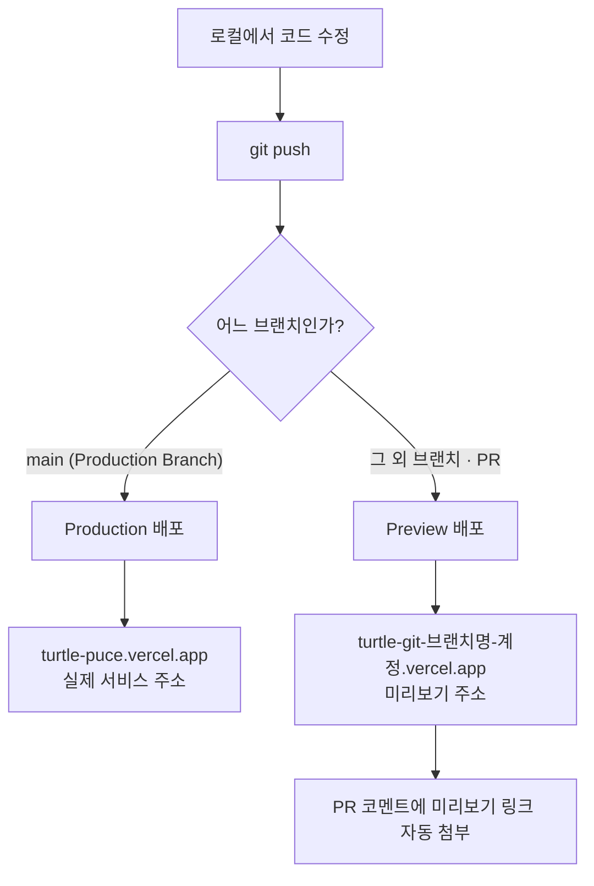

## 들어가며 (Situation)

웹캠으로 거북목을 감지하는 [Turtle](https://github.com/yang7493/Turtle) 프로젝트를 만들고 나니, 이제 남에게 보여줄 **주소**가 필요했다.
내 컴퓨터에서 `index.html`을 열면 잘 돌아가지만, 링크 하나로 공유할 수는 없었다.

그래서 배포처를 찾다가 **Vercel**을 선택했고, 그 과정을 정리해 둔다.

---

## 문제 상황 (Task)

배포처를 고를 때 조건은 세 가지였다.

1. **HTTPS가 필수**였다. 웹캠을 쓰려면 `getUserMedia()`를 호출해야 하는데, 이 API는 **보안 컨텍스트(HTTPS 또는 localhost)** 에서만 동작한다. `http://`로 배포하면 카메라 권한 요청 자체가 막힌다.
2. **푸시하면 자동으로 배포**되면 좋겠다. 코드를 고칠 때마다 파일을 직접 올리는 건 금방 지친다.
3. **무료**여야 했다. 개인 토이 프로젝트라 비용을 들이고 싶지 않았다.

---

## 해결 과정 (Action)

### 1. 어디에 배포할까 — 대안 비교

이 블로그는 이미 GitHub Pages로 운영 중이라 그걸 그대로 쓸 수도 있었다. 후보를 정리하면 이랬다.

| 항목 | GitHub Pages | Netlify | **Vercel** |
|------|--------------|---------|------------|
| HTTPS | 자동 지원 | 자동 지원 | 자동 지원 |
| 푸시 자동 배포 | 지원 (Actions) | 지원 | 지원 |
| 미리보기(Preview) 배포 | 기본 제공 안 함 | 제공 | **브랜치·PR마다 제공** |
| 서버리스 함수 | 없음 | 제공 | 제공 |
| 정적 파일만 배포 | 가능 | 가능 | 가능 |
| 비용 | 무료 | 무료 플랜 있음 | 무료 플랜 있음 |

Turtle은 빌드 없는 정적 파일 하나라서 사실 셋 다 가능했다. 그중 Vercel을 고른 이유는 두 가지다.

- **브랜치마다 미리보기 URL이 생긴다.** 자세 판정 수식을 바꿔 보는 실험이 많았는데, main을 건드리지 않고 브랜치 주소로 바로 테스트할 수 있다.
- **설정할 게 거의 없다.** 저장소만 연결하면 끝이고, 별도 워크플로 파일을 쓰지 않아도 된다.

> 참고로 GitHub Pages가 나쁘다는 뜻은 아니다. 이 블로그처럼 Jekyll 기반이라면 Pages 쪽이 더 잘 맞는다. **정적 사이트 + 미리보기 배포**가 필요하면 Vercel, **Jekyll 블로그**라면 Pages 정도로 나눠 생각하면 된다.

### 2. 방법 A — 대시보드에서 Git 저장소 연결 (권장)

가장 간단한 방법이다. 한 번만 연결해 두면 이후로는 손댈 일이 없다.

1. [vercel.com](https://vercel.com)에 **GitHub 계정으로 로그인**한다.
2. 대시보드 우측 상단 **Add New → Project**를 누른다.
3. **Import Git Repository** 목록에서 배포할 저장소를 고른다.
   - 목록에 없으면 **Adjust GitHub App Permissions**에서 해당 저장소 접근 권한을 추가한다.
4. 설정 화면에서 아래를 확인한다.

| 항목 | 설명 | Turtle의 경우 |
|------|------|---------------|
| Project Name | 배포 주소가 된다 (`프로젝트명.vercel.app`) | `turtle` |
| Framework Preset | 프레임워크 자동 감지 | **Other** (빌드 없는 정적 파일) |
| Root Directory | 소스가 있는 폴더 | `./` (저장소 루트) |
| Build Command | 빌드 명령 | 비워 둠 |
| Output Directory | 결과물 폴더 | 비워 둠 |

5. **Deploy**를 누르면 끝이다. 빌드 로그가 지나가고 `프로젝트명.vercel.app` 주소가 나온다.

정적 파일만 있는 프로젝트라면 **Build Command와 Output Directory를 비워 두는 것**이 핵심이다. 여기에 엉뚱한 명령이 들어가면 빌드 단계에서 실패한다.

### 3. 배포가 자동으로 도는 흐름

한 번 연결하면 이후에는 **푸시가 곧 배포**다.



Vercel 문서에 따르면 Git 저장소를 연결한 뒤에는 **커밋이나 PR마다 새 배포가 자동으로 생성**된다.

> When you import a Git repository to Vercel, each commit or pull request automatically triggers a new deployment.
> — [Deploying Git Repositories with Vercel](https://vercel.com/docs/git)

| 배포 종류 | 언제 생기나 | 주소 |
|-----------|-------------|------|
| **Production** | Production Branch(기본 `main`)에 푸시 | 고정 주소 (`프로젝트명.vercel.app`) |
| **Preview** | 그 외 브랜치 푸시, PR 생성 | 브랜치별 임시 주소 |

즉 `main`에 머지하기 전까지는 실제 서비스 주소가 바뀌지 않으므로, 실험은 브랜치에서 마음껏 해도 된다.

### 4. 방법 B — CLI로 배포하기

저장소를 연결하지 않고 로컬에서 바로 올릴 수도 있다. 설정 파일을 빠르게 시험해 볼 때 편하다.

```bash
npm i -g vercel     # 설치
vercel login        # 로그인
vercel              # 현재 폴더를 Preview로 배포
vercel --prod       # Production으로 배포
```

| 명령 | 동작 |
|------|------|
| `vercel` | 미리보기(Preview) 배포 |
| `vercel --prod` | 실제 서비스(Production) 배포 |
| `vercel logs <배포 URL>` | 배포 로그 확인 |
| `vercel env pull` | 대시보드의 환경 변수를 `.env`로 내려받기 |

처음 `vercel`을 실행하면 프로젝트 이름, 루트 디렉터리 등을 물어보고, 그 답을 `.vercel/` 폴더에 저장한다. **이 폴더는 `.gitignore`에 들어간다.**

### 5. 설정을 파일로 고정하기 — `vercel.json`

대시보드에서 누른 설정은 저장소에 남지 않는다. 설정을 코드로 관리하고 싶으면 루트에 `vercel.json`을 둔다.

```json
{
  "$schema": "https://openapi.vercel.sh/vercel.json",
  "cleanUrls": true,
  "headers": [
    {
      "source": "/(.*)",
      "headers": [
        { "key": "X-Content-Type-Options", "value": "nosniff" }
      ]
    }
  ]
}
```

*(예시 코드 — 정적 사이트에서 자주 쓰는 옵션만 추린 것이다.)*

| 옵션 | 역할 |
|------|------|
| `cleanUrls` | `/about.html`을 `/about`으로 접근 가능하게 |
| `redirects` | 경로 리다이렉트 |
| `headers` | 응답 헤더 추가 (보안 헤더, 캐시 정책 등) |
| `rewrites` | SPA에서 모든 경로를 `index.html`로 넘길 때 |

### 6. 환경 변수와 커스텀 도메인

API 키처럼 코드에 넣으면 안 되는 값은 **Settings → Environment Variables**에 등록한다. 값마다 적용할 환경(Production / Preview / Development)을 고를 수 있어서, 개발용 키와 운영용 키를 분리할 수 있다.

도메인을 직접 연결하려면 **Settings → Domains**에서 도메인을 추가하고 DNS를 설정한다.

| 도메인 종류 | 설정할 DNS 레코드 |
|-------------|-------------------|
| Apex 도메인 (`example.com`) | **A 레코드** |
| 서브도메인 (`www.example.com`) | **CNAME 레코드** |

---

## 결과 (Result)

| 항목 | Before | After |
|------|--------|-------|
| 공유 방법 | 내 컴퓨터에서만 실행 | `turtle-puce.vercel.app` 링크 하나 |
| 배포 절차 | 수동 업로드 | `git push` 한 번 |
| HTTPS | 없음 → 웹캠 API 사용 불가 | 자동 적용 → `getUserMedia()` 정상 동작 |
| 실험 방식 | main을 직접 수정 | 브랜치 푸시 → 미리보기 URL에서 확인 |

가장 크게 달라진 건 **배포가 더 이상 "작업"이 아니게 된 것**이다.
코드를 고치고 푸시하면 몇십 초 뒤 주소에 반영되니, 배포를 의식하지 않고 기능에만 집중할 수 있었다.

특히 HTTPS가 자동으로 붙는다는 점이 이 프로젝트에선 결정적이었다. 웹캠을 쓰는 앱은 HTTPS가 없으면 **기능 자체가 동작하지 않기 때문**에, 인증서를 직접 발급받지 않아도 되는 것만으로 충분한 이유가 됐다.

---

## 더 학습하면 좋은 개념

- **보안 컨텍스트(Secure Context)** — 웹캠, 마이크, 위치 정보, 서비스 워커 등 강력한 API는 HTTPS에서만 허용된다. 어떤 API가 여기에 해당하는지 알아 두면 배포 방식을 미리 결정할 수 있다.
- **CI/CD 파이프라인** — Vercel이 대신 해주는 "푸시 → 빌드 → 배포"가 바로 CI/CD다. GitHub Actions로 같은 흐름을 직접 짜 보면 Vercel이 무엇을 감춰 주고 있는지 보인다.
- **CDN과 엣지 네트워크** — Vercel은 배포 결과물을 전 세계 엣지에 캐싱한다. `Cache-Control` 헤더와 함께 이해하면 `vercel.json`의 `headers` 설정이 왜 필요한지 알 수 있다.
- **환경 변수와 빌드 타임 vs 런타임** — 정적 사이트에서 환경 변수는 빌드 시점에 코드로 박힌다. 브라우저에 노출되는 값과 서버에서만 쓰는 값의 차이를 구분해야 키가 유출되지 않는다.
- **서버리스 함수(Serverless Functions)** — 지금은 정적 파일만 올렸지만, `api/` 폴더에 파일을 두면 백엔드 없이 API를 만들 수 있다. 정적 사이트의 한계를 넘는 다음 단계다.

---

## 참고 자료

- [Vercel Docs - Deploying Git Repositories](https://vercel.com/docs/git)
- [Vercel Docs - Deploying GitHub Projects with Vercel](https://vercel.com/docs/git/vercel-for-github)
- [Vercel Docs - Deployments](https://vercel.com/docs/deployments)
- [Vercel Docs - Deploying a project from the CLI](https://vercel.com/docs/projects/deploy-from-cli)
- [Vercel Docs - vercel deploy (CLI)](https://vercel.com/docs/cli/deploy)
- [Vercel Docs - Environment Variables](https://vercel.com/docs/environment-variables)
- [Vercel Docs - Adding & Configuring a Custom Domain](https://vercel.com/docs/domains/working-with-domains/add-a-domain)
- [Vercel Docs - Project Settings](https://vercel.com/docs/project-configuration/project-settings)
- [MDN - MediaDevices.getUserMedia()](https://developer.mozilla.org/en-US/docs/Web/API/MediaDevices/getUserMedia)
- [MDN - Secure contexts](https://developer.mozilla.org/en-US/docs/Web/Security/Secure_Contexts)
