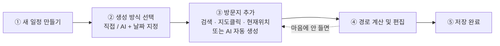
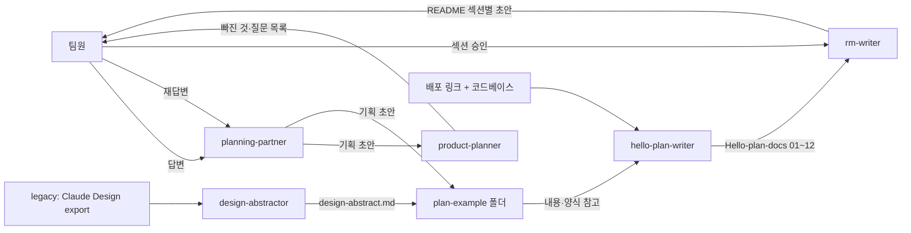
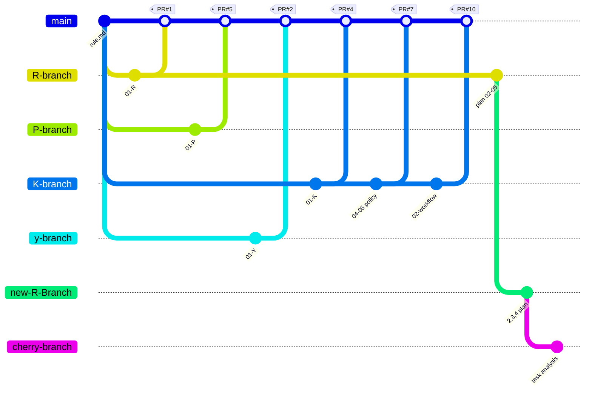
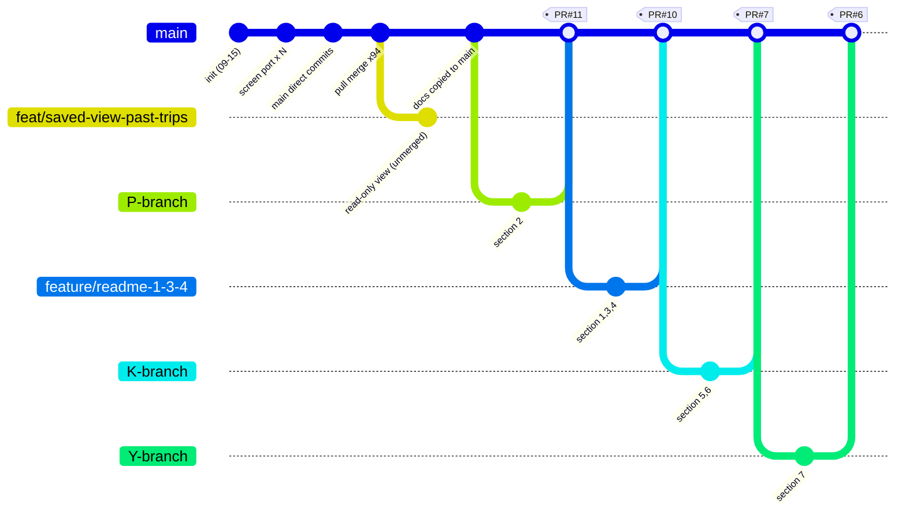

> 여러 장소를 이동해야 하는 사람을 위해, **목적지만 입력하면 AI가 동선과 일정을 자동으로 짜주는 서비스**

| 항목 | 내용 |
|------|------|
| 팀명 | 인사팀 |
| 기간 | 2026.09.07 ~ 2026.09.21 (발표 09.22) |
| 배포 링크 | [pinder-one.vercel.app](https://pinder-one.vercel.app/) |
| 보안·성능 리포트 | [AI 보안감사 및 부하테스트 평가 리포트](https://claude.ai/artifact/3ZavH8CCET2EvRe9s6rinQ) |
| 피그마 | [Travel Route Planner Wireframe](https://www.figma.com/make/ud387SQMeP4m5WJTFciCXg/Travel-Route-Planner-Wireframe?fullscreen=1&t=kdsf4qiqAWLw50Et-1&code-node-id=0-6) |
| Claude Design | [Route Planner App](https://claude.ai/design/p/f9f84bdd-ea4c-4e76-b7bc-cad662483c31?file=Route+Planner+App.dc.html&via=share) |

### 팀원과 담당

| 팀원 | 담당 |
|------|------|
| 김예린 | Next.js 전환·배포 환경 구축, DB·인증·이메일·지도·AI 연동, 플래너 경로 계산/최적화 |
| 류다연 | 서비스 기획·정책 문서화, AI 가중치 기반 최적경로 기능, 내 일정 권한·개인화 기능 |
| 양다연 | AI 도우미(챗봇)·AI 동선 생성 기능, 초대·공유 권한 체계, 탐색 페이지 콘텐츠 구성 |
| 박유수 | Route Planner·커뮤니티·알림 기능, 온보딩(Product Tour)·화면 UI, 모바일 반응형 전면 작업 |

---

## 들어가며 (Situation)


앞서 [문제 정의와 유사 서비스 분석]({{ research.url | relative_url }})에서 기존 서비스가 두 갈래로 갈려 있다는 것을 확인했다.

- **경로 최적화형**(유니다고, 데이코스) — 순서는 잘 짜주지만 장소를 추천하지 않는다
- **장소 추천형**(트리플, 대한민국 구석구석, 뚜르제이, Funliday) — 장소는 추천하지만 동선을 못 짜거나 수정할 수 없다

**"추천"과 "동선"이 따로 논다**는 빈틈을 메우려고 만든 것이 **p:nder**다.

---

## 1. 프로젝트 소개 (Task)

### 문제 정의

| 항목 | 내용 |
|------|------|
| 타깃 사용자 | 국내에서 여행·데이트·모임 등으로 여러 장소를 이동해야 하는 사람들(외국인 포함) |
| 겪는 문제 | 목적지는 정해져 있어도, 주변에서 무엇을 할지와 장소 간 이동 순서를 **함께** 고려한 일정을 짜기 어렵다 |
| 우리의 해결 | 목적지를 입력하면 AI가 최적화된 일정과 동선을 자동 생성하고, **생성 이후에도 같은 화면에서 계속 수정**할 수 있게 한다 |

### MVP 기능

| 우선순위 | 카테고리 | 기능 | 상태 |
|:---:|-----------|------|------|
| 1 | 장소 탐색 | 목적지 검색 및 추가 | 완료 |
| 2 | 장소 탐색 | 지도에 목적지 표시 | 완료 |
| 3 | 경로 계산 | 출발지 선택 및 경로 계산 | 완료 |
| 4 | 경로 계산 | 최단시간·최단거리 경로 계산 | 완료 |
| 5 | 경로 계산 | 변수·가중치 적용 | 완료 |

### 범위에서 제외한 것

- 교통·날씨 등 변동을 **자동으로 감지해** 동선을 재조정하는 기능
  - 이유: 기획 단계에서 제외 결정. 대신 사용자가 "변수 추가"를 눌러야 재계산이 시작된다.

### 정상 흐름



### 예외 흐름

| 상황 | 사용자에게 보이는 것 | 다음 행동 | 구현 |
|------|----------------------|-----------|:---:|
| 필수 입력이 비어 있음 (예: 커뮤니티 글쓰기 시 사진 0장) | 인라인 오류 문구 ("사진을 1장 이상 첨부해주세요.") | 값 보완 후 재시도 | ✅ |
| 데이터가 하나도 없음 (검색·필터 결과 없음) | "검색 결과가 없어요" / "아직 게시물이 없어요" | 다른 조건으로 검색, 첫 글 작성 | ✅ |
| 일정 저장 중 서버 오류 | "저장하지 못했어요. 다시 시도해주세요." 토스트, 화면은 저장 전 상태 유지 | 다시 저장 시도 | ✅ |
| 비로그인 상태에서 저장·편집 권한 요청 | 로그인 필요 모달 또는 즉시 `/login` 이동 | 로그인 또는 회원가입 | ✅ |
| AI 추천 장소의 좌표를 카카오에서 못 찾음 (최대 3회 재시도 후 실패) | "좌표 매칭에 실패했습니다" 모달 — 해당 장소는 제외하고 진행 | 나머지 장소로 계속, 또는 조건 변경 후 재시도 | ✅ |

### 기획 문서

- **사전 기획** (코딩 시작 직후 작성 — `git log`상 커밋 `d61b43b`, 2026-09-15 17:22, 첫 코드 커밋 16:58 직후): 문제 정의 / 요구사항 / 기능 문서
- **사후 검증** (배포된 코드를 기준으로 역산, 2026-09-18): PRD / 유저 스토리 / 화면 흐름

---

## 2. 디자인 시스템

### 사용 도구와 역할

| 도구 | 어느 단계에 썼나 | 원본 여부 |
|------|------------------|-----------|
| 피그마 | 초안 main 화면 참고 및 디자인 방향 확인 / 색상 팔레트 원본 정의 | 참고 |
| Claude Design | Figma 디자인·팔레트를 참고해 초기 프로토타입 제작, UI/UX 구체화 | 원본 |
| VS Code / Claude Code | 프로토타입 기반으로 실제 React/Next.js 화면 구현 및 UI/UX 수정 | 구현 |

### 정의

| 구분 | 정의 | 피그마 | Claude Design |
|------|------|:---:|:---:|
| 색상 | Brand `#7BCB93`, Brand-strong `#63B37E`, Brand-accent `#26AB4E`, Light/Dark Background, Text | ❌ | ✅ |
| 타이포 | Pretendard 기반으로 화면·컴포넌트별 크기 및 굵기 적용 | ❌ | ❌ |
| 아이콘 | 아이콘 라이브러리 미사용. PNG 래스터(`public/icons/`)가 주력, 이모지·인라인 `<svg>`·유니코드 기호 혼용 | ❌ | ❌ |

### 컴포넌트 목록

`src/components/ui/` 기준 실제 export된 컴포넌트:

`Button`(sm/md/lg, primary/secondary/disabled) · `Card`(interactive) · `Header`(desktop/mobile) · `Modal` · `SegmentedControl` · `DateRangeCalendar` · `ImageCropModal`(4:3 crop) · `PlaceholderImage` · `AuthorAvatar` · `HighlightedCaption`(hashtag) · `NotificationBell` · `ThemeToggle` · `MobileMenu`

---

## 3. Agent 구성 (Action)

이 프로젝트는 화면을 직접 만드는 "디자이너 → 퍼블리셔" Agent 대신, **기획·문서 작업을 나눠 맡는 Agent 5개**를 저장소에 정의해 썼다. (근거: `plan/.claude/agents/*.md`)



### 역할별 Agent

| Agent | 역할 | 출력 | 제약 |
|-------|------|------|------|
| `planning-partner` | 기획 인터뷰 진행, 팀 답변을 문서 양식에 기록 | 기획 문서 초안, `[제안]`/`[?]` 표시 | 팀 대신 결정하지 않음, 지정 문서 외 쓰기 금지 |
| `product-planner` | 기획 문서의 빈 칸·모호한 문장 검증 | 빠진 것·질문 목록 (문서는 직접 쓰지 않음) | Read 전용, 답을 대신 채우지 않음 |
| `design-abstractor` | Claude Design export를 코드 기준으로 요약 | `design-abstract.md` (화면·요소·상호작용 표) | 원본 수정 금지, 해당 파일 외 쓰기 금지 |
| `hello-plan-writer` | 배포된 서비스를 코드·화면 기준으로 **역산**해 문서화 | `plan/Hello-plan-docs/` 01~12 | 추측·`[제안]`/`[?]` 금지, 근거 없으면 "미확인" |
| `rm-writer` | Hello-plan-docs를 종합해 발표용 README 작성 | `READ_ME.md` 한 파일 | 근거 없는 내용은 `<확인 필요>` 표시 |

### 지시문 핵심 발췌

이 문서의 근거를 가장 많이 만들어 낸 `hello-plan-writer`의 절대 규칙:

```text
1. Write/Edit는 오직 plan/Hello-plan-docs/ 안의 파일에만 한다.
2. plan-example/ 폴더는 양식(표 구조·섹션 순서)만 참고하고 내용은 전부 무시한다.
3. 추측하지 않는다. [제안]·[?] 태그를 쓰지 않는다.
   확인이 안 되면 "미확인 — 근거 없음"으로만 표시한다.
4. 모든 서술 항목에는 근거를 남긴다. 형식: (근거: src/app/matches/page.tsx)
5. "계획"이 아니라 "실제로 지금 동작하는 것"만 쓴다.
```

### 지시문 수정 이력

없음 — 각 Agent 지시문 파일은 최초 작성 커밋 이후 수정된 적이 없다. (근거: `git log --follow` 결과 파일마다 커밋 1개)

---

## 4. 프로젝트 규칙 (하네스)

`CLAUDE.md`는 `@AGENTS.md` 한 줄만 있고, `AGENTS.md`는 `next dev`가 자동 재생성하는 안내문이라 팀이 직접 쓴 규칙이 아니다. 실제 팀 규칙은 `docs/ARCHITECTURE.md`·`docs/CONTRIBUTING.md`에 있다.

| 구분 | 규칙 |
|------|------|
| 코드 컨벤션 | 의존 방향은 `app/ → components/ → lib·constants·types` 한쪽으로만 / 기본은 서버 컴포넌트 / CSS는 `*.module.css` + `tokens.css` 변수만 |
| 폴더 구조 | `src/app`(라우팅) · `components/{ui,layout,providers}` · `lib`(도메인 로직) · `constants` · `types` · `legacy/`(구 프로토타입, 빌드 제외) · `docs/` |
| 금지 사항 | 색상·간격·반경은 토큰만(hex 직접 금지) / 공통 컴포넌트는 고치지 말고 variant로 확장 / API 키는 서버 라우트에서만(`NEXT_PUBLIC_` 금지) / `main` 직접 push 금지(PR만) |

**실제로 지켜졌는지**: 색상 토큰 규칙은 **지켜지지 않았다.** CSS 모듈 90건 이상에서 하드코딩된 hex가 발견되고(`planner.module.css` 약 50건), 다크모드 미대응을 스스로 주석으로 인정한 곳도 있다.

### 재사용 프롬프트

별도 Skill 파일(`.claude/skills/`)은 없고, 3번의 Agent 지시문 5개가 재사용 프롬프트 역할을 겸한다.

| 이름 | 하는 일 | 사용 횟수 |
|------|---------|-----------|
| `hello-plan-writer` | 배포된 코드를 역산해 기획 문서 작성 | 문서 12개 생성 |
| `rm-writer` | Hello-plan-docs를 종합해 README 작성 | 섹션 단위 반복 |
| `planning-partner` / `product-planner` | 기획 인터뷰 진행 / 빈 칸·모호한 문장 검증 | 초안 다수 · 검증 라운드 다수 |
| `design-abstractor` | Claude Design export를 코드 기준으로 요약 | 1회 |

### 검증 절차

1. 문서에 적은 주장은 코드를 직접 읽거나 grep해서 **파일·줄번호까지 대조**하고, 필요하면 `git log`로 수정 이력까지 확인한다
2. 대조 결과가 다르면 짐작으로 고치지 않고 **재현되는 것만** 반영한다. 확인이 안 되면 `<확인 필요>`로 남긴다

**실제 사례** — AI가 추천한 장소의 좌표를 카카오에서 못 찾으면 좌표 없이 그대로 일정에 들어가고, 플래너가 이를 알리지 않은 채 **가짜 이동시간·지하철 노선명을 지어내 보여주는** 결함을 코드 추적(`AiGenerateWizard.tsx` → `PlannerClient.tsx` → `route-engine.ts`)으로 발견했다. 이후 대체 후보 재시도(최대 3회)와 실패 안내 모달이 추가되어, 실패한 장소는 가짜 데이터 대신 제외되도록 고쳐졌다. (근거: 커밋 `8d81aaa`)

---

## 5. 협업 방식

### 브랜치 전략 — 기획 단계 (`hello-planning`)

실제로 분기·병합이 일어난 단계다. PR 1~16번이 전부 여기에 반영됐다.



- PR 13건 중 **7건(#1,2,3,4,5,7,10)은 자가병합** — 자기 PR을 스스로 merge 버튼을 눌러 병합했다
- 유일하게 **PR#10**만 김예린이 열고 류다연이 병합했다(`55a6025`, 09-10 17:11). **이 저장소 전체에서 "내가 아닌 다른 사람이 리뷰하고 병합해준" 유일한 사례**다
- PR#6이 막힌 뒤 `new-R-Branch` → `cherry-branch`로 두 번 더 새 브랜치를 파서 재시도했지만 **PR#11~14·16 다섯 건 모두 병합되지 못했다**

### 브랜치 전략 — 개발 단계 (`pinder`)

09-17까지는 "브랜치"라는 이름은 있지만 **실제 분기가 거의 없었다.** 09-22 README 문서화에서 처음으로 PR 기반 분기·병합이 자리 잡았다.



- `feat/google-login`·`feat/home-page-port`·`feat/login-signup-screens`·`feat/planner-screen`·`feature/migration` — 5개 브랜치 tip 커밋의 **부모가 1개뿐**(`git log -1 --format=%P`). 실제로 분기된 적이 없고 같은 한 줄 위에 **이름표만 붙어 있는 상태**다
- `feat/saved-view-past-trips` — 09-17까지 기준 유일하게 진짜로 갈라진 브랜치. `main`에 없는 커밋이 1개(`a487d9a`) 있는데 **지금까지 병합되지 않고 방치**돼 있다. "일정 종료 후에도 편집·저장·초대가 그대로 동작한다"는 문제의 원인이 바로 이것 — **그 기능을 실제로 만들다가 병합을 안 한 것**이다
- 09-22 README 문서화에서 **개발 저장소에 처음으로 PR 분기·병합이 일어났다.** 섹션을 나눠(2절 박유수, 1·3·4절 류다연, 5·6절 김예린, 7절 양다연) 각자 커밋 후 PR을 열고 실제로 병합했다
- 이슈 번호를 붙이는 규칙(`feature/<이슈번호>-<기능명>`)은 두 저장소 어디에서도 쓰인 적이 없다 (커밋 메시지의 이슈 참조 **0건**)

### 이슈 활용

| 이슈 | 생성일 | 작성자 | 체크리스트 진행률 | 댓글 | 연결 PR | 상태 |
|------|--------|--------|-------------------|:---:|:---:|------|
| #8 "9/10 - 프로토타입 기반으로 기획서 수정할 것" | 09-10 | 류다연 | 6/6 (100%) | 0 | 없음 | open |
| #9 "문서 2,3,4번 수정사항" | 09-10 | 김예린 | 0/18 (0%) | 0 | 없음 | open |
| #15 "할 일 정리" | 09-14 | 류다연 | 1/219 (0.5%) | 0 | 없음 | open |

- **#8**은 그날 오후 할 일 6개를 적고 전부 체크한, **하루짜리 실행 로그**에 가까운 이슈
- **#9**는 문서별 수정 항목을 나열했지만 체크된 항목이 하나도 없다 — 체크리스트를 실행 추적용이 아니라 **"생각 정리용 메모"** 로만 쓴 사례
- **#15**는 체크박스 219개짜리 전체 로드맵으로, A1(제작자)/A2(편집자)/Viewer/Saved-Viewer 역할 흐름 다이어그램까지 포함한다. 체크된 항목은 1개뿐이지만 **여기 적힌 역할·권한 흐름이 실제 코드(`src/db/schema.ts`의 `scheduleCollaborators.role`)와 거의 그대로 일치**한다 — 진행률 추적은 못 했지만 설계 문서로는 계속 참조된 셈
- 담당자(assignee) 필드는 세 이슈 모두 비어 있고, 댓글은 **전부 0건**, 지금까지 **닫힌 적이 없다**
- 이슈-PR 연결(`Closes #`) 관행 **0건**. 코드 저장소에 이슈 템플릿은 만들어져 있지만 **실제 이슈가 0건**이다 — "추적할 문제"가 아니라 **todo 메모장**으로 쓴 것

### PR 활용

| 항목 | `hello-planning` | `pinder` |
|------|------------------|----------|
| 총 PR 수 | 13개 | 5개 (전부 09-22) |
| 병합 | 7건 (#1,2,3,4,5,7,10 — 전부 첫 주) | 5건 전부 |
| 미병합 | 6건 (#6,11,12,13,14,16) | 0 |
| 리뷰 코멘트가 오간 PR | 3개 (#6에 12건, #12·#13에 각 1건) | 0 |

- PR 템플릿은 `pinder`에 있지만(작업 내용/관련 이슈/lint·typecheck·build 체크리스트/스크린샷) **쓰인 적이 없다.** `hello-planning`은 템플릿 없이 자유 형식이라 본문이 **"01-K" 한 줄뿐인 경우가 대부분**이었다
- `pinder`의 CODEOWNERS는 **실제 GitHub 계정으로 치환되지 않은 채** 남아 있어 강제되는 리뷰가 없었다
- 다만 PR#10 제목("...류다님 확인 바랍니다")처럼 특정 팀원을 지목해 리뷰를 요청하는 관행은 있었고, **PR#6에는 실제 인라인 리뷰 코멘트가 12건** 오갔다

### 역할 분담

> 두 저장소의 커밋을 모두 합쳐서 집계했다. 커밋 메시지의 스코프 표기가 아니라 **실제 diff 기준**이다.

| 팀원 | 기획 단계 (`hello-planning`) | 개발 단계 (`pinder`) |
|------|------------------------------|----------------------|
| 김예린 | **12커밋** — "01-K" 작성 후 3개 브랜치를 직접 merge해 "01통합본" 정리, 04·05 정책 문서, 02-workflow 재구성 | **135커밋** — 초기 화면 이식, 플래너 핵심 로직(`PlannerClient.tsx` 46회)·인증(24회)·일정 API(16회)·마이페이지(16회) |
| 박유수 | **8커밋** — `rule.md`(브랜치명 규칙) 작성, 01-P, 유사 서비스 조사 3건 | **94커밋** — 커뮤니티 화면(30회), 플래너 모바일 반응형 CSS(21회), 내 일정 카드(7회) |
| 양다연 | **4커밋** — 01-Y, 유사 서비스 조사·표 수정 | **65커밋** — `PlannerClient.tsx`(17회)·내 일정(17회)·AI 도우미(`api/chat` 13회)·탐색 페이지(11회) |
| 류다연 | **18커밋(최다)** — 초기 기획 주도. PR#6이 막힌 뒤 두 번 더 재시도했지만 전부 미병합. 유일하게 타인의 PR을 병합해줌 | **43커밋** — `PlannerClient.tsx`(14회, 출발지 선택 팝업 흐름)·내 일정 개인화(7회)·커뮤니티(5회) |

`PlannerClient.tsx`는 **네 명 모두**가 상위권으로 고친 파일이고(46 · 17 · 14 · 8회), `planner.module.css`도 세 명이 반복 수정했다(21 · 18 · 13회). 이 겹침이 아래 충돌 사례로 그대로 이어졌다.

### 충돌 해결 사례

**① 회원탈퇴 후 로그인 화면 이동 — Revert 충돌 (09-16)**

```text
11:39  김예린  router.push('/login') 3줄 추가       (067f9fc)
11:52  양다연  그 3줄을 git revert로 통째로 삭제    (1e8c103)
12:02  김예린  같은 3줄을 재적용                     (7f59765)
```

김예린은 커밋 메시지에 *"팀원이 별다른 설명 없이 revert 했는데, 테스트로 확인된 실제 버그 수정이라 다시 적용한다"* 고 직접 기록했다. diff가 3줄 추가/3줄 삭제로 완전히 대칭이라 **코드 충돌이 아니라 소통 부재** 사건이다. 왜 되돌렸는지는 기록에 남아 있지 않다.

**② "출발지 선택" 팝업 흐름 — 같은 날 4번 수정**

`114ecb4`(돌아갈 팝업을 "목록"에서 "출발지 확정"으로) → `b4eacf0`("취소"를 "이전"으로, 스크롤 추가) → `7d8159b`(ESC/뒤로가기에 `returnToOriginPickerAfterAdd` 상태 확인 추가) → `b2d8349`·`3349a20`(재조정). git 충돌은 아니고 **요구사항이 구현 중 계속 바뀐** 사례다.

**③ 플래너 모바일 버튼 위치 — CSS만 12번**

박유수는 "뒤로가기" 버튼이 검색 오버레이와 겹치는 문제를 09-17에 **5번** 수정(`602267a`에서 버튼 JSX를 `mapCol` 밖에서 `mapArea` 안으로 이동), 양다연은 AI 도우미·현재 위치 버튼이 하단 요약바와 겹치는 문제를 09-18 아침에 **7번 연속** 수정했다. 전부 `position`/`z-index`만 바꾸며 **한 번에 맞는 값을 못 찾은 패턴**이다.

---

## 6. 데모

### 실행 방법

`main`에 push하면 Vercel Git Integration이 자동으로 새 프로덕션 배포를 만든다. 저장소의 CI(`ci.yml`)는 lint·typecheck·build 검증만 하고 **실제 배포는 하지 않으므로**, 배포 성공 여부는 GitHub 커밋 상태가 아니라 **Vercel 대시보드**에서 확인해야 한다.

브랜치·PR을 만들면 **프리뷰 배포**도 자동 생성되므로, 리뷰어가 코드를 받지 않고도 PR 링크로 화면을 바로 확인할 수 있다.

로컬 실행 시에는 환경 변수를 하나씩 채우는 대신 Vercel에 등록된 실제 배포용 값을 그대로 받아온다.

```bash
npm i -g vercel              # 최초 1회
vercel login
vercel link                  # 이미 연결된 프로젝트 "pinder" 선택
vercel env pull .env.local   # KAKAO_JS_KEY / GEMINI_API_KEY / DATABASE_URL 등을 실제 배포값으로
npm install
npm run dev                  # http://localhost:3000
```

키를 하나도 못 받아와도 앱 자체는 뜨고, 해당 기능(지도·AI 도우미·구글 로그인 등)만 오류 메시지를 보여준다.

### 시연 순서

1. **로그인** — 홈에서 "내 일정" 클릭 → 로그인
2. **내 일정** — 제목·일정 수정 → 온보딩 설명 → **최단 시간 / 최단 거리** 옵션 → **이동수단** 설정(일괄 적용·개별 변경·카카오맵 연동) → **방문지 추가**(주소 검색 / 지도 클릭 / 현위치) → **경로 계산** 팝업에서 출발지 설정 및 변수 추가
3. **최적 동선 생성** — AI 일정 생성 → 이틀 일정 선택 → "다시 추천받기"로 재생성 → "이 일정으로 시작하기" → 경로 계산 → 저장하지 않고 나갈 때 확인창
4. **여행지 탐색** — 경북 → 포항 → "일정짜기" → 이틀로 변경 → 지도 클릭으로 주소 추가 → 경로 계산 → AI 도우미에 "포항에서 진짜 유명한 곳으로 추천해줘" → "호미곶을 일정에 추가해줘" → 저장 → **편집 링크 공유** → **권한 관리** 팝업
5. **편집 링크 접속** — 편집자 화면: 보기 전용 → 권한 신청 → 승인 후 편집자 화면 전환
6. **커뮤니티** — 게시물 작성 / 댓글 / 좋아요 / 저장 → 내 프로필에서 저장 목록 → 여행지 검색

---

## 7. AI 보안 감사와 부하 테스트

배포로 끝내지 않고 **AI를 이용한 보안 감사와 부하 테스트**를 돌려 서비스 상태를 점검했다.

> 📄 [AI 보안감사 및 부하테스트 평가 리포트](https://claude.ai/artifact/3ZavH8CCET2EvRe9s6rinQ)

| 구분 | 확인하려던 것 |
|------|----------------|
| 보안 감사 | 취약점이 있는지, 있다면 심각도가 어느 정도인지 |
| 부하 테스트 | 동시 접속이 몰렸을 때 응답 시간과 오류율이 견딜 만한지 |

만들 때는 "동작하느냐"만 봤는데, 감사와 테스트를 돌리고 나서야 **"안전하냐", "버티느냐"가 별개의 문제**라는 걸 알게 됐다.

---

## 8. 회고 (Result)

### 잘 된 점

- 사용자가 글이 안 올라간 걸 모를 수 있는 **"성공으로 잘못 처리되는" 버그**(커뮤니티 글 작성)를 찾아내 바로잡음 — 조용히 묻힐 수 있는 종류의 버그였다
- **Neon DB 네트워크 사용량 소진**이라는 인프라 문제를 스키마 구조는 그대로 둔 채 Supabase로 재배포해 해결 — 스키마와 인프라를 분리해 둔 덕에 DB를 교체해도 나머지 코드 영향이 적었다
- 실패한 구간만 골라 **재시도**할 수 있게 만들고, 동시 요청 과부하 문제도 원인을 짚어 처리 방식을 고쳐 안정성을 높임
- 팀원 다같이 모여 실제 웹을 함께 실행해 보며 오류를 찾아 그 자리에서 수정함

### 실패 사례와 개선

| 무엇이 실패했나 | 왜 | 어떻게 고쳤나 |
|------------------|-----|----------------|
| 커뮤니티 글 작성 실패를 성공으로 처리 | 에러 응답을 성공 케이스로 잘못 분기 | 실패 응답을 실패로 처리하도록 분기 수정 |
| UI 겹침·간격 문제를 여러 번 임시방편으로 반복 수정 | 레이아웃 구조(z-index, 앵커 기준)를 먼저 정하지 않고 그때그때 시도 | 여러 차례 수정을 거쳐 최종 배치로 수렴 |
| 동시 경로 요청이 몰려 일부 이동수단 경로 계산 실패 | 여러 이동수단 API를 동시 호출해 요청 과부하 | 요청 처리 방식을 수정해 과부하 해소 |
| Neon DB 네트워크 사용량 소진 | 한도 초과 | Supabase로 새 DB 구축 후 재배포, 스키마 구조만 이전 |

### 팀 안에서 공유한 Claude 활용 노하우

- 모든 에이전트에 **"AI가 채운 부분과 사실을 구분하는 태그"** 규칙을 공통으로 넣었다. 팀이 확정한 내용은 그대로, AI가 보탠 제안은 `[제안]`, 근거 없는 추정은 `[확인 필요]`/`[?]`로 표시해 나중에 섞여서 사실처럼 보이지 않게 했다
- `CLAUDE.md`에 규칙을 직접 적지 않고 `@AGENTS.md`, `@docs/ARCHITECTURE.md`, `@docs/CONTRIBUTING.md`로만 **연결**했다(`bdeddd9`). 컨벤션·폴더 구조가 바뀌어도 `CLAUDE.md`를 고칠 필요 없이 원본 문서만 갱신하면 항상 최신 규칙을 읽게 된다

### 다음 프로젝트에서 다르게 할 것

1. 같은 영역(인증/마이페이지 등) 작업 전에 **담당·범위를 먼저 공지**한다
2. 직접 push 대신 **PR 단위로 병합하고 리뷰**를 거쳐, 되돌림(revert) 사고를 리뷰 단계에서 먼저 걸러낸다
3. 같은 UI 겹침 문제를 임시방편으로 반복 수정하기보다, **레이아웃 구조(z-index, 앵커 기준)를 먼저 정하고** 수정한다

---

## 더 학습하면 좋은 개념

- **TSP(외판원 문제)와 경로 최적화** — 동선 생성의 뿌리에 있는 문제. 장소가 늘어날수록 경우의 수가 폭발하므로 근사 알고리즘 이해가 필요하다.
- **부하 테스트 도구(k6, JMeter, Locust)와 백분위수 지표** — 평균 응답 시간은 느린 사용자를 가린다. p95·p99를 봐야 실제 경험이 보인다.
- **OWASP Top 10** — 웹 보안 감사의 사실상 표준 체크리스트. 어떤 취약점이 왜 위험한지 알아야 감사 결과를 스스로 판단할 수 있다.
- **Next.js 서버 컴포넌트와 App Router** — 클라이언트 경계를 어디에 두느냐가 API 키 노출과 번들 크기를 좌우한다. 팀 규칙의 "기본은 서버 컴포넌트"가 나온 배경이다.
- **디자인 토큰과 CSS 아키텍처** — 색상 토큰 규칙이 지켜지지 않아 hex가 90건 넘게 하드코딩됐다. 토큰을 강제하는 방법(린트 룰 등)을 알면 규칙이 문서에만 남지 않는다.

---

## 참고 자료

- [p:nder - AI 동선 플래너](https://pinder-one.vercel.app/)
- [AI 보안감사 및 부하테스트 평가 리포트](https://claude.ai/artifact/3ZavH8CCET2EvRe9s6rinQ)
- [Next.js Docs - App Router](https://nextjs.org/docs/app)
- [Kakao Maps API](https://apis.map.kakao.com/)
- [OWASP Top 10](https://owasp.org/www-project-top-ten/)
- [k6 Documentation](https://grafana.com/docs/k6/latest/)
- [Vercel Docs - Deployments](https://vercel.com/docs/deployments)
