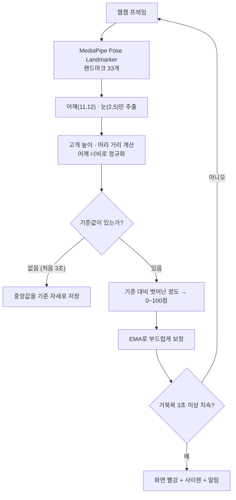
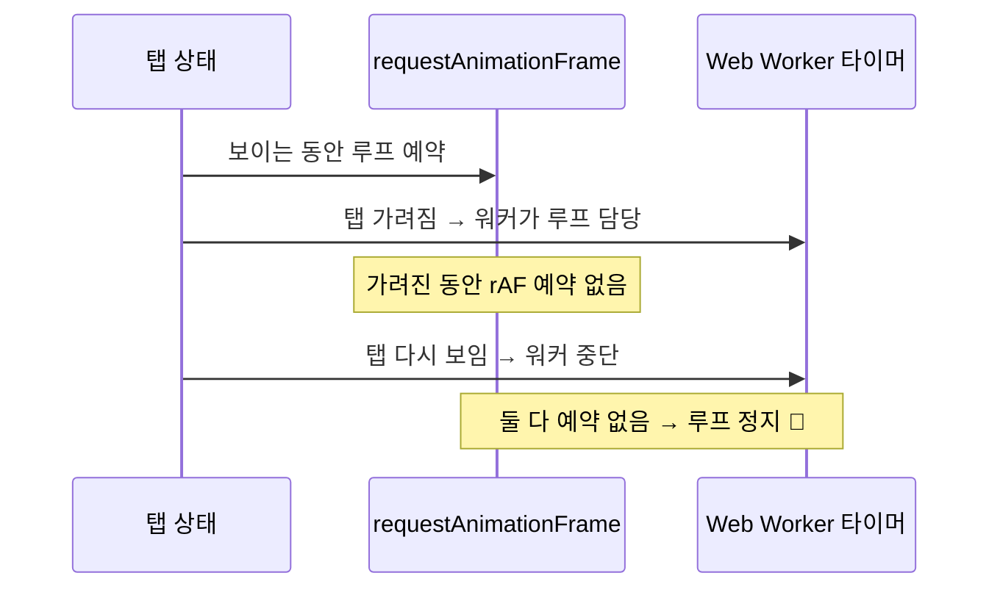

**웹캠으로 거북목을 잡아주는 웹앱 만들기 (Turtle)**

> 배포 주소: [turtle-puce.vercel.app](https://turtle-puce.vercel.app/)
> 저장소: [github.com/yang7493/Turtle](https://github.com/yang7493/Turtle)

## 1. 만든 이유 (Situation)

컴퓨터 앞에 오래 앉아 있으면 나도 모르게 목이 앞으로 빠진다.
그래서 **다른 일을 하는 동안 옆에 띄워 두면, 거북목이 될 때 바로 알려주는 서브앱**을 만들었다.

---

## 2. 주요 기능 (Task)

- **실시간 거북목 감지**: 웹캠으로 어깨와 눈 위치를 읽어 0~100점 자세 점수를 매긴다.
- **경고 알림**: 거북목 상태가 3초 이상 이어지면 화면이 빨갛게 바뀌고, 사이렌 소리와 Windows 알림이 온다.
- **서브앱 모드**: 항상 위에 떠 있는 작은 창(Picture-in-Picture)으로 띄워 두고 다른 작업을 할 수 있다.
- **대시보드**: 자세 점수, 측정 시간, 바른 자세 비율, 경고 횟수, 1초 단위 자세 기록 막대를 보여준다.
- **결과와 기록**: 측정을 끝내면 "거북이 지수"와 6단계 등급을 보여주고, 저장·삭제할 수 있다.
- **개인정보**: 영상은 브라우저 안에서만 분석되고 서버로 전송되지 않는다.

---

## 3. 사용한 기술 (Action)

| 구분 | 기술 |
|---|---|
| 화면 | HTML, CSS, JavaScript (빌드 없이 `index.html` 한 파일) |
| 자세 인식 | MediaPipe Tasks Vision – Pose Landmarker (lite 모델) |
| 소리 | Web Audio API (오실레이터로 사이렌 소리 직접 생성) |
| 알림 | Notification API |
| 작은 창 | Document Picture-in-Picture API |
| 백그라운드 동작 | Web Worker 타이머 |
| 저장 | localStorage (기록, 설정) |
| 설치 | PWA manifest |
| 배포 | GitHub + Vercel (푸시하면 자동 배포) |

---

## 4. 거북목은 어떻게 판단할까?

MediaPipe가 몸의 랜드마크 33개 좌표를 준다. 그중 **양쪽 어깨(11, 12)** 와 **양쪽 눈(2, 5)** 만 쓴다.

1. **고개 높이**: 어깨 중심보다 눈이 얼마나 위에 있는지를 어깨 너비로 나눈 값이다. 고개가 숙여지면 작아진다.
2. **머리 거리**: 두 눈 사이 거리를 어깨 너비로 나눈 값이다. 머리가 화면 쪽으로 나오면 커진다.

어깨 너비로 나누기 때문에 카메라와의 거리가 달라져도 비교할 수 있다.

처음 3초 동안 바른 자세를 **기준값(중앙값)** 으로 저장하고, 이후에는 기준에서 벗어난 정도로 점수를 매긴다.

```js
const drop = Math.max(0, 1 - m.neck / base.neck);   // 고개가 내려간 비율
const lean = Math.max(0, m.close / base.close - 1); // 머리가 다가간 비율
const deviation = drop + lean * 0.6;
const raw = 100 - (deviation / sens) * 50;           // sens: 민감도
ema = ema * 0.8 + raw * 0.2;                         // 튀는 값을 부드럽게
```

전체 판단 흐름은 다음과 같다.



---

## 5. 겪은 문제와 해결 (트러블슈팅)

### ① 머리카락이 귀를 가리면 인식이 엉망이 됐다

처음에는 머리 위치를 **귀**로 쟀다.
그런데 머리카락이 귀를 가리면 모델이 귀 위치를 엉뚱하게 추정했다. 바르게 앉아 있어도 계속 "거북목"이 나왔다.

또 귀가 안 보인다고 판단되면 그 프레임을 버렸는데, 그러다 보니 기준 자세를 잡을 데이터가 모자라 **3초 세기가 끝없이 반복**됐다.

→ 거의 가려지지 않는 **눈** 기준으로 바꿔서 해결했다.

| 기준점 | 문제 | 결과 |
|--------|------|------|
| 귀(7, 8) | 머리카락에 가려짐 → 좌표 추정 오류, 프레임 폐기 | 오탐 + 기준 자세 수집 실패 |
| 눈(2, 5) | 거의 가려지지 않음 | 안정적으로 기준 자세 확보 |

### ② 다른 탭에 갔다 돌아오면 분석이 멈췄다

탭이 보일 때는 `requestAnimationFrame`으로, 가려지면 브라우저가 타이머를 느리게 만들기 때문에 **Web Worker 타이머**로 분석 루프를 돌렸다.

그런데 가려진 동안에는 rAF를 예약하지 않았다. 그래서 탭이 다시 보이는 순간 워커는 멈추고, rAF에는 예약된 게 없어서 **루프가 영원히 멈췄다.**



→ `visibilitychange`에서 루프를 다시 깨우고, **0.4초 넘게 멈추면 워커가 강제로 재개**하는 안전장치를 넣었다.

```js
document.addEventListener("visibilitychange", () => {
  if (!document.hidden) kickLoop();
});

ticker.onmessage = () => {
  const stalled = performance.now() - lastLoopAt > 400;
  if (background || stalled) kickLoop();
};
```

### ③ 카메라 해상도가 바뀌면 표시가 어긋났다

오버레이 캔버스 크기를 시작할 때 한 번만 맞췄더니, 카메라 해상도가 바뀌면 그림이 영상과 어긋났다.

→ **매 프레임** 영상 크기와 비교해 맞추고, 가로세로 비율이 바뀌면 기준 자세를 자동으로 다시 잡게 했다.

### ④ 알림 글씨를 키울 수 없었다

Windows 알림의 글자 크기는 OS가 정해서 코드로 바꿀 수 없다.

→ 캔버스에 큰 글씨와 거북이 그림을 그려 `toDataURL()`로 만든 뒤, 알림의 `image`/`icon`으로 붙였다.

### ⑤ 그 밖에 배운 것

- `<dialog>`의 `close` 이벤트는 **비동기**로 발생한다. 테스트할 때 한 틱 기다려야 했다.
- CSS 미디어 쿼리를 원래 규칙보다 **앞**에 두면 덮어써져서 적용되지 않는다. 반응형 규칙은 맨 뒤에 둔다.
- 한국어 줄바꿈은 `word-break: keep-all`을 줘야 단어 중간에서 끊기지 않는다.
- 헤드리스 브라우저의 **가상 시간 모드**에서는 rAF와 카메라 프레임이 진행되지 않아서, 테스트할 때 따로 흉내 내야 했다.

---

## 6. 정리 (Result)

| 항목 | Before | After |
|------|--------|-------|
| 머리 위치 기준점 | 귀 → 머리카락에 가려져 오탐 | 눈 → 기준 자세 수집 안정화 |
| 백그라운드 루프 | 탭 복귀 시 영구 정지 | `visibilitychange` + 0.4초 stall 감지로 자동 재개 |
| 오버레이 정렬 | 시작 시 1회 동기화 | 매 프레임 동기화 + 비율 변경 시 기준 재설정 |
| 알림 가독성 | OS 기본 글자 크기 고정 | 캔버스로 그린 이미지를 알림에 첨부 |

만들면서 가장 크게 배운 것은 **"모델이 준 좌표를 그대로 믿으면 안 된다"** 는 점이다.
랜드마크는 가려져도 값을 뱉기 때문에, 어떤 관절을 기준으로 삼느냐가 정확도를 좌우했다.
그리고 브라우저가 백그라운드에서 타이머를 제한한다는 사실은 알고 있었지만, **두 개의 루프를 번갈아 쓸 때 생기는 빈틈**까지는 예상하지 못했다.

---

## 더 학습하면 좋은 개념

- **이동 평균과 EMA(지수 이동 평균)** — 코드의 `ema = ema * 0.8 + raw * 0.2`가 바로 EMA다. 계수를 어떻게 잡느냐에 따라 반응 속도와 안정성이 달라지므로, 센서 데이터를 다룰 때 반드시 이해해야 하는 개념이다.
- **Page Visibility API와 브라우저 스로틀링 정책** — 백그라운드 탭에서 타이머가 느려지는 규칙을 알아야 ②번 같은 버그를 처음부터 피할 수 있다.
- **Web Worker와 메인 스레드 분리** — 지금은 타이머 용도로만 쓰고 있지만, 추론 자체를 워커로 옮기면 UI 끊김을 줄일 수 있다. `OffscreenCanvas`와 함께 보면 좋다.
- **정규화(Normalization)** — 어깨 너비로 나눠 카메라 거리 영향을 없앤 것이 정규화다. 머신러닝 전처리의 기본 개념이라 다른 센서 데이터에도 그대로 응용된다.
- **PWA와 서비스 워커** — 지금은 manifest만 있는데, 서비스 워커를 붙이면 오프라인에서도 실행되는 진짜 설치형 앱이 된다.

---

## 참고 자료

- [MediaPipe - Pose Landmarker (Web)](https://ai.google.dev/edge/mediapipe/solutions/vision/pose_landmarker/web_js)
- [MDN - Page Visibility API](https://developer.mozilla.org/en-US/docs/Web/API/Page_Visibility_API)
- [MDN - Window.requestAnimationFrame()](https://developer.mozilla.org/en-US/docs/Web/API/Window/requestAnimationFrame)
- [MDN - Web Workers API](https://developer.mozilla.org/en-US/docs/Web/API/Web_Workers_API)
- [MDN - Document Picture-in-Picture API](https://developer.mozilla.org/en-US/docs/Web/API/Document_Picture-in-Picture_API)
- [MDN - Notifications API](https://developer.mozilla.org/en-US/docs/Web/API/Notifications_API)
- [MDN - Web Audio API](https://developer.mozilla.org/en-US/docs/Web/API/Web_Audio_API)
- [MDN - &lt;dialog&gt;](https://developer.mozilla.org/en-US/docs/Web/HTML/Element/dialog)
