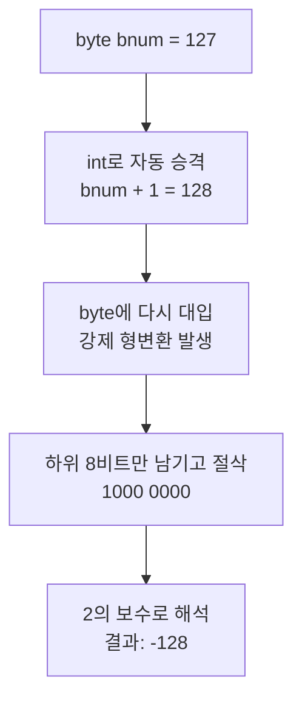

## 들어가며 (Situation)

Java 공부를 하다가 이런 코드를 만났다.

```java
byte bnum = 127;
bnum++;
System.out.println(bnum);
```

127 + 1이니까 당연히 128이 나올 줄 알았는데, 실제로 출력된 값은 **-128**이었다.
왜 이런 일이 생기는지 `bit`, `byte`, `overflow`, `underflow`, `type casting` 다섯 가지 키워드로 정리해 본다.

---

## 문제 상황 (Task)

정리하면 확인하고 싶은 것은 세 가지였다.

1. `byte`의 최댓값은 왜 하필 **127**인가? (256가지를 쓸 수 있다면서 왜 128이 아닌가)
2. 왜 하필 **-128**이라는 값이 나오는가?
3. 범위를 벗어났는데 왜 **에러 없이** 조용히 넘어가는가?

---

## 해결 과정 (Action)

### 1. bit와 byte: 숫자를 담는 상자의 크기

`bit`는 컴퓨터가 정보를 저장하는 가장 작은 단위로, 0 또는 1 하나만 담을 수 있다. 전등 스위치 하나가 켜짐/꺼짐 두 가지 상태만 가지는 것과 같다.

`byte`는 bit 8개를 묶은 단위다. 스위치 8개로 만들 수 있는 조합은 2⁸ = 256가지이므로, byte 하나로는 숫자를 256개까지만 표현할 수 있다.

Java의 `byte`는 **부호 있는(signed) 타입**이다. 맨 앞 비트를 부호 비트로 사용해서 0이면 양수, 1이면 음수로 해석하고, 음수는 2의 보수 방식으로 표현한다. 그래서 범위는 다음과 같다.

| 타입 | 크기 | 범위 |
|------|------|------|
| `byte` | 8 bit | -128 ~ 127 |
| `short` | 16 bit | -32,768 ~ 32,767 |
| `int` | 32 bit | -2,147,483,648 ~ 2,147,483,647 |
| `long` | 64 bit | -9,223,372,036,854,775,808 ~ 9,223,372,036,854,775,807 |

#### 왜 하필 최댓값이 127일까?

처음 이 표를 보고 "256가지를 표현할 수 있다면서 왜 128이 아니라 127에서 끝나지?"가 가장 헷갈렸다. 답은 **256칸을 음수와 양수가 나눠 갖는데, 0이 양수 쪽 자리 하나를 차지하기 때문**이다.

먼저 256가지 조합은 맨 앞 부호 비트에 따라 정확히 절반씩 갈린다.

| 비트 패턴 | 개수 | 표현하는 값 |
|-----------|------|-------------|
| `0xxx xxxx` (앞자리 0) | 128가지 | 0 ~ 127 |
| `1xxx xxxx` (앞자리 1) | 128가지 | -128 ~ -1 |

양수 쪽 128칸 중 한 칸(`0000 0000`)은 **0**이 가져간다. 그래서 실제로 쓸 수 있는 양수는 128개가 아니라 127개이고, 최댓값이 127이 된다. 반면 음수 쪽 128칸은 전부 음수에만 쓰이니 -1부터 -128까지 128개가 그대로 들어간다. **음수가 하나 더 많은 이유**가 바로 이것이다.

```text
0000 0000  →    0   ← 양수 쪽 한 칸을 0이 가져감
0000 0001  →    1
   ...
0111 1111  →  127   ← 앞자리 0으로 만들 수 있는 마지막 값
1000 0000  → -128   ← 여기서부터 음수
   ...
1111 1111  →   -1
```

이 규칙은 `byte`만의 특성이 아니라 모든 부호 있는 정수 타입에 똑같이 적용된다.

```text
n비트 부호 있는 정수의 범위 = -2^(n-1) ~ 2^(n-1) - 1
```

| 타입 | n | 최솟값 | 최댓값 |
|------|---|--------|--------|
| `byte` | 8 | -2⁷ = -128 | 2⁷-1 = **127** |
| `short` | 16 | -2¹⁵ = -32,768 | 2¹⁵-1 = 32,767 |
| `int` | 32 | -2³¹ | 2³¹-1 |

최댓값에 붙는 `-1`이 바로 **0에게 자리 하나를 내준 값**이다.

> 만약 "부호 비트 + 절댓값"(sign-magnitude) 방식을 썼다면 `0000 0000`(+0)과 `1000 0000`(-0)처럼 0이 두 개 생겨서 범위가 -127 ~ 127이 됐을 것이다. Java가 쓰는 **2의 보수**는 0이 하나뿐이라 남는 패턴 하나를 -128에 배정한 것이고, 덕분에 뺄셈을 덧셈 회로로 그대로 처리할 수 있다는 이점도 있다.

### 2. overflow: 상자가 넘칠 때

127을 2진수로 바꾸고 1을 더해 보자.

```text
  0111 1111   (127)
+ 0000 0001   (  1)
-----------
  1000 0000   (-128)
```

결과인 `1000 0000`은 맨 앞 부호 비트가 1이므로 음수로 해석되고, 2의 보수로 읽으면 **-128**이다.

이렇게 타입이 표현할 수 있는 최댓값을 넘어서 최솟값 쪽으로 넘어가는 현상을 **overflow**라고 한다. 시계가 12시 다음에 13시가 아니라 1시로 돌아가는 것처럼, 값이 한 바퀴 빙 돌아간다고 생각하면 이해하기 쉽다.

```text
... 125 → 126 → 127 → -128 → -127 → ...
                     ↑ 여기서 한 바퀴!
```

### 3. underflow: 반대 방향으로 넘칠 때

반대로 최솟값에서 1을 빼면 어떻게 될까?

```java
byte bnum = -128;
bnum--;
System.out.println(bnum);  // 127
```

```text
  1000 0000   (-128)
- 0000 0001   (   1)
-----------
  0111 1111   ( 127)
```

최솟값보다 작아져서 최댓값 쪽으로 넘어가는 현상을 흔히 **underflow**라고 부른다.

> 엄밀히 말하면 정수에서는 양쪽 방향 모두 "overflow"라고 하고, "underflow"는 원래 실수(`float`, `double`)가 0에 너무 가까워져서 표현할 수 없게 되는 현상을 뜻한다. 다만 입문 단계에서는 위와 같은 의미로 많이 쓰인다.

### 4. type casting: 에러 대신 -128이 나오는 진짜 이유

여기서 한 가지 의문이 생긴다. **범위를 넘으면 에러가 나야 하지 않을까?**

비밀은 `bnum++` 안에 숨어 있는 **type casting(형변환)** 에 있다. Java는 `byte` 값으로 산술 연산을 할 때 먼저 `int`로 자동 형변환(promotion)한다. 그래서 `bnum++`는 실제로 이렇게 동작한다.

```java
bnum = (byte)(bnum + 1);
```

순서대로 풀어 보면 이렇다.



1. `bnum + 1`은 `int`로 계산된다. `int`는 범위가 넓어서 128이 문제없이 나온다.
2. 이 `int` 값 128을 다시 `byte`에 넣기 위해 **강제 형변환(narrowing casting)** 이 일어난다.
3. 32비트 `int`를 8비트 `byte`로 줄이면서 **하위 8비트만 남기고** 나머지는 잘라낸다.

```text
int  128 = 0000 0000 0000 0000 0000 0000 1000 0000
                                         └─────────┘
byte     =                               1000 0000  → -128
```

큰 상자에 있던 값을 작은 상자에 억지로 옮겨 담다 보니 넘치는 부분이 잘려 나가고, 남은 모양이 -128이 된 것이다.

반면 아래처럼 직접 쓰면 컴파일 에러가 난다.

```java
bnum = bnum + 1;  // 에러: int를 byte에 넣을 수 없음
```

`++`, `+=` 같은 연산자는 형변환을 자동으로 포함하기 때문에 에러 없이 **조용히** overflow가 일어난다. 그래서 오히려 더 조심해야 한다.

같은 원리로 아래 결과도 이해할 수 있다.

```java
System.out.println((byte)128);  // -128
System.out.println((byte)200);  // -56  (200 - 256)
System.out.println((byte)256);  // 0    (하위 8비트가 모두 0)
```

### 5. 어떻게 피할 수 있을까?

범위를 넘을 가능성이 있는 값이라면 처음부터 `int`나 `long`처럼 더 큰 타입을 사용하는 것이 좋다. overflow가 발생했는지 확인하고 싶다면 `Math.addExact()`를 쓰면 된다. 이 메서드는 overflow가 발생하면 조용히 넘어가지 않고 `ArithmeticException`을 던진다.

```java
int result = Math.addExact(Integer.MAX_VALUE, 1);  // ArithmeticException 발생
```

| 방법 | 동작 | 언제 쓰나 |
|------|------|-----------|
| 더 큰 타입 사용 | 애초에 범위를 넘지 않음 | 값의 크기를 예측하기 어려울 때 |
| `Math.addExact()` | overflow 시 예외 발생 | 금액·카운터처럼 틀리면 안 되는 계산 |
| 그대로 두기 | 순환(wrap-around) | 해시 계산 등 순환이 의도된 경우 |

---

## 결과 (Result)

| 코드 | 예상한 값 | 실제 값 | 이유 |
|------|-----------|---------|------|
| `byte b = 127; b++;` | 128 | **-128** | int 계산 후 하위 8비트 절삭 |
| `byte b = -128; b--;` | -129 | **127** | 반대 방향 순환 |
| `(byte)200` | 200 | **-56** | 200 - 256 |
| `(byte)256` | 256 | **0** | 하위 8비트가 모두 0 |

`byte`는 8 bit 크기라서 -128 ~ 127까지만 표현할 수 있다. 256가지 조합을 음수와 양수가 절반씩 나눠 갖는데 0이 양수 쪽 자리 하나를 차지하므로, 최댓값은 128이 아니라 `2⁷-1 = 127`이 된다. `bnum++`는 내부적으로 `int`로 계산한 뒤 다시 `byte`로 강제 형변환하는데, 이때 하위 8비트만 남는다. 127 + 1의 결과인 `1000 0000`은 2의 보수로 -128이므로 overflow가 발생한 것이다. 반대로 -128에서 1을 빼면 127이 되는 underflow도 같은 원리다.

**한 줄 요약**: "작은 상자에 큰 숫자를 넣으면, 시계처럼 한 바퀴 돌아간다!" 🕐

---

## 더 학습하면 좋은 개념

- **2의 보수(Two's Complement)** — 음수를 별도의 부호 저장 없이 표현하는 방식. 왜 `1000 0000`이 -128로 읽히는지, 왜 음수 쪽이 하나 더 많은지를 근본적으로 이해할 수 있다.
- **정수 승격(Numeric Promotion)** — Java가 `byte`, `short`, `char` 연산을 무조건 `int`로 올려서 계산하는 규칙. 이 규칙을 알아야 `char + char`가 왜 숫자가 되는지 같은 함정을 피할 수 있다.
- **비트 연산자와 시프트(`&`, `|`, `<<`, `>>`, `>>>`)** — 형변환에서 일어나는 "하위 8비트만 남기기"는 사실 `& 0xFF`와 같은 연산이다. 비트 연산을 알면 절삭 과정을 직접 코드로 표현할 수 있다.
- **부동소수점 표현(IEEE 754)** — 정수와 달리 실수는 왜 `0.1 + 0.2 != 0.3`인지, 진짜 underflow가 무엇인지 설명해 준다.
- **`Math.addExact` / `Math.toIntExact` 계열 API** — 금액·수량처럼 overflow가 곧 버그가 되는 도메인에서 안전하게 계산하는 표준 방법.

---

## 참고 자료

- [Java Language Specification - Primitive Types and Values (§4.2)](https://docs.oracle.com/javase/specs/jls/se21/html/jls-4.html#jls-4.2)
- [Java Language Specification - Narrowing Primitive Conversion (§5.1.3)](https://docs.oracle.com/javase/specs/jls/se21/html/jls-5.html#jls-5.1.3)
- [Java Language Specification - Compound Assignment Operators (§15.26.2)](https://docs.oracle.com/javase/specs/jls/se21/html/jls-15.html#jls-15.26.2)
- [Java SE API - Math.addExact(int, int)](https://docs.oracle.com/en/java/javase/21/docs/api/java.base/java/lang/Math.html#addExact(int,int))
- [Java Tutorials - Primitive Data Types](https://docs.oracle.com/javase/tutorial/java/nutsandbolts/datatypes.html)
