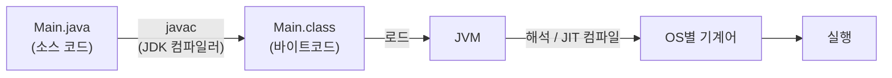
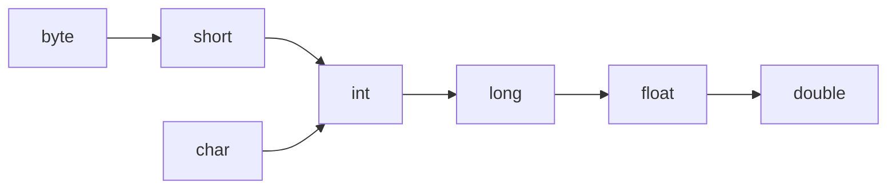
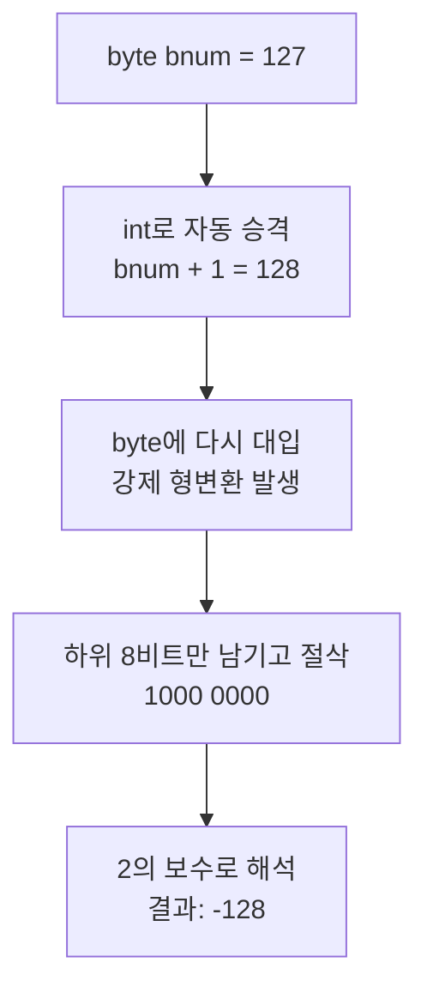

## 들어가며 (Situation)

Java 수업 첫날, chap01 `java-basic`에서 Java 프로그램의 기본기를 배웠다.

| 파일 | 주제 |
|------|------|
| `Helloworld.java`, `a_basic/Main.java` | 주석, Java 실행 과정 |
| `b_variable/module01/Application.java` | 리터럴, 자료형, 변수 선언과 초기화 |
| `b_variable/module01/Application2.java` | Scanner로 입력받기 |
| `b_variable/module02/Application.java` | 형변환 (암시적 / 명시적) |
| `c_operator/Application.java` | 산술·비교·논리·증감 연산자 |
| `b_variable/module01/app.java` | byte 127 + 1 실험 |

그리고 마지막 실험에서 이런 코드를 만났다.

```java
byte bnum = 127;
bnum++;
System.out.println(bnum);
```

127 + 1이니까 당연히 128이 나올 줄 알았는데, 실제로 출력된 값은 **-128**이었다.

## 문제 상황 (Task)

이 글에서 답하고 싶은 질문은 다음과 같다.

1. 내가 쓴 `.java` 파일은 **어떤 과정을 거쳐** 실행되는가?
2. 값을 담는 **자료형**에는 무엇이 있고, 서로 다른 자료형끼리는 어떻게 **변환**되는가?
3. 연산자를 쓸 때 **예상과 다른 결과**가 나오는 경우는 언제인가?
4. 그리고 가장 헷갈렸던 것. `byte`의 최댓값은 왜 **127**이고, 127 + 1은 왜 **에러 없이 -128**이 되는가?

4번은 1~3번에서 배운 자료형, 형변환, 증감 연산자가 한꺼번에 얽힌 문제였다. 그래서 순서대로 쌓아 올린 뒤 마지막에 풀었다.

## 해결 과정 (Action)

### 1. 주석과 Java 실행 과정

#### 주석

```java
// 한 줄 주석

/* 여러 줄 주석
 * 여러 줄의 필기를 진행할 수 있습니다.
 * */
```

수업에서는 IntelliJ의 TODO 설정(`설정 → TODO`)에 `comment.` 패턴을 추가했다. 그러면 필기용 주석이 주황색으로 표시돼서 일반 주석과 구분된다.

#### Java 프로그램은 어떻게 실행되나

```java
public class Main {
    public static void main(String[] args) {
        System.out.println("Hello World!!!!!~");
    }
}
```

- 모든 Java 코드는 **클래스 안에서** 동작한다.
- `main()` 메소드가 프로그램의 **시작점**이다.



| 단계 | 담당 | 결과물 |
|------|------|--------|
| 1. 코드 작성 | 개발자 | `.java` |
| 2. 컴파일 | `javac` (JDK에 포함) | `.class` (바이트코드) |
| 3. 로드·실행 | JVM | 바이트코드를 읽어 실행 |
| 4. 기계어 변환 | JVM (인터프리터, JIT 컴파일러) | 현재 OS·CPU용 기계어 |

`.class` 파일은 특정 OS가 아니라 JVM을 위한 코드다. 그래서 JVM만 있으면 Windows, macOS, Linux 어디서든 같은 `.class`를 실행할 수 있다. Java의 "Write Once, Run Anywhere"가 이 구조에서 나온다.

### 2. 리터럴, 자료형, 변수

#### 리터럴

**리터럴**은 코드에 직접 쓴 **값 그 자체**다. `10`, `3.14`, `'ㅎ'`, `"안녕하세요"`, `true`가 모두 리터럴이다.

#### 자료형

```java
// 정수
byte b = 10;      // 1byte
short s = 10;     // 2byte
int i = 10;       // 4byte
long l = 10;      // 8byte

// 실수
float f = 3.14f;  // 4byte
double d = 3.14;  // 8byte

// 문자 / 문자열
char ch = 'ㅎ';
String str = "안녕하세요";

// 논리
boolean bl = true;
```

| 분류 | 자료형 | 크기 | 리터럴 예시 | 비고 |
|------|--------|------|------------|------|
| 정수 | `byte` | 1byte | `10` | |
| 정수 | `short` | 2byte | `10` | |
| 정수 | `int` | 4byte | `10` | 정수 리터럴의 기본 타입 |
| 정수 | `long` | 8byte | `10`, `10L` | int 범위를 넘는 값은 `L`이 필요 |
| 실수 | `float` | 4byte | `3.14f` | **`f`를 빼면 컴파일 에러** |
| 실수 | `double` | 8byte | `3.14` | 실수 리터럴의 기본 타입 |
| 문자 | `char` | 2byte | `'ㅎ'` | 작은따옴표, 한 글자 |
| 논리 | `boolean` | — | `true`, `false` | |
| 문자열 | `String` | — | `"안녕하세요"` | 큰따옴표. 기본 자료형이 아닌 **참조 자료형**(클래스) |

`float f = 3.14;`가 에러인 이유는 `3.14`가 기본적으로 `double`(8byte) 리터럴이기 때문이다. 8byte 값을 4byte 상자에 넣으려면 `f`를 붙여 "이건 float 값이다"라고 알려 줘야 한다. 아래 형변환과 같은 원리다.

#### 변수 선언과 초기화

```java
int num;        // 선언: int 값을 담을 공간을 만든다
num = 30;       // 초기화: 처음으로 값을 넣는다
int num2 = 10;  // 선언과 동시에 초기화
```

같은 영역(`{ }`) 안에서 **같은 변수명을 두 번 선언할 수 없다.** 그래서 수업 코드도 두 번째 문자열은 `str2`라는 이름으로 선언했다.

#### Scanner로 입력받기

```java
Scanner sc = new Scanner(System.in);
System.out.print("당신의 이름을 입력하세요 : ");
String name = sc.nextLine();   // 한 줄 전체를 문자열로 입력받음

System.out.println("이름: " + name + "입니다!");
```

`System.out.print`는 줄을 바꾸지 않고, `println`은 출력 후 줄을 바꾼다. 그래서 입력 안내문 바로 옆에 커서가 놓인다.

### 3. 형변환 — 자료형을 다른 자료형으로

형변환(type conversion)은 값의 자료형을 바꾸는 것이다. 방향에 따라 두 가지로 나뉜다.

```java
// 명시적 형변환: 큰 타입 → 작은 타입
double dnum = 99.99;       // 8byte
int inum = (int) dnum;     // 4byte
System.out.println("dnum = " + dnum);   // 99.99
System.out.println("inum = " + inum);   // 99
```

`99.99`를 `int`로 바꾸면 `100`이 아니라 **`99`**가 된다. 반올림이 아니라 **소수점 아래를 버리기** 때문이다. 이렇게 값이 잘려 나갈 수 있어서 Java는 `(int)`를 직접 써야만 변환을 허락한다. `int inum = dnum;`처럼 쓰면 컴파일 에러가 난다.

```java
// 암시적 형변환: 작은 타입 → 큰 타입
int num2 = 100;           // 4byte
double dnum2 = num2;      // 8byte, 캐스트 없이 자동 변환 → 100.0
```

작은 상자의 값은 큰 상자에 그대로 들어가므로 손실이 없다. 그래서 컴파일러가 알아서 변환해 준다.

> 수업 코드에서는 암시적 형변환 예시를 `double dnum2 = (double) num2;`로 작성했다. `(double)`을 쓰면 형식상 명시적 형변환이다. 이 경우는 쓰지 않아도 자동으로 변환되므로, 암시적 형변환의 예로는 `double dnum2 = num2;`가 더 정확하다.

| 구분 | 방향 | 캐스트 연산자 | 데이터 손실 | 예시 |
|------|------|-------------|------------|------|
| 암시적 (widening) | 작은 → 큰 | 생략 가능 | 없음 | `double d = 100;` → `100.0` |
| 명시적 (narrowing) | 큰 → 작은 | **반드시 작성** | 있을 수 있음 | `(int) 99.99` → `99` |



화살표 방향(작은 → 큰)으로는 자동 변환되고, 반대 방향은 `(타입)`을 써야 한다.

> 참고로 `module02/Application.java`의 `main`은 `public` 없이 `static void main`으로 작성되어 있다. 수업 프로젝트의 JDK(27)에서는 Java 25부터 도입된 규칙 덕분에 실행되지만, 그보다 낮은 버전에서는 `public static void main(String[] args)`로 써야 프로그램 시작점으로 인식된다.

### 4. 연산자

수업 코드는 `int a = 10; int b = 3;`으로 테스트했다.

#### 산술 연산자 — 문자열과 정수 나눗셈 주의

```java
System.out.println("덧셈: " + a + b);     // 덧셈: 103  ← !!
System.out.println("덧셈: " + (a + b));   // 덧셈: 13
System.out.println("나눗셈: " + (a / b)); // 나눗셈: 3
System.out.println("나머지: " + (a % b)); // 나머지: 1
```

첫 줄에서 `13`이 아니라 `103`이 나온다. `+`는 **왼쪽부터 차례로** 계산되는데, 문자열과 `+`를 만나면 상대도 문자열로 바뀌어 이어 붙여지기 때문이다.

```text
"덧셈: " + a + b
= ("덧셈: " + 10) + 3
= "덧셈: 10" + 3
= "덧셈: 103"
```

숫자끼리 먼저 더하려면 `(a + b)`처럼 괄호로 묶어야 한다.

`10 / 3`이 `3.333...`이 아니라 `3`인 이유는 **정수끼리 나누면 결과도 정수**이기 때문이다. 소수점 아래는 버려진다. `%`는 나눈 **나머지**를 구하는 연산자로, 짝수·홀수 판별(`n % 2 == 0`)에 자주 쓰인다.

#### 비교 연산자

```java
System.out.println("a > b: " + (a > b));    // true
System.out.println("a != b: " + (a != b));  // true
```

| 연산자 | 의미 |
|--------|------|
| `==`, `!=` | 같다, 다르다 (`!`는 NOT) |
| `<`, `>`, `<=`, `>=` | 대소 비교 |

결과는 항상 `boolean`(`true` / `false`)이다.

#### 논리 연산자

```java
boolean isTrue = true;
boolean isFalse = false;
System.out.println("둘 다 참이니?: " + (isFalse && isTrue));        // false
System.out.println("둘 중 하나는 참이니?: " + (isFalse || isTrue)); // true
```

| 연산자 | 의미 | 결과가 `true`인 경우 |
|--------|------|-------------------|
| `&&` | AND | 둘 다 `true` |
| <code>&#124;&#124;</code> | OR | 하나라도 `true` |
| `!` | NOT | 피연산자가 `false` |

수업 주석에는 "**`A && B`에서 A와 B 중 무엇을 앞에 두느냐**"가 예전에 면접 질문으로 나왔다고 적혀 있었다. 이 질문의 답인 단축 평가는 [다음 날(9/29) 수업]({{ site.baseurl }})에서 자세히 다뤘다.

#### 증감 연산자 — 전위와 후위

```java
int age = 20;
System.out.println(" 초기 값 age: " + (age));  // 20
System.out.println("++age: " + (++age));       // 21
System.out.println("age: " + (age));           // 21
System.out.println("age ++ : " + (age++));     // 21  ← 아직 21!
System.out.println("age: " + (age));           // 22
```

| 형태 | 동작 순서 | 위 코드에서 출력 | 실행 후 age |
|------|----------|----------------|------------|
| `++age` (전위) | **먼저 1 증가**, 그다음 값 사용 | 21 | 21 |
| `age++` (후위) | **먼저 값 사용**, 그다음 1 증가 | 21 | 22 |

`age++`를 출력한 줄에서는 21이 나오고, 다음 줄에서야 22가 보인다. 증가는 했지만 **식에 쓰인 값은 증가 전 값**이기 때문이다.

### 5. 심화: byte에 127을 넣고 1을 더하면 왜 -128이 될까?

이제 처음 코드로 돌아간다. 이 문제를 풀려면 지금까지 배운 **자료형의 크기**, **형변환**, **증감 연산자**가 모두 필요하다. 확인하고 싶은 것은 세 가지였다.

1. `byte`의 최댓값은 왜 하필 **127**인가? (256가지를 쓸 수 있다면서 왜 128이 아닌가)
2. 왜 하필 **-128**이라는 값이 나오는가?
3. 범위를 벗어났는데 왜 **에러 없이** 조용히 넘어가는가?

#### 5-1. bit와 byte: 숫자를 담는 상자의 크기

`bit`는 컴퓨터가 정보를 저장하는 가장 작은 단위로, 0 또는 1 하나만 담을 수 있다. 전등 스위치 하나가 켜짐/꺼짐 두 가지 상태만 가지는 것과 같다.

`byte`는 bit 8개를 묶은 단위다. 스위치 8개로 만들 수 있는 조합은 2⁸ = 256가지이므로, byte 하나로는 숫자를 256개까지만 표현할 수 있다.

Java의 `byte`는 **부호 있는(signed) 타입**이다. 맨 앞 비트를 부호 비트로 사용해서 0이면 양수, 1이면 음수로 해석하고, 음수는 2의 보수 방식으로 표현한다. 그래서 범위는 다음과 같다.

| 타입 | 크기 | 범위 |
|------|------|------|
| `byte` | 8 bit | -128 ~ 127 |
| `short` | 16 bit | -32,768 ~ 32,767 |
| `int` | 32 bit | -2,147,483,648 ~ 2,147,483,647 |
| `long` | 64 bit | -9,223,372,036,854,775,808 ~ 9,223,372,036,854,775,807 |

#### 5-2. 왜 하필 최댓값이 127일까?

처음 이 표를 보고 "256가지를 표현할 수 있다면서 왜 128이 아니라 127에서 끝나지?"가 가장 헷갈렸다. 답은 **256칸을 음수와 양수가 나눠 갖는데, 0이 양수 쪽 자리 하나를 차지하기 때문**이다.

먼저 256가지 조합은 맨 앞 부호 비트에 따라 정확히 절반씩 갈린다.

| 비트 패턴 | 개수 | 표현하는 값 |
|-----------|------|-------------|
| `0xxx xxxx` (앞자리 0) | 128가지 | 0 ~ 127 |
| `1xxx xxxx` (앞자리 1) | 128가지 | -128 ~ -1 |

양수 쪽 128칸 중 한 칸(`0000 0000`)은 **0**이 가져간다. 그래서 실제로 쓸 수 있는 양수는 128개가 아니라 127개이고, 최댓값이 127이 된다. 반면 음수 쪽 128칸은 전부 음수에만 쓰이니 -1부터 -128까지 128개가 그대로 들어간다. **음수가 하나 더 많은 이유**가 바로 이것이다.

```text
0000 0000  →    0   ← 양수 쪽 한 칸을 0이 가져감
0000 0001  →    1
   ...
0111 1111  →  127   ← 앞자리 0으로 만들 수 있는 마지막 값
1000 0000  → -128   ← 여기서부터 음수
   ...
1111 1111  →   -1
```

이 규칙은 `byte`만의 특성이 아니라 모든 부호 있는 정수 타입에 똑같이 적용된다.

```text
n비트 부호 있는 정수의 범위 = -2^(n-1) ~ 2^(n-1) - 1
```

| 타입 | n | 최솟값 | 최댓값 |
|------|---|--------|--------|
| `byte` | 8 | -2⁷ = -128 | 2⁷-1 = **127** |
| `short` | 16 | -2¹⁵ = -32,768 | 2¹⁵-1 = 32,767 |
| `int` | 32 | -2³¹ | 2³¹-1 |

최댓값에 붙는 `-1`이 바로 **0에게 자리 하나를 내준 값**이다.

> 만약 "부호 비트 + 절댓값"(sign-magnitude) 방식을 썼다면 `0000 0000`(+0)과 `1000 0000`(-0)처럼 0이 두 개 생겨서 범위가 -127 ~ 127이 됐을 것이다. Java가 쓰는 **2의 보수**는 0이 하나뿐이라 남는 패턴 하나를 -128에 배정한 것이고, 덕분에 뺄셈을 덧셈 회로로 그대로 처리할 수 있다는 이점도 있다.

#### 5-3. overflow: 상자가 넘칠 때

127을 2진수로 바꾸고 1을 더해 보자.

```text
  0111 1111   (127)
+ 0000 0001   (  1)
-----------
  1000 0000   (-128)
```

결과인 `1000 0000`은 맨 앞 부호 비트가 1이므로 음수로 해석되고, 2의 보수로 읽으면 **-128**이다.

이렇게 타입이 표현할 수 있는 최댓값을 넘어서 최솟값 쪽으로 넘어가는 현상을 **overflow**라고 한다. 시계가 12시 다음에 13시가 아니라 1시로 돌아가는 것처럼, 값이 한 바퀴 빙 돌아간다고 생각하면 이해하기 쉽다.

```text
... 125 → 126 → 127 → -128 → -127 → ...
                     ↑ 여기서 한 바퀴!
```

#### 5-4. underflow: 반대 방향으로 넘칠 때

반대로 최솟값에서 1을 빼면 어떻게 될까?

```java
byte bnum = -128;
bnum--;
System.out.println(bnum);  // 127
```

```text
  1000 0000   (-128)
- 0000 0001   (   1)
-----------
  0111 1111   ( 127)
```

최솟값보다 작아져서 최댓값 쪽으로 넘어가는 현상을 흔히 **underflow**라고 부른다.

> 엄밀히 말하면 정수에서는 양쪽 방향 모두 "overflow"라고 하고, "underflow"는 원래 실수(`float`, `double`)가 0에 너무 가까워져서 표현할 수 없게 되는 현상을 뜻한다. 다만 입문 단계에서는 위와 같은 의미로 많이 쓰인다.

#### 5-5. type casting: 에러 대신 -128이 나오는 진짜 이유

여기서 한 가지 의문이 생긴다. **범위를 넘으면 에러가 나야 하지 않을까?**

비밀은 `bnum++` 안에 숨어 있는 **형변환**에 있다. Java는 `byte` 값으로 산술 연산을 할 때 먼저 `int`로 자동 형변환(promotion)한다. 그래서 `bnum++`는 실제로 이렇게 동작한다.

```java
bnum = (byte)(bnum + 1);
```

순서대로 풀어 보면 이렇다.



1. `bnum + 1`은 `int`로 계산된다. `int`는 범위가 넓어서 128이 문제없이 나온다. (3장의 **암시적 형변환**)
2. 이 `int` 값 128을 다시 `byte`에 넣기 위해 **강제 형변환(narrowing casting)**이 일어난다. (3장의 **명시적 형변환**)
3. 32비트 `int`를 8비트 `byte`로 줄이면서 **하위 8비트만 남기고** 나머지는 잘라낸다.

```text
int  128 = 0000 0000 0000 0000 0000 0000 1000 0000
                                         └─────────┘
byte     =                               1000 0000  → -128
```

큰 상자에 있던 값을 작은 상자에 억지로 옮겨 담다 보니 넘치는 부분이 잘려 나가고, 남은 모양이 -128이 된 것이다. `(int) 99.99`가 `99`가 된 것과 같은 "명시적 형변환의 데이터 손실"이다.

반면 아래처럼 직접 쓰면 컴파일 에러가 난다.

```java
bnum = bnum + 1;  // 에러: int를 byte에 넣을 수 없음
```

`++`, `+=` 같은 연산자는 형변환을 자동으로 포함하기 때문에 에러 없이 **조용히** overflow가 일어난다. 그래서 오히려 더 조심해야 한다.

같은 원리로 아래 결과도 이해할 수 있다.

```java
System.out.println((byte)128);  // -128
System.out.println((byte)200);  // -56  (200 - 256)
System.out.println((byte)256);  // 0    (하위 8비트가 모두 0)
```

#### 5-6. 어떻게 피할 수 있을까?

범위를 넘을 가능성이 있는 값이라면 처음부터 `int`나 `long`처럼 더 큰 타입을 사용하는 것이 좋다. overflow가 발생했는지 확인하고 싶다면 `Math.addExact()`를 쓰면 된다. 이 메서드는 overflow가 발생하면 조용히 넘어가지 않고 `ArithmeticException`을 던진다.

```java
int result = Math.addExact(Integer.MAX_VALUE, 1);  // ArithmeticException 발생
```

| 방법 | 동작 | 언제 쓰나 |
|------|------|-----------|
| 더 큰 타입 사용 | 애초에 범위를 넘지 않음 | 값의 크기를 예측하기 어려울 때 |
| `Math.addExact()` | overflow 시 예외 발생 | 금액·카운터처럼 틀리면 안 되는 계산 |
| 그대로 두기 | 순환(wrap-around) | 해시 계산 등 순환이 의도된 경우 |

## 결과 (Result)

첫날 배운 내용 중 **예상과 다른 결과**가 나왔던 코드를 모아 보면 이렇다.

| 코드 | 예상한 값 | 실제 값 | 이유 |
|------|-----------|---------|------|
| `"덧셈: " + 10 + 3` | 덧셈: 13 | **덧셈: 103** | 문자열 + 숫자는 이어 붙이기 |
| `10 / 3` | 3.333... | **3** | 정수끼리 나누면 정수 |
| `(int) 99.99` | 100 | **99** | 반올림이 아니라 버림 |
| `age++` (age = 21) | 22 | **21** | 후위 연산은 값을 먼저 사용 |
| `byte b = 127; b++;` | 128 | **-128** | int 계산 후 하위 8비트 절삭 |
| `byte b = -128; b--;` | -129 | **127** | 반대 방향 순환 |
| `(byte)200` | 200 | **-56** | 200 - 256 |
| `(byte)256` | 256 | **0** | 하위 8비트가 모두 0 |

`byte`는 8 bit 크기라서 -128 ~ 127까지만 표현할 수 있다. 256가지 조합을 음수와 양수가 절반씩 나눠 갖는데 0이 양수 쪽 자리 하나를 차지하므로, 최댓값은 128이 아니라 `2⁷-1 = 127`이 된다. `bnum++`는 내부적으로 `int`로 계산한 뒤 다시 `byte`로 강제 형변환하는데, 이때 하위 8비트만 남는다. 127 + 1의 결과인 `1000 0000`은 2의 보수로 -128이므로 overflow가 발생한 것이다.

**배운 점**

- 자료형은 단순히 "숫자냐 문자냐"가 아니라 **상자의 크기**다. 크기를 알아야 형변환과 overflow를 이해할 수 있다.
- Java는 위험한 변환(큰 → 작은)에 대해 캐스트를 요구하지만, `++`, `+=`처럼 **형변환이 숨어 있는 연산자**에서는 에러 없이 값이 바뀔 수 있다.

**한 줄 요약**: "작은 상자에 큰 숫자를 넣으면, 시계처럼 한 바퀴 돌아간다!" 🕐

## 더 학습하면 좋은 개념

- **JVM 구조와 JIT 컴파일러** — 바이트코드가 실제로 어떻게 기계어가 되는지, 왜 Java 프로그램이 처음엔 느리다가 점점 빨라지는지 설명해 준다.
- **2의 보수(Two's Complement)** — 음수를 별도의 부호 저장 없이 표현하는 방식. 왜 `1000 0000`이 -128로 읽히는지, 왜 음수 쪽이 하나 더 많은지를 근본적으로 이해할 수 있다.
- **정수 승격(Numeric Promotion)** — Java가 `byte`, `short`, `char` 연산을 무조건 `int`로 올려서 계산하는 규칙. 이 규칙을 알아야 `char + char`가 왜 숫자가 되는지 같은 함정을 피할 수 있다.
- **부동소수점 표현(IEEE 754)** — 정수와 달리 실수는 왜 `0.1 + 0.2 != 0.3`인지, 진짜 underflow가 무엇인지 설명해 준다.
- **`Math.addExact` / `Math.toIntExact` 계열 API** — 금액·수량처럼 overflow가 곧 버그가 되는 도메인에서 안전하게 계산하는 표준 방법.

## 참고 자료

- [Oracle Java Tutorials - The "Hello World!" Application](https://docs.oracle.com/javase/tutorial/getStarted/application/index.html)
- [Oracle Java Tutorials - About the Java Technology](https://docs.oracle.com/javase/tutorial/getStarted/intro/definition.html)
- [Oracle Java Tutorials - Primitive Data Types](https://docs.oracle.com/javase/tutorial/java/nutsandbolts/datatypes.html)
- [Oracle Java Tutorials - Assignment, Arithmetic, and Unary Operators](https://docs.oracle.com/javase/tutorial/java/nutsandbolts/op1.html)
- [Oracle Java Tutorials - Equality, Relational, and Conditional Operators](https://docs.oracle.com/javase/tutorial/java/nutsandbolts/op2.html)
- [Java Language Specification - Primitive Types and Values (§4.2)](https://docs.oracle.com/javase/specs/jls/se21/html/jls-4.html#jls-4.2)
- [Java Language Specification - Widening Primitive Conversion (§5.1.2)](https://docs.oracle.com/javase/specs/jls/se21/html/jls-5.html#jls-5.1.2)
- [Java Language Specification - Narrowing Primitive Conversion (§5.1.3)](https://docs.oracle.com/javase/specs/jls/se21/html/jls-5.html#jls-5.1.3)
- [Java Language Specification - Compound Assignment Operators (§15.26.2)](https://docs.oracle.com/javase/specs/jls/se21/html/jls-15.html#jls-15.26.2)
- [Java SE API - Math.addExact(int, int)](https://docs.oracle.com/en/java/javase/21/docs/api/java.base/java/lang/Math.html#addExact(int,int))
- [Java SE API - Scanner](https://docs.oracle.com/en/java/javase/21/docs/api/java.base/java/util/Scanner.html)
