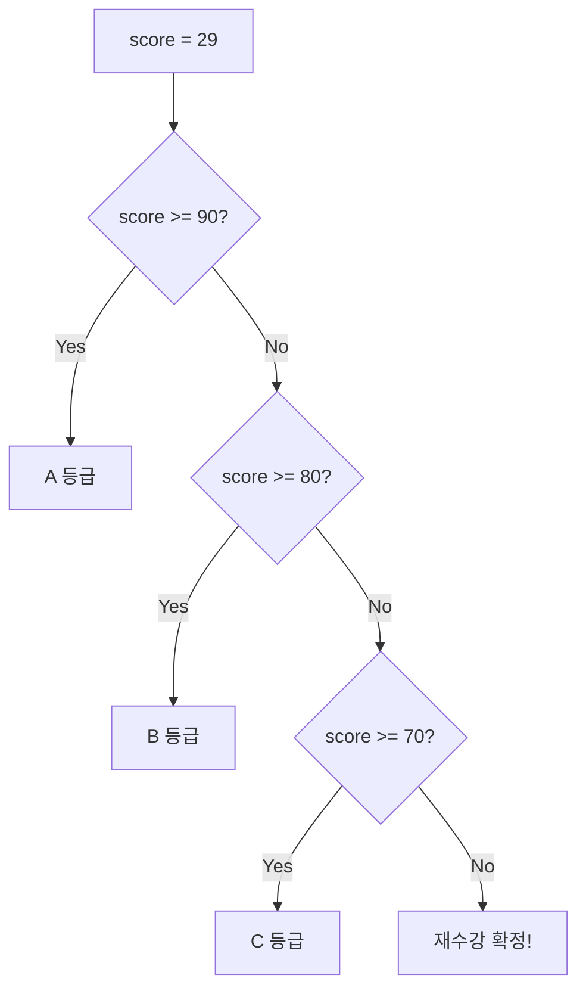
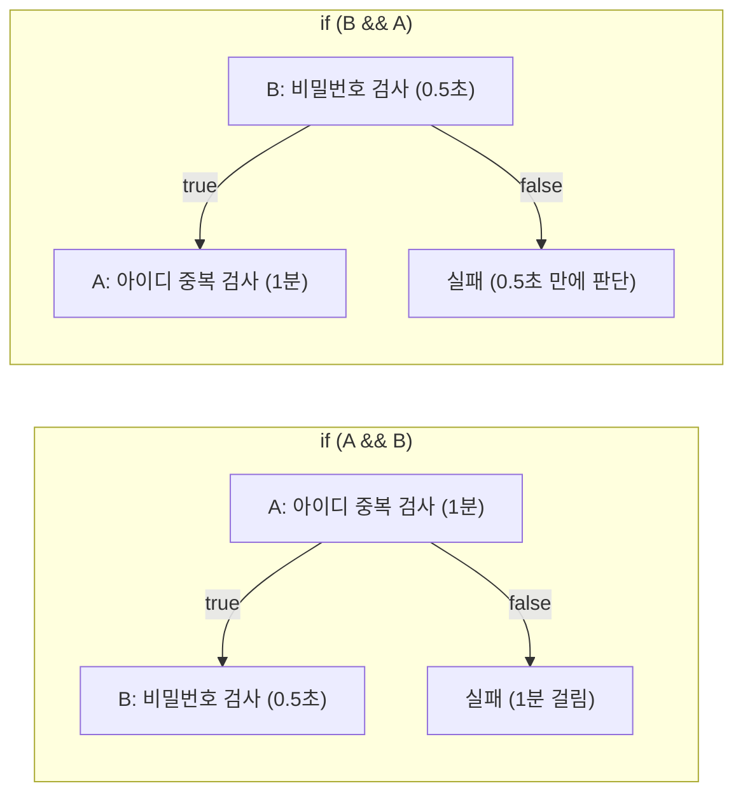
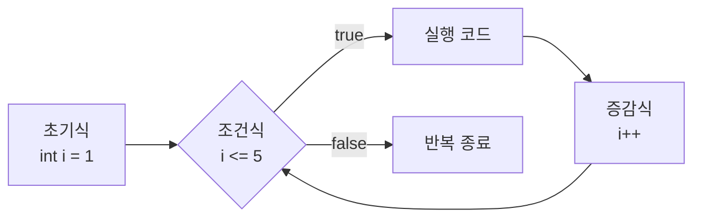
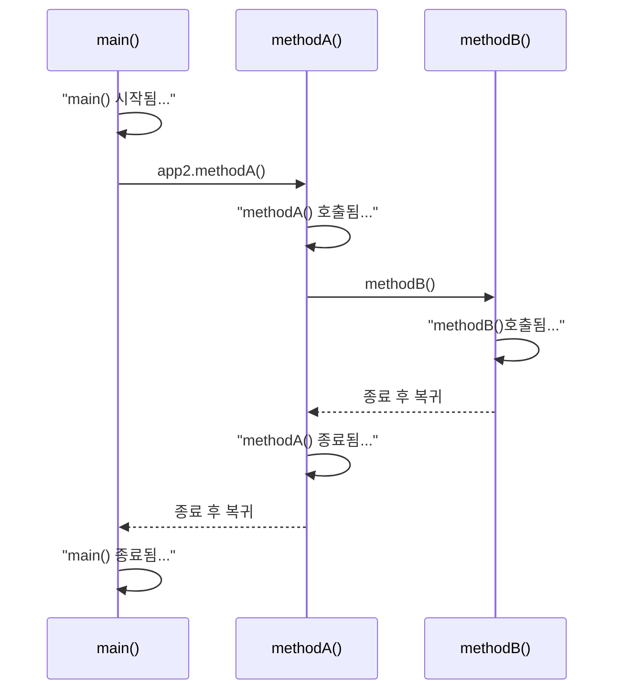

## 들어가며 (Situation)

Java 수업 chap02 `control-flow-and-method`에서 **프로그램의 흐름을 제어하는 방법**을 배웠다. chap01까지는 위에서 아래로 한 줄씩 실행되는 코드만 썼다. 이번에는 조건에 따라 흐름을 갈라 보고, 같은 동작을 반복하고, 코드를 메소드로 묶었다.

| 패키지 | 주제 |
|--------|------|
| `a_controlflow` | if / else if / else, Scanner 입력, 단축 평가, switch |
| `b_loop` | for, while, do-while |
| `c_method` | 메소드가 필요한 이유, 메소드 정의와 호출 흐름 |

## 문제 상황 (Task)

이번 챕터는 세 가지 질문으로 정리된다.

1. 상황에 따라 **다른 코드**를 실행하려면? → 조건문
2. 같은 코드를 **여러 번** 실행하려면? → 반복문
3. 같은 코드를 **여러 곳에서** 다시 쓰려면? → 메소드

예를 들어 두 수를 더하는 코드를 메소드 없이 쓰면 이렇게 된다.

```java
int num1 = 1;
int num2 = 2;
System.out.println("1번째 연산 결과: " + (num1 + num2));

int num3 = 3;
int num4 = 4;
System.out.println("2번째 연산 결과: " + (num3 + num4));
// 더할 때마다 변수 2줄 + 출력 1줄이 계속 늘어난다
```

이렇게 반복되는 코드를 줄이는 방법을 순서대로 정리했다.

## 해결 과정 (Action)

### 1. if문 — 조건에 따라 흐름을 "분기"한다

if문은 조건식의 결과(`true`/`false`)에 따라 실행할 코드를 고른다.

```java
int score = 29;
if (score >= 90) {
    System.out.println(" A 등급 입니다! ");
} else if (score >= 80) {
    System.out.println(" B 등급 입니다!");
} else if (score >= 70) {
    System.out.println(" C 등급 입니다!");
} else {
    System.out.println(" 재수강 확정!");
}
```



`else if`는 **위에서부터 차례로 검사하다가 처음 `true`인 블록 하나만 실행**한다. 그래서 `score >= 80`까지 왔다는 건 이미 90 미만이라는 뜻이다. 조건을 `score >= 80 && score < 90`처럼 쓸 필요가 없다.

#### Scanner로 입력받아 분기하기

콘솔에서 값을 입력받으려면 `Scanner`를 쓴다.

```java
Scanner sc = new Scanner(System.in);
System.out.print("나이를 입력해주세요 : ");
int age = sc.nextInt();          // 입력값을 int로 받는다

double discountRate;
if (age < 13) {
    discountRate = 0.5;          // 청소년 50%
} else if (age >= 65) {
    discountRate = 0.3;          // 노약자 30%
} else {
    discountRate = 0.0;
}
System.out.println("나이: " + age + ", 할인율: " + (discountRate * 100) + "%");
```

```text
나이를 입력해주세요 : 10
나이: 10, 할인율: 50.0%
```

`discountRate`가 `double`이라서 `50%`가 아니라 `50.0%`로 출력된다. `discountRate`를 선언만 하고 초기화하지 않았는데도 에러가 나지 않는다. `if / else if / else`의 **모든 경로에서 값이 대입되기 때문**이다. 마지막 `else`를 지우면 "값이 없을 수도 있다"는 컴파일 에러가 난다.

### 2. 단축 평가 — 조건의 순서가 성능에 영향을 준다

`&&`와 `||`는 **왼쪽만 보고 결과가 정해지면 오른쪽은 실행하지 않는다.** 이것을 단축 평가(short-circuit evaluation)라고 한다.

| 연산자 | 결과가 `true`인 경우 | 오른쪽을 건너뛰는 경우 | 왼쪽에 둘 조건 |
|--------|---------------------|----------------------|---------------|
| `A && B` | 둘 다 `true` | A가 `false`일 때 | `false`가 될 확률이 높은 조건 |
| <code>A &#124;&#124; B</code> | 하나라도 `true` | A가 `true`일 때 | `true`가 될 확률이 높은 조건 |

수업에서 든 회원가입 예시가 이해하기 쉬웠다.

| 조건 | 내용 | 걸리는 시간 |
|------|------|------------|
| A | 아이디 중복 검사 | 1분 |
| B | 비밀번호 8글자 미만 검사 | 0.5초 |



비밀번호가 짧아서 실패할 사용자라면 `B && A` 순서일 때 0.5초 만에 결과를 알 수 있다. **빠르고 실패하기 쉬운 조건을 왼쪽에 두면** 불필요한 작업을 건너뛸 수 있다.

> 수업 코드(`Application03`)에서는 `System.nanoTime()`으로 조건 순서별 시간을 재 봤다. 다만 if문 하나를 한 번 실행한 시간은 수십~수백 ns 수준이다. 이 정도는 측정 순서나 JVM 워밍업에 따라 결과가 쉽게 뒤집힌다. 그리고 조건이 하나뿐인 `if-else`는 단축 평가와 상관이 없다. 단축 평가의 효과는 위 회원가입 예시처럼 **`&&`·`||`로 연결한 조건 중 오른쪽이 무거운 작업일 때** 확실하게 드러난다.

### 3. switch문 — 값이 딱 정해진 다중 분기

비교할 값이 정해져 있는 경우(1월, 2월, 3월…)에는 `if-else`를 길게 이어 쓰는 것보다 `switch`가 읽기 쉽다.

```java
int month = 1;

switch (month) {
    case 1:
        System.out.println("1월~");
        break;
    case 2:
        System.out.println("2월~");
        break;
    case 3:
        System.out.println("3월~");
        break;
    default:   // if문의 else 역할
        System.out.println("그 외의 월입니다!");
}
```

| 키워드 | 역할 |
|--------|------|
| `switch (식)` | 비교할 값. 정수형(`int`, `char` 등), `String`, `enum` 가능 |
| `case 값:` | 식과 값이 같으면 여기서부터 실행 |
| `break` | switch 블록을 빠져나간다 |
| `default` | 일치하는 `case`가 없을 때 실행 |

`break`를 빼먹으면 **다음 `case`까지 이어서 실행된다(fall-through).** `case 1`에 `break`가 없으면 `month = 1`일 때 "1월~"과 "2월~"이 둘 다 출력된다.

| 상황 | 추천 |
|------|------|
| 범위 비교 (`score >= 90`) | if-else |
| 특정 값과 일치하는지 비교 (`month == 1`) | switch |

### 4. 반복문 — for, while, do-while

#### for문: 반복 횟수가 정해져 있을 때

```java
for (int i = 1; i <= 5; i++) {
    if (i % 2 == 0) {                 // 2로 나눈 나머지가 0이면 짝수
        System.out.println("침묵함...");
    } else {
        System.out.println("성원님" + i + "번 했습니다~");
    }
    System.out.println("성원님" + i + "번 했습니다~");
}
```



초기식은 **처음 한 번만** 실행된다. 그다음부터는 `조건식 → 실행 코드 → 증감식`이 계속 반복된다.

이 코드에서는 if-else 블록 **바깥**에도 출력문이 하나 더 있다. 그래서 실제 출력은 이렇게 나온다.

```text
성원님1번 했습니다~
성원님1번 했습니다~
침묵함...
성원님2번 했습니다~
성원님3번 했습니다~
성원님3번 했습니다~
...
```

짝수일 때 "침묵"만 하려면 마지막 출력문을 지워야 한다. 중괄호 `{ }` 안팎 중 어디에 코드를 두는지에 따라 결과가 달라진다는 걸 확인할 수 있었다.

#### while문: 조건이 참인 동안

```java
int count = 0;
while (count <= 5) {
    System.out.println("카운트" + count);
    count++;          // 이 줄이 없으면 무한 반복
}
// 카운트0 ~ 카운트5 (총 6번)
```

#### do-while문: 일단 한 번은 실행

```java
int num = 0;
do {
    System.out.println("0~2까지 반복 출력 : " + num);
    num++;
} while (num < 3);
```

| 구분 | for | while | do-while |
|------|-----|-------|----------|
| 조건 검사 시점 | 실행 전 | 실행 전 | 실행 **후** |
| 최소 실행 횟수 | 0회 | 0회 | **1회** |
| 주로 쓰는 상황 | 반복 횟수가 정해짐 | 반복 횟수가 불확실, 조건에 따라 종료 | 최소 1번은 실행해야 함 (예: 메뉴 입력) |
| 증감식 위치 | 괄호 안 `for(;;i++)` | 블록 안에 직접 | 블록 안에 직접 |

### 5. 메소드 — 반복되는 코드에 이름을 붙인다

메소드는 **특정 작업을 수행하는 코드 블록**이다. 한 번 만들어 두면 이름으로 몇 번이든 다시 부를 수 있다.

```java
// [접근제어자] [반환타입] 메소드명([매개변수 타입 매개변수명]) { ... [return 반환값;] }
public int sumTwoNumber(int a, int b) {
    return a + b;
}
```

처음 문제였던 두 수 더하기는 이렇게 바뀐다.

```java
Application01 app = new Application01();   // 메소드를 가진 객체 준비
System.out.println("3번째 연산 :  " + app.sumTwoNumber(5, 6));    // 11
System.out.println("4번째 연산 :  " + app.sumTwoNumber(7, 8));    // 15
System.out.println("5번째 연산 :  " + app.sumTwoNumber(9, 10));   // 19
```

`new Application01()`이 필요한 이유는 `sumTwoNumber`에 `static`이 없기 때문이다. `static`이 없는 메소드는 객체를 만들어야 호출할 수 있다. 이 부분은 chap03의 `static` 키워드에서 더 자세히 다룬다.

#### 메소드 호출 흐름

메소드가 다른 메소드를 부르면, 호출된 메소드가 **끝난 다음에야** 원래 자리로 돌아온다.

```java
public static void main(String[] args) {
    System.out.println("main() 시작됨...");
    Application02 app2 = new Application02();
    app2.methodA();
    System.out.println("main() 종료됨...");
}

public void methodA() {
    System.out.println("methodA() 호출됨...");
    methodB();
    System.out.println("methodA() 종료됨...");
}

public void methodB() {
    System.out.println("methodB()호출됨...");
}
```



```text
main() 시작됨...
methodA() 호출됨...
methodB()호출됨...
methodA() 종료됨...
main() 종료됨...
```

두 가지가 중요했다.

- `methodB()`를 만들기만 하고 **아무도 부르지 않으면 실행되지 않는다.** 프로그램은 항상 `main()`에서 시작하고, 호출된 메소드만 실행된다.
- `methodA()` 안에서는 `methodB()`를 객체 없이 바로 부를 수 있다. 둘 다 같은 객체(`app2`)의 메소드이기 때문이다. 정확히는 `this.methodB()`가 생략된 것이다.

## 결과 (Result)

처음 세 가지 질문에 대한 답을 정리하면 다음과 같다.

| 질문 | 도구 | 핵심 |
|------|------|------|
| 상황마다 다른 코드를 실행하려면? | if-else, switch | 범위는 if, 정해진 값은 switch |
| 같은 코드를 여러 번 실행하려면? | for, while, do-while | 횟수가 정해지면 for, 조건 중심이면 while, 최소 1회면 do-while |
| 같은 코드를 여러 곳에서 쓰려면? | 메소드 | 이름을 붙여 묶고, 매개변수로 값을 받고, return으로 돌려준다 |

두 수 더하기 예시는 이렇게 바뀌었다.

| | 메소드 없이 | 메소드 사용 |
|---|------------|------------|
| 연산 1회당 코드 | 3줄 (변수 2 + 출력 1) | 1줄 (호출) |
| 더하는 방식을 바꾸고 싶을 때 | 모든 곳을 수정 | 메소드 1곳만 수정 |

**배운 점**

- 같은 결과가 나오는 코드여도 조건의 순서에 따라 불필요한 작업이 생길 수 있다.
- 메소드는 정의만 해서는 실행되지 않는다. 호출해야 실행되고, 끝나면 호출한 자리로 돌아온다.

## 더 학습하면 좋은 개념

- **switch 표현식 (Java 14+)** — `case 1 -> "1월";`처럼 화살표 문법을 쓰면 `break` 없이도 fall-through가 일어나지 않는다. switch 결과를 변수에 바로 담을 수도 있다. 최신 Java 코드에서 자주 보인다.
- **break / continue와 레이블** — 반복문을 중간에 끝내거나 이번 회차만 건너뛰는 방법이다. 중첩 반복문을 한 번에 빠져나올 때는 레이블이 필요하다.
- **콜 스택 (Call Stack)** — 메소드 호출 흐름이 "나중에 부른 것이 먼저 끝나는" 이유다. 재귀 함수와 `StackOverflowError`를 이해하는 기반이 된다.
- **static 메소드** — `main()`에는 `static`이 붙어 있는데, `sumTwoNumber()`는 왜 `new`로 객체를 만들어야 호출할 수 있을까? chap03 객체지향으로 이어지는 질문이다.
- **마이크로 벤치마크와 JMH** — `System.nanoTime()` 한 번으로 성능을 재면 왜 결과를 믿기 어려운지(JIT 컴파일, 워밍업) 알 수 있다. 성능 비교를 제대로 하는 방법이다.

## 참고 자료

- [Oracle Java Tutorials - The if-then and if-then-else Statements](https://docs.oracle.com/javase/tutorial/java/nutsandbolts/if.html)
- [Oracle Java Tutorials - The switch Statement](https://docs.oracle.com/javase/tutorial/java/nutsandbolts/switch.html)
- [Oracle Java Tutorials - The while and do-while Statements](https://docs.oracle.com/javase/tutorial/java/nutsandbolts/while.html)
- [Oracle Java Tutorials - The for Statement](https://docs.oracle.com/javase/tutorial/java/nutsandbolts/for.html)
- [Oracle Java Tutorials - Equality, Relational, and Conditional Operators](https://docs.oracle.com/javase/tutorial/java/nutsandbolts/op2.html)
- [JLS 15.23 - Conditional-And Operator &&](https://docs.oracle.com/javase/specs/jls/se21/html/jls-15.html#jls-15.23)
- [Oracle Java Tutorials - Defining Methods](https://docs.oracle.com/javase/tutorial/java/javaOO/methods.html)
- [Java SE 21 API - Scanner](https://docs.oracle.com/en/java/javase/21/docs/api/java.base/java/util/Scanner.html)
- [Java Language Guide - Switch Expressions](https://docs.oracle.com/en/java/javase/21/language/switch-expressions-and-statements.html)
