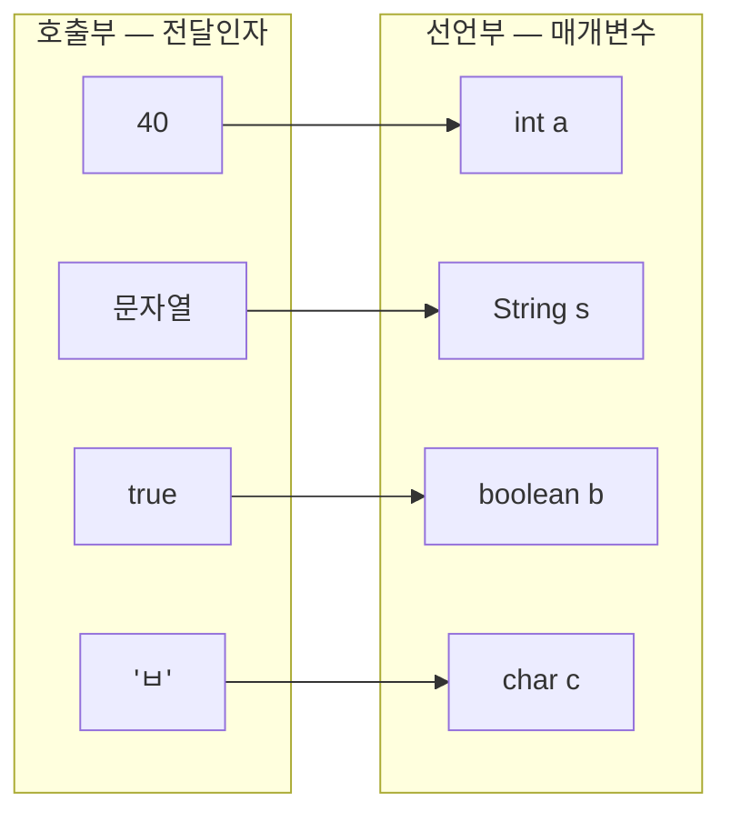
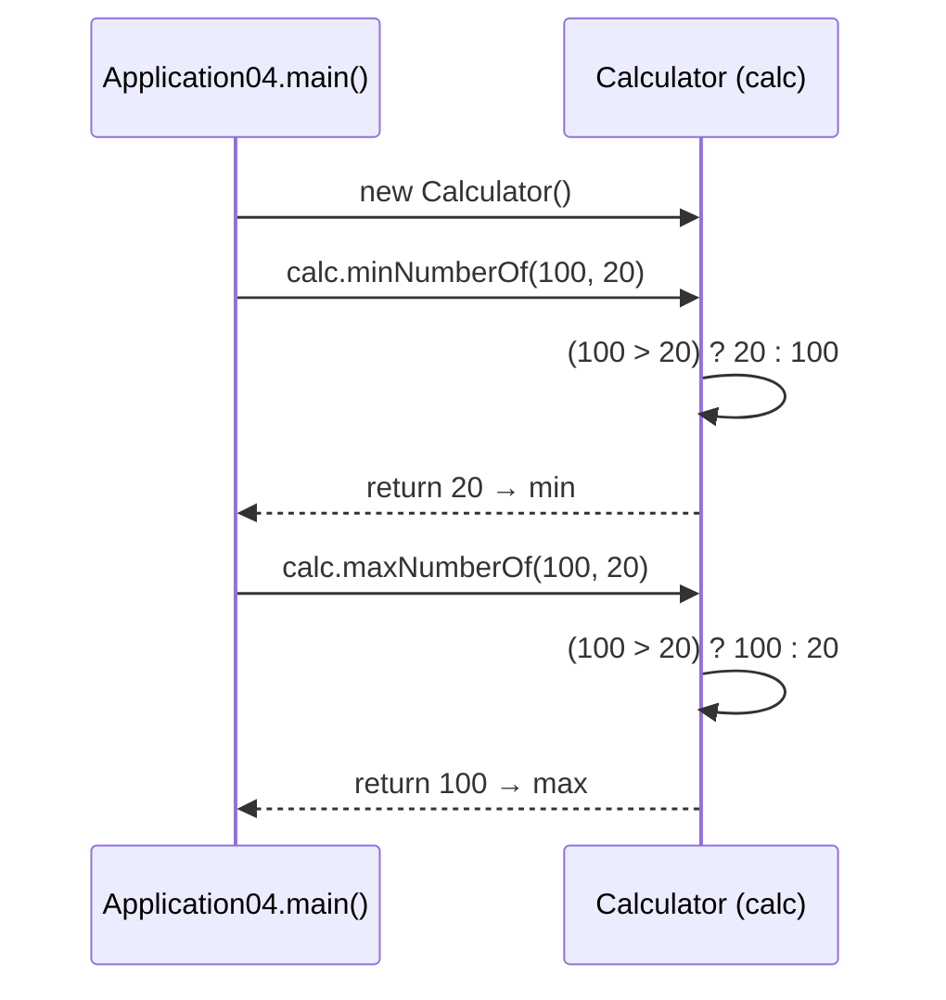
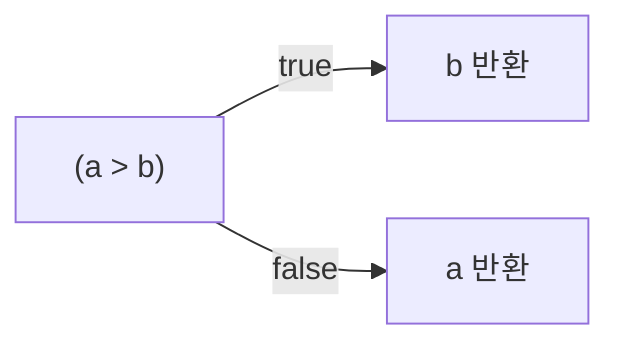

## 들어가며 (Situation)

[어제(9/29) 수업]({{ site.baseurl }})에서는 메소드를 처음 만들었다. 반복되는 코드를 메소드로 묶었고, `main → methodA → methodB` 순서로 호출 흐름을 따라가 봤다.

오늘은 chap02 `c_method`의 나머지 부분을 배웠다.

| 파일 | 주제 |
|------|------|
| `Application03.java` | 전달인자와 매개변수, 반환타입, 접근제어자 |
| `Application04.java` | 다른 클래스에 있는 메소드 호출하기 |
| `Calculator.java` | 최솟값·최댓값 메소드, 삼항 연산자 |

## 문제 상황 (Task)

어제 만든 `methodA()`, `methodB()`는 값을 받지도 돌려주지도 않았다. 호출하면 출력만 하고 끝났다. 실제로 쓸모 있는 메소드가 되려면 세 가지가 더 필요하다.

1. 메소드에 **값을 넘겨주려면?** → 매개변수와 전달인자
2. 메소드가 계산한 결과를 **돌려받으려면?** → 반환타입과 `return`
3. 메소드를 **다른 클래스에 모아 두고** 가져다 쓰려면? → 객체 생성과 접근제어자

## 해결 과정 (Action)

### 1. 매개변수와 전달인자 — 메소드에 값을 넘기는 통로

```java
public class Application03 {

    public static void main(String[] args) {
        Application03 app3 = new Application03();
        int x = app3.testMethod(40, "문자열", true, 'ㅂ');   // 전달인자 (argument)

        System.out.println("당신의 나이는" + x + " 세 입니다. ");
    }

    public int testMethod(int a, String s, boolean b, char c) {   // 매개변수 (parameter)
        return a;
    }
}
```

```text
당신의 나이는40 세 입니다. 
```

호출할 때 넘긴 값(전달인자)이 메소드 선언부의 변수(매개변수)에 **순서대로 하나씩** 들어간다.



| 용어 | 위치 | 예시 |
|------|------|------|
| 매개변수 (parameter) | 메소드 **선언부**에서 값을 받을 변수 | `int a, String s, boolean b, char c` |
| 전달인자 (argument) | 메소드 **호출부**에서 실제로 넘기는 값 | `40, "문자열", true, 'ㅂ'` |

전달인자는 매개변수와 **개수, 순서, 타입이 모두 맞아야** 한다. 하나라도 어긋나면 컴파일 에러가 난다. 아래는 이해를 돕기 위한 **예시 코드**다.

```java
// 예시 코드
app3.testMethod(40, "문자열", true);            // X — 개수가 부족 (char c가 없음)
app3.testMethod("문자열", 40, true, 'ㅂ');      // X — 순서가 다름 (int 자리에 String)
app3.testMethod(40, "문자열", "true", 'ㅂ');    // X — 타입이 다름 (boolean 자리에 String)
```

### 2. 반환타입과 return — 결과를 돌려받는다

메소드 이름 앞에 쓰는 **반환타입**은 "이 메소드가 끝나면 어떤 타입의 값을 돌려주는지"를 정한다.

```java
//     ↓ 반환타입
public int testMethod(int a, String s, boolean b, char c) {
    return a;   // ← int 값을 돌려준다
}
```

`testMethod`는 `int`를 반환한다. 그래서 호출한 자리에 반환값이 그대로 들어가고, `int x`에 담을 수 있다.

```java
int x = app3.testMethod(40, "문자열", true, 'ㅂ');
//      └──────────── 실행 후 40으로 바뀐다 ────────────┘
```

| 반환타입 | `return` | 호출 결과를 변수에 담을 수 있나? | 예시 |
|----------|----------|------------------------------|------|
| `void` | 생략 가능 (값 없이 `return;`만 가능) | X | 어제의 `methodA()` |
| `int`, `String` 등 | **생략 불가**, 반환타입과 같은 타입의 값 필수 | O | `testMethod()`, `minNumberOf()` |

수업 코드 주석에도 "반환타입이 `void`가 아니라면 `return`은 생략될 수 없다"고 적혀 있다. `return a;`를 지우면 "missing return statement" 컴파일 에러가 난다.

### 3. 접근제어자 — 누가 이 메소드를 부를 수 있나

메소드 형식의 맨 앞 `[접근제어자]` 자리에는 **이 메소드를 어디서 호출할 수 있는지**를 정하는 키워드가 온다.

```java
// [접근제어자] [반환타입] 메소드명([매개변수 타입 매개변수명]) { 실행할 코드; [return 반환값;] }
   public       int       testMethod(int a, String s, boolean b, char c) { return a; }
```

| 접근제어자 | 같은 클래스 | 같은 패키지 | 자식 클래스 (다른 패키지) | 전체 |
|-----------|:----------:|:----------:|:------------------------:|:----:|
| `public` | O | O | O | O |
| `protected` | O | O | O | X |
| (default, 생략) | O | O | X | X |
| `private` | O | X | X | X |

위에서 아래로 갈수록 접근할 수 있는 범위가 좁아진다. 아무것도 쓰지 않은 **default**는 "같은 패키지까지만 허용"이라는 뜻이다. 이름이 `default`라고 해서 실제로 `default`라고 쓰는 건 아니다.

오늘 수업에서 `Application04`가 `Calculator`의 메소드를 부를 수 있었던 것도 두 클래스가 같은 패키지(`com.wanted.c_method`)에 있고, 메소드가 `public`이기 때문이다. `minNumberOf`를 `private`으로 바꾸면 `Application04`에서는 호출할 수 없다.

### 4. 다른 클래스의 메소드 호출하기

지금까지는 `main()`이 있는 클래스 **안에** 메소드를 만들어 호출했다. 오늘은 계산 기능을 `Calculator`라는 별도 클래스로 분리했다.

```java
public class Calculator {

    // 두 정수 중 최솟값을 반환
    public int minNumberOf(int a, int b) {
        return (a > b) ? b : a;
    }

    // 두 정수 중 최댓값을 반환
    public int maxNumberOf(int a, int b) {
        return (a > b) ? a : b;
    }
}
```

```java
public class Application04 {

    public static void main(String[] args) {
        int first = 100;
        int second = 20;

        // 1. 호출 준비
        Calculator calc = new Calculator();

        // 2. 최솟값 메소드 호출
        int min = calc.minNumberOf(first, second);
        System.out.println(first + ", " + second + " 두 수 중 최솟값은 : " + min + "입니다.");

        // 3. 최댓값 메소드 호출
        int max = calc.maxNumberOf(first, second);
        System.out.println(first + ", " + second + " 두 수 중 최댓값은 : " + max + "입니다.");
    }
}
```

```text
100, 20 두 수 중 최솟값은 : 20입니다.
100, 20 두 수 중 최댓값은 : 100입니다.
```



호출 방법은 어제와 같다. **`클래스명 변수명 = new 클래스명();`으로 준비한 뒤 `변수명.메소드명()`으로 호출**한다. 다른 점은 메소드가 `main()`과 다른 클래스에 있다는 것뿐이다.

| | 같은 클래스의 메소드 (어제) | 다른 클래스의 메소드 (오늘) |
|---|--------------------------|--------------------------|
| 객체 생성 | `new Application01()` | `new Calculator()` |
| 호출 | `app.sumTwoNumber(5, 6)` | `calc.minNumberOf(100, 20)` |
| 장점 | 간단한 예제에 적합 | 기능별로 클래스를 나눠 관리하고, 여러 곳에서 재사용 |

계산 기능이 `Calculator`에 모여 있으면 다른 프로그램에서도 `new Calculator()` 한 줄로 최솟값·최댓값 기능을 가져다 쓸 수 있다. "계산은 Calculator가, 실행 흐름은 main이" 맡도록 **역할을 나눈 것**이다.

### 5. 삼항 연산자 — 값 하나를 고르는 짧은 if-else

`Calculator`의 메소드는 삼항 연산자로 한 줄에 끝난다.

```java
return (a > b) ? b : a;
//     조건식    참  거짓
```



같은 코드를 if-else로 쓰면 이렇다(**예시 코드**).

```java
// 예시 코드 — minNumberOf를 if-else로 작성
public int minNumberOf(int a, int b) {
    if (a > b) {
        return b;
    } else {
        return a;
    }
}
```

| 구분 | if-else | 삼항 연산자 |
|------|---------|------------|
| 형태 | 문장(statement) — 코드를 실행 | 연산자 — **값**을 만든다 |
| 길이 | 5~6줄 | 1줄 |
| 어울리는 상황 | 분기마다 실행할 코드가 여러 줄일 때 | 조건에 따라 값 하나를 고를 때 |
| 주의 | — | 중첩하면(`a ? b : c ? d : e`) 읽기 어려워진다 |

삼항 연산자는 결과가 **값**이라서 `return` 뒤나 변수 대입문에 바로 쓸 수 있다.

## 결과 (Result)

처음 세 가지 질문의 답을 정리하면 다음과 같다.

| 질문 | 도구 | 핵심 |
|------|------|------|
| 메소드에 값을 넘기려면? | 매개변수 / 전달인자 | 개수·순서·타입이 일치해야 한다 |
| 결과를 돌려받으려면? | 반환타입 / `return` | `void`가 아니면 `return` 필수, 호출한 자리가 반환값으로 바뀐다 |
| 다른 클래스의 메소드를 쓰려면? | `new` + 접근제어자 | 객체를 만들어 `변수.메소드()`로 호출, 접근제어자가 허용해야 한다 |

어제와 오늘 만든 메소드를 비교하면 메소드가 점점 "쓸모 있는" 형태가 되는 게 보인다.

| 메소드 | 매개변수 | 반환값 | 위치 |
|--------|---------|--------|------|
| `methodA()` (9/29) | 없음 | 없음 (`void`) | 같은 클래스 |
| `sumTwoNumber(a, b)` (9/29) | 2개 | `int` | 같은 클래스 |
| `testMethod(a, s, b, c)` (9/30) | 4개 (서로 다른 타입) | `int` | 같은 클래스 |
| `minNumberOf(a, b)` (9/30) | 2개 | `int` | **다른 클래스** |

**배운 점**

- 메소드 호출식은 실행이 끝나면 **반환값으로 바뀐다.** 그래서 `int min = calc.minNumberOf(...)`처럼 변수에 바로 담을 수 있다.
- 기능을 별도 클래스로 나누면 `main()`은 흐름만 담당하고, 실제 계산은 그 기능을 가진 클래스가 담당하게 된다.

## 더 학습하면 좋은 개념

- **Java의 값 전달 (Pass by Value)** — 메소드 안에서 매개변수 값을 바꿔도 호출한 쪽 변수는 바뀌지 않는다. 객체를 넘길 때는 어떻게 동작하는지까지 알아두면 버그를 많이 피할 수 있다.
- **메소드 오버로딩** — 같은 이름으로 매개변수만 다른 메소드를 여러 개 만드는 방법이다. 오늘 배운 "개수·순서·타입"이 바로 오버로딩을 구분하는 기준(메소드 시그니처)이 된다. ([10/6 OOP 정리]({{ site.baseurl }})에서 이어진다.)
- **static 메소드** — `Math.max(a, b)`처럼 `new` 없이 `클래스명.메소드()`로 바로 부르는 방법이다. `Calculator`처럼 상태 없이 계산만 하는 클래스는 static으로 만드는 경우가 많다.
- **캡슐화와 private** — 접근제어자를 단순 문법이 아니라 "외부에 무엇을 보여주고 무엇을 숨길지" 정하는 설계 도구로 보는 관점이다. 객체지향의 핵심 원칙 중 하나다.
- **가변 인자 (varargs)** — `int... nums`처럼 개수가 정해지지 않은 전달인자를 받는 방법이다. 두 수가 아니라 여러 수 중 최솟값을 구하는 메소드로 확장할 수 있다.

## 참고 자료

- [Oracle Java Tutorials - Defining Methods](https://docs.oracle.com/javase/tutorial/java/javaOO/methods.html)
- [Oracle Java Tutorials - Passing Information to a Method or a Constructor](https://docs.oracle.com/javase/tutorial/java/javaOO/arguments.html)
- [Oracle Java Tutorials - Returning a Value from a Method](https://docs.oracle.com/javase/tutorial/java/javaOO/returnvalue.html)
- [Oracle Java Tutorials - Controlling Access to Members of a Class](https://docs.oracle.com/javase/tutorial/java/javaOO/accesscontrol.html)
- [Oracle Java Tutorials - Creating Objects](https://docs.oracle.com/javase/tutorial/java/javaOO/objectcreation.html)
- [Oracle Java Tutorials - Equality, Relational, and Conditional Operators (?:)](https://docs.oracle.com/javase/tutorial/java/nutsandbolts/op2.html)
- [JLS 15.25 - Conditional Operator ? :](https://docs.oracle.com/javase/specs/jls/se21/html/jls-15.html#jls-15.25)
