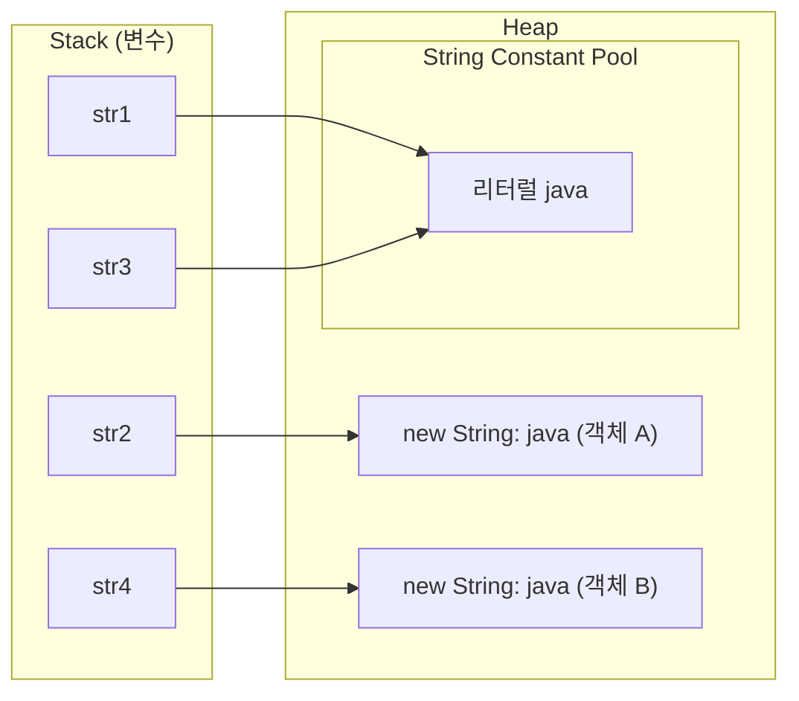
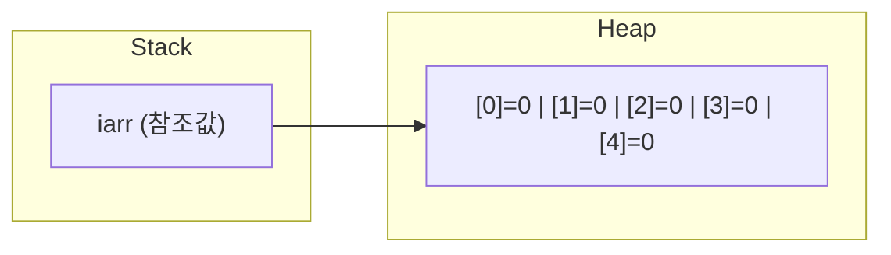
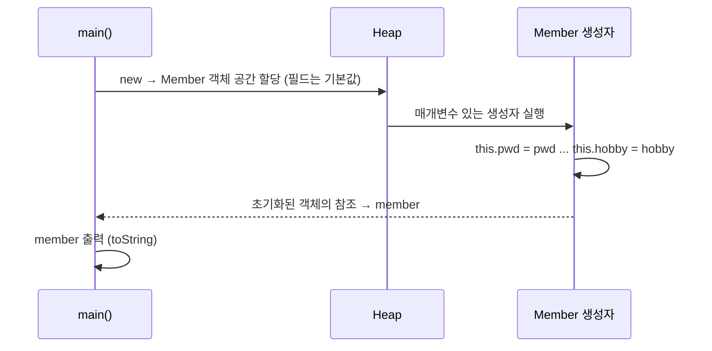

 ## 들어가며 

 
| 패키지 | 주제 |
|--------|------|
| `a_object.a_string` | String 메소드, 리터럴과 `new String()`, `==`와 `equals()` |
| `a_object.b_array` | 배열 선언·할당, heap 기본값, 점수 계산기 |
| `b_opp.a_user_type` | 사용자 정의 자료형 (Member 클래스), 필드 |
| `b_opp.b_constructor` | 기본 생성자, 매개변수 있는 생성자, `this` |

수업 코드 주석에서는 자료형을 세 가지로 나눴다.

| 분류 | 예시 | 오늘 다룬 것 |
|------|------|-------------|
| 기본 자료형 | `int`, `char`, `double` | (chap01에서 배움) |
| 참조 자료형 | `String`, `int[]` | String, 배열 |
| 사용자 정의 자료형 | 직접 만든 `Member` | Member 클래스 |

엄밀히 말하면 사용자 정의 자료형(클래스)도 참조 자료형에 속한다. 수업에서는 "Java가 제공하는 것"과 "내가 만드는 것"을 구분하려고 따로 나눴다.

## 문제 상황 (Task)

오늘 수업은 처음부터 끝까지 **"변수의 한계"**를 하나씩 넘어서는 흐름이었다.

1. 변수 하나에는 값이 **하나만** 들어간다. → 같은 타입 여러 개는? **배열**
2. 배열은 **같은 자료형만** 묶을 수 있다. → 아이디(String), 나이(int), 성별(char)처럼 다른 타입을 묶으려면? **클래스**
3. 클래스로 만든 객체의 필드를 한 줄씩 채우기 번거롭다. → 만들면서 바로 채우려면? **생성자**


## 해결 과정 (Action)

### 1. String — Java가 제공하는 참조 자료형

#### 자주 쓰는 메소드

```java
String str1 = "apple";
System.out.println("str1 길이: " + str1.length());   // 5

for (int i = 0; i < 5; i++) {
    System.out.println(str1.charAt(i));   // a, p, p, l, e 한 줄씩
}

String trimStr = "   java   ";
System.out.println("공백 제거 전: #" + trimStr + "#");         // #   java   #
System.out.println("공백 제거 후: #" + trimStr.trim() + "#");  // #java#
```

| 메소드 | 반환 | 설명 |
|--------|------|------|
| `length()` | `int` | 문자열 길이 |
| `charAt(index)` | `char` | `index` 위치의 문자 하나 |
| `trim()` | `String` | 앞뒤 공백을 제거한 **새 문자열** |

인덱스는 **0부터** 시작한다. `"apple"`에서 `a`는 0번, `e`는 4번이다. 수업 코드는 `i < 5`로 썼지만, 문자열이 바뀌어도 동작하게 하려면 `i < str1.length()`로 쓰는 게 좋다. 길이를 넘는 인덱스(`charAt(5)`)에 접근하면 `StringIndexOutOfBoundsException`이 발생한다.

`#`을 양옆에 붙여 출력한 건 공백이 눈에 보이게 하려는 장치다. 수업에서 강조한 공부법도 기억에 남는다.

> 메소드를 다 외우고 쓰는 게 아니라, **사용해 보고 → 출력해 보고 → 이해한다.**

#### 리터럴 vs new String(), 그리고 == vs equals()

문자열을 만드는 방법은 두 가지다.

```java
String str1 = "java";               // 1. 리터럴
String str2 = new String("java");   // 2. 객체 생성
String str3 = "java";
String str4 = new String("java");

System.out.println(str1 == str2);       // false
System.out.println(str1 == str3);       // true
System.out.println(str2 == str4);       // false
System.out.println(str1.equals(str2));  // true
```

네 변수 모두 내용은 `"java"`인데 `==` 결과가 다르다. `==`는 참조 자료형에서 **같은 객체(주소)인지**를 비교하기 때문이다.



- **리터럴**(`"java"`)은 String Constant Pool에 한 번만 만들어지고, 같은 리터럴은 그 객체를 **공유**한다. 그래서 `str1 == str3`은 `true`다.
- **`new`**는 만날 때마다 **항상 새 객체를 만든다.** 그래서 `str2`와 `str4`는 내용이 같아도 서로 다른 객체다.

| 비교 | 결과 | 이유 |
|------|------|------|
| `str1 == str2` | `false` | 리터럴(Pool) vs `new`로 만든 새 객체 |
| `str1 == str3` | `true` | 둘 다 Pool의 같은 리터럴을 가리킴 |
| `str2 == str4` | `false` | `new`를 두 번 → 객체 2개 |
| `str1.equals(str2)` | `true` | **내용**을 비교 |

결론: **문자열 내용을 비교할 때는 항상 `equals()`를 쓴다.**

### 2. 배열 — 같은 자료형을 하나로 묶는다

#### 변수의 한계

```java
int num1 = 1;
int num2 = 2;
int num3 = 3;
int num4 = 4;
int num5 = 5;
int sum = num1 + num2 + num3 + num4 + num5;
```

값이 5개면 변수도 5개, 100개면 100개가 필요하다. 반복문으로 더할 수도 없다. 변수 이름에는 번호를 붙여 돌릴 방법이 없기 때문이다.

#### 배열 선언과 할당

```java
int[] iarr = new int[5];   // 자료형[] 변수명 = new 자료형[크기];

System.out.println("iarr= " + iarr);                // iarr= [I@1b6d3586 (주소 정보)
System.out.println("iarr.length= " + iarr.length);  // 5
System.out.println(iarr[0]);                        // 0
```

| 구문 | 의미 |
|------|------|
| `int[] iarr` | 선언 — int 배열을 가리킬 변수 |
| `new int[5]` | 할당 — heap에 int 5칸짜리 공간 생성 |
| `iarr[0]` | 0번 인덱스의 값 |
| `iarr.length` | 배열 크기 (메소드가 아니라 필드라서 괄호가 없다) |

`iarr`를 그대로 출력하면 값이 아니라 `[I@...` 같은 문자열이 나온다. 배열 변수에는 값이 아니라 **heap에 있는 배열의 위치(참조)**가 들어 있기 때문이다.



#### 값을 넣지 않았는데 0이 나오는 이유

배열은 heap 영역에 만들어진다. heap에는 빈 값이 있을 수 없어서, 값을 넣지 않아도 JVM이 **기본값**으로 채운다.

| 자료형 | 기본값 |
|--------|--------|
| 정수 (`int`, `long` 등) | `0` |
| 실수 (`double`, `float`) | `0.0` |
| 논리 (`boolean`) | `false` |
| 문자 (`char`) | `'\u0000'` (빈 문자) |
| 참조 (`String`, 배열, 객체) | `null` |

메소드 안에서 선언한 **지역 변수**는 이렇게 자동 초기화되지 않는다. 초기화하지 않고 쓰면 컴파일 에러가 난다. 기본값은 heap에 만들어지는 배열 요소와 객체의 필드에만 해당한다.

#### 배열 + 반복문 = 점수 계산기

배열의 진짜 장점은 **인덱스가 0부터 1씩 증가한다**는 점이다. 그래서 반복문의 `i`와 딱 맞물린다.

```java
Scanner sc = new Scanner(System.in);
int[] scores = new int[5];

for (int i = 0; i < scores.length; i++) {
    System.out.println((i + 1) + "번째의 학생의 java 점수를 입력해주세요 : ");
    scores[i] = sc.nextInt();
}

double sum = 0;
double avg = 0.0;

for (int i = 0; i < scores.length; i++) {
    sum += scores[i];   // sum = sum + scores[i];
}

avg = sum / scores.length;

System.out.println("sum= " + sum);
System.out.println("avg= " + avg);
```

90, 85, 80, 92, 80을 입력했다고 하면 출력은 이렇다.

```text
1번째의 학생의 java 점수를 입력해주세요 : 
90
...
sum= 427.0
avg= 85.4
```

`sum`을 `double`로 선언했기 때문에 `sum / scores.length`가 실수 나눗셈이 된다. 만약 `int sum`이었다면 `427 / 5 = 85`처럼 소수점이 잘린다.

| | 변수 5개 | 배열 1개 |
|---|---------|---------|
| 선언 | 5줄 | 1줄 |
| 학생이 100명이 되면 | 변수 100개 + 덧셈식 수정 | `new int[100]`만 수정 |
| 반복문 사용 | 불가능 | `scores[i]`로 가능 |

### 3. 사용자 정의 자료형 — 다른 자료형을 하나로 묶는다

#### 배열로도 안 되는 것

회원 한 명의 정보를 변수로 관리하면 이렇다.

```java
String id = "user01";
String pwd = "pass01";
String name = "yang";
int age = 20;
char gender = '여';
String[] hobby = {"드럼", "야구보기", "코난보기"};
```

배열은 **같은 자료형**만 묶을 수 있어서 String, int, char를 한 배열에 넣을 수 없다. 수업에서 짚은 단점은 세 가지였다.

1. 변수명을 전부 따로 관리해야 한다.
2. 회원 정보를 메소드에 넘기려면 매개변수가 6개로 비대해진다.
3. 메소드는 `return`으로 **값 하나만** 돌려줄 수 있어서 회원 정보를 묶어 반환할 수 없다.

#### 클래스로 묶기

```java
public class Member {
    String id;
    String pwd;
    String name;
    int age;
    char gender;
    String[] hobby;
}
```

메소드 없이 클래스 안에 바로 선언한 변수를 **필드**라고 한다. 같은 대상을 부르는 이름이 여러 개다.

| 부르는 이름 | 관점 |
|------------|------|
| 필드 (field) | Java 문법 용어 |
| 인스턴스 변수 | 객체(인스턴스)마다 따로 생기는 변수 |
| 속성 (attribute) | 객체가 가진 특징 |
| 전역 변수 | 수업에서 쓴 표현. 메소드 안 지역 변수와 달리 클래스 전체에서 쓸 수 있다는 의미 |

```java
Member member = new Member();
System.out.println("member의 이름: " + member.name);   // null
System.out.println("member의 나이: " + member.age);    // 0

member.id = "user02";
member.hobby = new String[]{"야구시청", "배드민턴"};

System.out.println("member.id= " + member.id);         // user02
System.out.println("member.hobby = " + member.hobby);  // [Ljava.lang.String;@... (주소)
System.out.println("member = " + member);              // Member{id='user02', ...}
```

- 값을 넣지 않은 `name`, `age`가 `null`, `0`인 이유는 배열과 같다. 객체도 heap에 만들어지기 때문이다.
- `member.hobby`는 배열이라 그대로 출력하면 주소가 나온다. `Member`의 `toString()`에서는 `Arrays.toString(hobby)`를 써서 `[야구시청, 배드민턴]`처럼 내용이 보이게 했다.
- `member`를 출력하면 `toString()`이 자동으로 호출된다. 이 메소드를 재정의(`@Override`)해 두었기 때문에 필드 값이 보기 좋게 나온다. `@Override`는 10/6 상속 수업에서 자세히 배웠다.

이제 회원 정보는 `Member` 타입 변수 **하나**로 다룰 수 있다. 메소드에 넘길 때도 `member` 하나, 반환할 때도 `Member` 하나면 된다.

### 4. 생성자 — 객체를 만들면서 필드를 채운다

#### 사실 우리는 계속 생성자를 호출하고 있었다

```java
Member member = new Member();
//                  ↑ 이 부분이 "생성자" 호출
```

`Member()`는 클래스 이름과 같은 특별한 메소드, 즉 **생성자**다. `new`를 만나는 순간 가장 먼저 실행된다. 클래스에 생성자를 하나도 쓰지 않으면 컴파일러가 **기본 생성자**(`public Member() {}`)를 자동으로 넣어 준다.

#### 기본 생성자와 매개변수 있는 생성자

```java
public class Member {
    String id;
    String pwd;
    String name;
    int age;
    char gender;
    String[] hobby;

    // 기본 생성자
    public Member() {
        System.out.println("기본생성자 동작함...");
    }

    // 매개변수 있는 생성자
    public Member(String pwd, String name, int age, String id, char gender, String[] hobby) {
        System.out.println("매개변수 있는 생성자가 동작함...");
        this.pwd = pwd;
        this.name = name;
        this.age = age;
        this.id = id;
        this.gender = gender;
        this.hobby = hobby;
    }
}
```

| 구분 | 기본 생성자 | 매개변수 있는 생성자 |
|------|------------|-------------------|
| 형태 | `Member()` | `Member(String pwd, ...)` |
| 필드 초기화 | JVM 기본값 (`null`, `0`) | 전달인자로 초기화 |
| 자동 생성 | 생성자가 하나도 없으면 컴파일러가 추가 | 직접 작성해야 함 |

생성자는 반환타입을 쓰지 않는다. `void`도 쓰지 않는다. 이름은 반드시 클래스 이름과 같다.

**주의할 점**: 매개변수 있는 생성자를 하나라도 작성하면 컴파일러는 기본 생성자를 **자동으로 만들어 주지 않는다.** 그래서 `new Member()`도 계속 쓰려면 위처럼 기본 생성자를 직접 작성해야 한다.

#### this — 필드와 매개변수 구분하기

```java
this.name = name;
// 필드  ← 매개변수
```

매개변수 이름이 필드 이름과 같으면, 메소드 안에서 `name`은 매개변수를 가리킨다. `this`는 **지금 만들어지고 있는 객체 자신**을 가리키므로, `this.name`은 필드가 된다. `this` 없이 `name = name;`이라고 쓰면 매개변수에 자기 자신을 대입하는 셈이라 필드는 `null` 그대로 남는다.

#### 생성자 호출 흐름

```java
System.out.println("main() 시작됨...");

Member member = new Member("user01", "yang", 20,
        "pass01", '여', new String[]{"탁구", "야구"});

System.out.println("member= " + member);
System.out.println("main() 종료됨...");
```



#### 실행해 보면: id와 pwd가 뒤바뀌어 있다

```text
main() 시작됨...
매개변수 있는 생성자가 동작함...
member= Member{id='pass01', pwd='user01', name='yang', age=20, gender=여, hobby=[탁구, 야구]}
main() 종료됨...
```

`id`에 `"user01"`을 넣으려고 했는데 결과는 `id='pass01'`, `pwd='user01'`이다. 원인은 생성자의 **매개변수 순서**다.

| 순서 | 1 | 2 | 3 | 4 | 5 | 6 |
|------|---|---|---|---|---|---|
| 매개변수 | `pwd` | `name` | `age` | `id` | `gender` | `hobby` |
| 전달인자 | `"user01"` | `"yang"` | `20` | `"pass01"` | `'여'` | `{"탁구","야구"}` |

생성자는 `(pwd, name, age, id, ...)` 순서인데, 호출할 때는 `id`가 먼저 오는 순서로 생각하고 값을 넣었다. 전달인자는 이름이 아니라 **순서대로** 매개변수에 들어간다([9/30 수업]({{ site.baseurl }})). `id`와 `pwd`가 둘 다 `String`이라 **컴파일 에러도 나지 않고 값만 조용히 바뀐다.**

해결 방법은 두 가지다.

1. 호출하는 쪽에서 매개변수 순서에 맞춰 넘긴다: `new Member("pass01", "yang", 20, "user01", ...)`
2. 생성자 매개변수 순서를 필드 선언 순서(`id, pwd, name, ...`)와 맞춘다. 이쪽이 실수를 줄이기에 더 좋다.

같은 타입의 매개변수가 여러 개 연달아 있으면 이런 실수가 생기기 쉽다는 걸 출력을 보고 알게 됐다. `toString()`으로 객체를 찍어 보지 않았다면 놓쳤을 것이다.

## 결과 (Result)

오늘 배운 내용은 "여러 값을 하나로 묶는 방법"의 단계였다.

| 단계 | 묶을 수 있는 것 | 한계 | 다음 단계 |
|------|---------------|------|----------|
| 변수 | 값 1개 | 값이 늘면 변수도 늘어남 | 배열 |
| 배열 | 같은 자료형 여러 개 | 다른 자료형은 못 묶음 | 클래스 |
| 클래스 (필드) | 서로 다른 자료형 여러 개 | 필드를 한 줄씩 채워야 함 | 생성자 |
| 생성자 | 생성과 동시에 초기화 | 매개변수 순서 실수 주의 | (10/2 캡슐화로 이어짐) |

**배운 점**

- 참조 자료형 변수에는 값이 아니라 **객체의 위치**가 들어 있다. 그래서 `==`는 주소 비교가 되고, 배열과 객체를 그냥 출력하면 주소 같은 문자열이 나온다.
- 같은 타입의 전달인자는 순서가 바뀌어도 컴파일러가 잡아 주지 않는다. **출력해서 확인하는 습관**이 필요하다.

## 더 학습하면 좋은 개념

- **JVM 메모리 구조 (Stack / Heap / Method Area)** — 오늘 나온 "heap 기본값", "참조값", "String Pool"이 모두 이 구조 위에서 동작한다. 그림으로 한 번 정리해 두면 이후 객체지향 수업이 훨씬 쉬워진다.
- **String의 불변성(Immutable)과 StringBuilder** — `trim()`이 원본을 바꾸지 않고 새 문자열을 반환하는 이유다. 반복문에서 문자열을 계속 이어 붙이면 왜 느린지도 여기서 설명된다.
- **향상된 for문 (for-each)** — `for (int score : scores)`처럼 인덱스 없이 배열을 순회하는 문법이다. 합계 계산처럼 인덱스가 필요 없을 때 더 간결하다.
- **`this()` 생성자 체이닝** — 생성자 안에서 다른 생성자를 호출해 중복 초기화 코드를 줄이는 방법이다. 생성자가 여러 개일 때 필요하다.
- **빌더 패턴 (Builder Pattern)** — 오늘 겪은 "같은 타입 매개변수 순서 실수"를 막으려고 쓰는 패턴이다. `Member.builder().id("user01").pwd("pass01").build()`처럼 이름을 붙여 값을 넣는다.

## 참고 자료

- [Java SE 21 API - String](https://docs.oracle.com/en/java/javase/21/docs/api/java.base/java/lang/String.html)
- [Oracle Java Tutorials - Comparing Strings and Portions of Strings](https://docs.oracle.com/javase/tutorial/java/data/comparestrings.html)
- [JLS 3.10.5 - String Literals](https://docs.oracle.com/javase/specs/jls/se21/html/jls-3.html#jls-3.10.5)
- [Oracle Java Tutorials - Arrays](https://docs.oracle.com/javase/tutorial/java/nutsandbolts/arrays.html)
- [Oracle Java Tutorials - Primitive Data Types (Default Values)](https://docs.oracle.com/javase/tutorial/java/nutsandbolts/datatypes.html)
- [Oracle Java Tutorials - Declaring Classes](https://docs.oracle.com/javase/tutorial/java/javaOO/classdecl.html)
- [Oracle Java Tutorials - Providing Constructors for Your Classes](https://docs.oracle.com/javase/tutorial/java/javaOO/constructors.html)
- [Oracle Java Tutorials - Using the this Keyword](https://docs.oracle.com/javase/tutorial/java/javaOO/thiskey.html)
