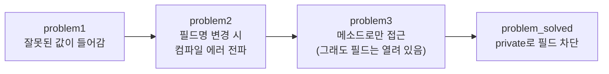
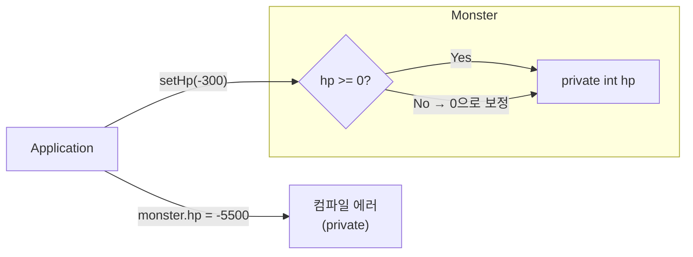
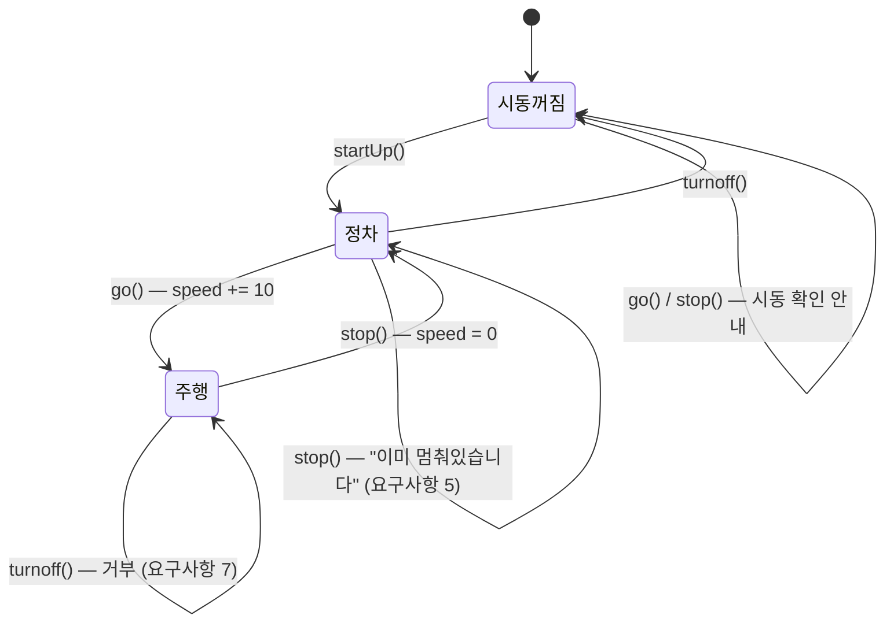
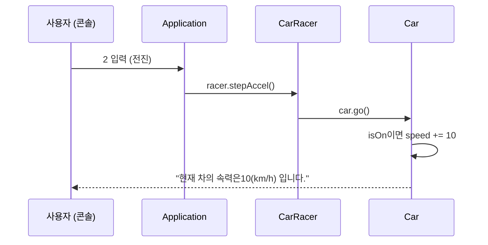

## 들어가며 (Situation)

[어제(10/1) 수업]({{ site.baseurl }})에서는 서로 다른 자료형을 `Member` 클래스 하나로 묶었다. 그리고 `member.id = "user02"`처럼 **필드에 직접 값을 넣었다.**

오늘은 그 방식에 어떤 문제가 있는지 보고, 객체지향의 두 가지 원칙으로 해결했다.

| 패키지 | 주제 |
|--------|------|
| `b_opp.c_encapsulation` problem1 ~ problem3 | 캡슐화를 적용하기 전에 생기는 문제 3가지 |
| `b_opp.c_encapsulation.problem_solved` | `private`로 필드를 숨겨 최종 해결 |
| `b_opp.d_abstraction.run` | 카레이서 프로그램으로 보는 추상화 (Car, CarRacer) |

## 문제 상황 (Task)

필드에 직접 접근하는 코드는 간단하지만, 프로그램이 커지면 두 가지 문제가 생긴다.

1. **잘못된 값을 막을 수 없다.** 몬스터의 체력에 `-200`을 넣어도 그대로 들어간다.
2. **필드를 바꾸면 쓰는 쪽이 전부 깨진다.** 필드 이름 하나만 바꿔도 그 필드를 쓰는 모든 곳에서 컴파일 에러가 난다.

또 현실 세계를 프로그램으로 옮길 때 **무엇을 클래스로 만들고, 어떤 기능을 넣을지** 정하는 기준이 필요하다. 이것이 추상화다.

## 해결 과정 (Action)

### 1. 캡슐화 — Monster 예제로 단계별 확인

수업은 Monster 클래스를 4단계로 바꿔 가며 진행됐다.



#### problem1 — 검증되지 않은 값이 들어간다

```java
public class Monster {
    String name;
    int hp;

    public void setHp(int hp) {
        if (hp >= 0) {
            System.out.println("정상 값입니다. 몬스터의 체력을 " + hp + "로 설정합니다.");
            this.hp = hp;
        } else {
            System.out.println("삐빅... 오류발생잘못된 값이 탐지되어 hp 를 0으로 강제합니다.");
            this.hp = 0;
        }
    }
}
```

```java
Monster monster2 = new Monster();
monster2.name = "피카츄";
monster2.hp = -200;          // 필드에 직접 대입 → 그대로 들어감

Monster monster3 = new Monster();
monster3.name = "갸라도스";
monster3.setHp(-300);        // 메소드로 대입 → 검증 후 0으로 보정
```

```text
monster2.hp = -200
삐빅... 오류발생잘못된 값이 탐지되어 hp 를 0으로 강제합니다.
monster3.hp = 0
```

체력이 음수인 몬스터는 말이 안 된다. `setHp()`는 음수를 걸러 내지만, **필드에 직접 대입하면 이 검증을 그냥 지나친다.** 검증 로직을 만들어 놔도 쓰는 사람이 우회할 수 있으면 소용이 없다.

`setHp(int hp)` 안의 `this.hp = hp;`는 [어제 생성자에서 본 것]({{ site.baseurl }})과 같다. 매개변수 `hp`와 필드 `hp`의 이름이 같으면 지역 변수(매개변수)가 우선이므로, 필드에는 `this.`를 붙여야 한다.

#### problem2 — 필드 이름을 바꾸면 쓰는 곳이 전부 깨진다

요구사항이 바뀌어 `name` 필드를 `kinds`로 바꿨다고 해 보자.

```java
public class Monster {
    // String name;
    String kinds;   // 요구사항 변경: name → kinds
    int hp;
    ...
}
```

이 순간 `monster1.name = "성원몬";`처럼 `name`을 직접 쓰던 코드가 **모두 컴파일 에러**가 난다. 지금은 `Application` 하나지만, `Monster`를 쓰는 클래스가 100개라면 100곳을 고쳐야 한다. 클래스 **내부 구현**(필드 이름)이 바깥 코드와 직접 엮여 있기 때문이다.

#### problem3 — 메소드로만 접근하게 바꾼다

필드에 직접 접근하는 대신, 값을 넣고 꺼내는 메소드를 만든다.

```java
public class Monster {
    String kinds;
    int hp;

    public void setHp(int hp) { ... }   // 검증 포함

    public void setName(String name) {
        this.kinds = name;              // 필드명이 kinds여도 메소드 이름은 그대로
    }

    public String getInfo() {
        return " 몬스터의 이름은" + this.kinds + "이고," +
               "체력은" + this.hp + " 입니다!";
    }
}
```

```java
Monster monster3 = new Monster();
monster3.setName("갸라도스");
monster3.setHp(-300);
System.out.println("resulat3= " + monster3.getInfo());
```

```text
삐빅... 오류발생잘못된 값이 탐지되어 hp 를 0으로 강제합니다.
resulat3=  몬스터의 이름은갸라도스이고,체력은0 입니다!
```

이제 `Application`은 `setName()`, `setHp()`, `getInfo()`만 안다. 필드 이름이 `name`이든 `kinds`든 **메소드 이름만 그대로면 바깥 코드는 영향을 받지 않는다.** 문제 1(검증 우회)과 문제 2(변경 전파)가 함께 해결됐다.

하지만 아직 끝이 아니다. 필드가 여전히 열려 있어서 누군가 이렇게 쓸 수 있다.

```java
monster3.hp = -5500;   // 여전히 가능 → 검증 우회
```

메소드를 만들어 둔 것은 **"이걸 써 주세요"라는 부탁**일 뿐, 강제가 아니다.

#### problem_solved — private로 필드를 막는다

```java
public class Monster {
    private String kinds;
    private int hp;

    public void setHp(int hp) { ... }
    public void setName(String name) { this.kinds = name; }
    public String getInfo() { ... }
}
```

```java
// monster3.hp = -5500;   // 컴파일 에러: hp has private access in Monster
System.out.println(monster3.getInfo());
```

필드를 `private`으로 선언하면 **클래스 밖에서는 접근 자체가 컴파일 에러**가 된다. 이제 `hp`를 바꾸는 유일한 길은 `setHp()`이고, 그 안의 검증을 반드시 거친다.



| 단계 | 필드 접근제어자 | 접근 방법 | 잘못된 값 | 필드명 변경 시 |
|------|---------------|----------|----------|---------------|
| problem1 | (default) | 필드 직접 + `setHp()` | 직접 대입하면 들어감 | — |
| problem2 | (default) | 필드 직접 | 들어감 | 쓰는 곳 전부 컴파일 에러 |
| problem3 | (default) | 메소드 (권장일 뿐) | 직접 대입하면 여전히 들어감 | 바깥 코드 영향 없음 |
| **problem_solved** | **`private`** | **메소드만 가능** | **항상 검증됨** | **바깥 코드 영향 없음** |

**캡슐화란** 필드(데이터)와 그 데이터를 다루는 메소드(기능)를 하나로 묶고, **필드는 `private`으로 숨긴 뒤 `public` 메소드로만 접근하게 하는 것**이다.

> 수업 코드에서 problem2, problem3, problem_solved의 `Application`은 본문이 주석 처리되어 있고, 같은 패키지의 Monster가 아니라 `problem1.Monster`를 import하고 있다. 그래서 위 단계별 결과는 각 패키지의 `Monster.java` 기준으로 정리했다. 직접 실행해 보려면 import를 해당 패키지의 Monster로 바꾸고 주석을 풀어야 한다.

### 2. 추상화 — 카레이서 프로그램

#### 추상화란

> 공통된 부분을 추출하고, 공통되지 않은 부분은 제거하는 것.
> 복잡한 현실 세계를 **프로그램의 목적에 맞게 단순화**하는 것.

현실의 자동차에는 색상, 연비, 타이어 마모도, 에어컨… 수많은 속성이 있다. 하지만 "카레이서가 운전하는 프로그램"에 필요한 건 **속력**과 **시동 여부**뿐이다. 필요한 것만 남기고 나머지는 버리는 것이 추상화다.

#### 1단계: 요구사항 작성

```text
주제 : 카레이서가 자동차를 운전하는 프로그램
1. 자동차는 처음에 멈춘 상태로 대기한다.
2. 카레이서는 먼저 자동차에 시동을 건다. 이미 걸려있다면, 다시 시동을 걸 수 없다.
3. 카레이서가 엑셀을 밟으면 시동이 걸려있다면 시속이 10km/h 증가하며 앞으로 나간다.
4. 자동차가 달리고 있는 중이면 브레이크를 밟을 시 시속이 0으로 떨어지며 멈춘다.
5. 브레이크를 밟을 때 자동차가 달리는 중이 아니라면 이미 멈춰있는 상태라고 안내한다.
6. 카레이서가 시동을 끄면, 더 이상 자동차는 움직이지 않는다.
7. 자동차가 달리는 중이라면 시동을 끌 수 없다.
```

#### 2단계: 클래스와 메시지 뽑기

수업에서 알려준 요령이 실용적이었다.

> **"은/는", "이/가" 앞의 단어**가 대부분 클래스 후보다.

요구사항에서 "카레이서**는**", "자동차**는**"이 반복된다. 그래서 필요한 객체는 **CarRacer**와 **Car**다. 각 객체가 받을 수 있는 **메시지**(= 해야 할 일)가 메소드가 된다.

| 메시지 | CarRacer 메소드 | Car 메소드 |
|--------|----------------|-----------|
| 시동을 걸어라 | `stratUp()` | `startUp()` |
| 엑셀을 밟아라 / 앞으로 가라 | `stepAccel()` | `go()` |
| 브레이크를 밟아라 / 멈춰라 | `stepBreak()` | `stop()` |
| 시동을 꺼라 | `turnoff()` | `turnoff()` |

(수업 코드의 메소드 이름을 그대로 옮겼다. `stratUp`은 `startUp`, `stepBreak`의 Break는 브레이크(brake)를 의도한 이름이다.)

#### 3단계: Car — 상태와 규칙을 가진 객체

변하는 값(**상태**)은 필드로, 요구사항의 규칙은 메소드 안 조건문으로 옮긴다.

```java
public class Car {
    private int speed;      // 속력
    private boolean isOn;   // 시동 여부

    public void startUp() {
        if (isOn) {
            System.out.println("시동이 이미 걸려있습니다!!!");
        } else {
            this.isOn = true;
            System.out.println("시동걸기완료!! 출발준비 OK🚗");
        }
    }

    public void go() {
        if (isOn) {
            System.out.println("차가 출발합니다~~~~");
            this.speed += 10;
            System.out.println("현재 차의 속력은" + this.speed + "(km/h) 입니다.");
        } else {
            System.out.println("차에 시동이 걸려있지 않습니다. 시동 확인해주세요!!");
        }
    }

    public void stop() {
        if (isOn) {
            if (speed > 0) {
                this.speed = 0;
                System.out.println("끼~~~~~~~~~읶~~~~~~~~~~ 브레이크 밟기 OK. 차는 멈췄습니다.");
            } else {
                System.out.println("차는 이미 멈춰있습니다!!!");
            }
        } else {
            System.out.println("차에 시동이 걸려있지 않습니다!시동부터 확인해주세요!");
        }
    }

    public void turnoff() {
        if (isOn) {
            if (speed > 0) {
                System.out.println("달리는 상태에서는 시동을 끌 수 없습니다. 차를 먼저 멈춰주세요");
            } else {
                this.isOn = false;
                System.out.println(" 시동이 꺼집니다.  다시 운행하고 싶으면 시동을 켜주세요!!");
            }
        } else {
            System.out.println("이미 시동이 꺼져있습니다!");
        }
    }
}
```

`speed`와 `isOn`이 `private`이라서 바깥에서 `car.speed = 200`처럼 상태를 마음대로 바꿀 수 없다. 상태는 **규칙을 지키는 메소드를 통해서만** 바뀐다. 추상화로 설계한 클래스에 캡슐화가 함께 적용된 것이다.

`Car`의 상태 변화를 그리면 요구사항 7개가 한눈에 보인다.



| 요구사항 | 구현 위치 |
|---------|----------|
| 1. 처음엔 멈춘 상태 | 필드 기본값 `speed = 0`, `isOn = false` |
| 2. 이미 시동이 걸렸으면 다시 못 건다 | `startUp()`의 `if (isOn)` |
| 3. 시동이 걸려 있으면 10km/h씩 증가 | `go()`의 `speed += 10` |
| 4. 달리는 중 브레이크 → 0으로 | `stop()`의 `speed = 0` |
| 5. 안 달리는 중 브레이크 → 안내 | `stop()`의 `else` |
| 6. 시동을 끄면 안 움직인다 | `go()`의 `if (isOn)` |
| 7. 달리는 중엔 시동을 못 끈다 | `turnoff()`의 `if (speed > 0)` |

요구사항 1은 [어제 배운 heap 기본값]({{ site.baseurl }}) 덕분에 코드를 따로 쓰지 않아도 지켜진다.

#### 4단계: CarRacer — Car를 대신 조작하는 객체

```java
public class CarRacer {
    // 클래스도 자료형이므로 필드로 선언할 수 있다.
    // Car는 CarRacer만 접근해야 한다.
    private Car car = new Car();

    public void stratUp()   { car.startUp(); }
    public void stepAccel() { car.go(); }
    public void stepBreak() { car.stop(); }
    public void turnoff()   { car.turnoff(); }
}
```

`CarRacer`는 `Car`를 필드로 **가지고 있다(has-a).** 그리고 `car`가 `private`이라서 `Application`은 `Car`에 직접 접근할 수 없다. 현실에서도 관객이 차를 직접 몰지 않고 카레이서에게 시키는 것과 같다.



#### 5단계: Application — 메뉴 반복

```java
Scanner sc = new Scanner(System.in);
CarRacer racer = new CarRacer();

while (true) {
    System.out.println("======카레이싱 프로그램======");
    System.out.println("1. 시동걸기");
    System.out.println("2. 전진!");
    System.out.println("3. 정지");
    System.out.println("4. 시동끄기");
    System.out.println("9. 프로그램 종료");
    System.out.print("메뉴를 선택해주세요 : ");
    int no = sc.nextInt();

    switch (no) {
        case 1: racer.stratUp(); break;
        case 2: racer.stepAccel(); break;
        case 3: racer.stepBreak(); break;
        case 4: racer.turnoff(); break;
        case 9: break;
        default:
            System.out.println("잘못된 번호 입력");
            break;
    }

    if (no == 9) {
        System.out.println("프로그램을 종료합니다...");
        break;
    }
}
```

`case 9`에서 `break`를 해도 프로그램이 끝나지 않는 이유가 있다. **`switch` 안의 `break`는 `switch`만 빠져나가기 때문이다.** 그래서 `while`을 끝내려면 `switch` 밖에서 `if (no == 9) break;`를 한 번 더 써야 한다.

실행 예시는 다음과 같다(1 → 2 → 2 → 4 → 3 → 4 → 9 입력).

```text
시동걸기완료!! 출발준비 OK🚗
차가 출발합니다~~~~
현재 차의 속력은10(km/h) 입니다.
차가 출발합니다~~~~
현재 차의 속력은20(km/h) 입니다.
달리는 상태에서는 시동을 끌 수 없습니다. 차를 먼저 멈춰주세요
끼~~~~~~~~~읶~~~~~~~~~~ 브레이크 밟기 OK. 차는 멈췄습니다.
 시동이 꺼집니다.  다시 운행하고 싶으면 시동을 켜주세요!!
프로그램을 종료합니다...
```

(메뉴 출력은 생략했다.)

## 결과 (Result)

| 원칙 | 한 줄 정의 | 오늘의 예제 | 얻은 것 |
|------|-----------|------------|--------|
| 캡슐화 | 필드는 `private`으로 숨기고 메소드로만 접근 | Monster의 `hp` | 잘못된 값 차단, 필드 변경이 바깥에 전파되지 않음 |
| 추상화 | 목적에 필요한 것만 남겨 단순화 | Car의 `speed`, `isOn` | 요구사항 → 클래스·필드·메소드로 옮기는 기준 |

Monster 예제의 Before/After를 비교하면 이렇다.

| | Before (problem1) | After (problem_solved) |
|---|------------------|----------------------|
| `monster.hp = -200` | 그대로 들어감 | 컴파일 에러 |
| `setHp(-300)` | 0으로 보정 | 0으로 보정 |
| 필드명 `name` → `kinds` 변경 | 사용하는 곳 전부 수정 | `Monster` 내부만 수정 |

**배운 점**

- 검증 메소드를 만드는 것만으로는 부족하다. `private`으로 **우회로를 막아야** 검증이 의미가 있다.
- 클래스 설계는 코드보다 **요구사항 문장**에서 시작한다. "은/는, 이/가" 앞의 명사가 클래스, 그 객체가 해야 할 일이 메소드가 된다.

## 더 학습하면 좋은 개념

- **getter / setter 관례와 JavaBeans** — 오늘의 `setHp()`, `getInfo()`를 정식 관례(`getHp()`, `setHp()`)로 정리한 것이다. IDE의 자동 생성 기능과 많은 라이브러리가 이 이름 규칙을 전제로 동작한다.
- **"setter를 무조건 만들지 말라"는 관점** — 모든 필드에 setter를 열면 사실상 `public` 필드와 다르지 않다. `go()`, `stop()`처럼 **의미 있는 행동 메소드**로 상태를 바꾸는 설계가 캡슐화의 본래 의도에 더 가깝다.
- **추상 클래스와 인터페이스** — 오늘 배운 "개념으로서의 추상화"를 Java 문법으로 표현하는 방법이다. 10/6 수업의 인터페이스로 이어진다.
- **컴포지션 (has-a) vs 상속 (is-a)** — `CarRacer`가 `Car`를 필드로 가진 것이 컴포지션이다. 10/6에 배운 상속(`CapsCar extends Car`)과 비교해 보면 언제 무엇을 쓸지 감이 잡힌다.
- **break 레이블** — `switch` 안에서 바깥 `while`을 한 번에 빠져나오는 방법이다. 오늘 `if (no == 9) break;`를 따로 쓴 이유와 연결된다.

## 참고 자료

- [Oracle Java Tutorials - What Is an Object? (Data Encapsulation)](https://docs.oracle.com/javase/tutorial/java/concepts/object.html)
- [Oracle Java Tutorials - Controlling Access to Members of a Class](https://docs.oracle.com/javase/tutorial/java/javaOO/accesscontrol.html)
- [Oracle Java Tutorials - Using the this Keyword](https://docs.oracle.com/javase/tutorial/java/javaOO/thiskey.html)
- [Oracle Java Tutorials - Abstract Methods and Classes](https://docs.oracle.com/javase/tutorial/java/IandI/abstract.html)
- [Oracle Java Tutorials - Branching Statements (break)](https://docs.oracle.com/javase/tutorial/java/nutsandbolts/branch.html)
- [Oracle Java Tutorials - The switch Statement](https://docs.oracle.com/javase/tutorial/java/nutsandbolts/switch.html)
