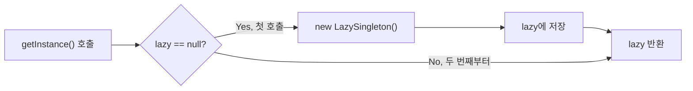
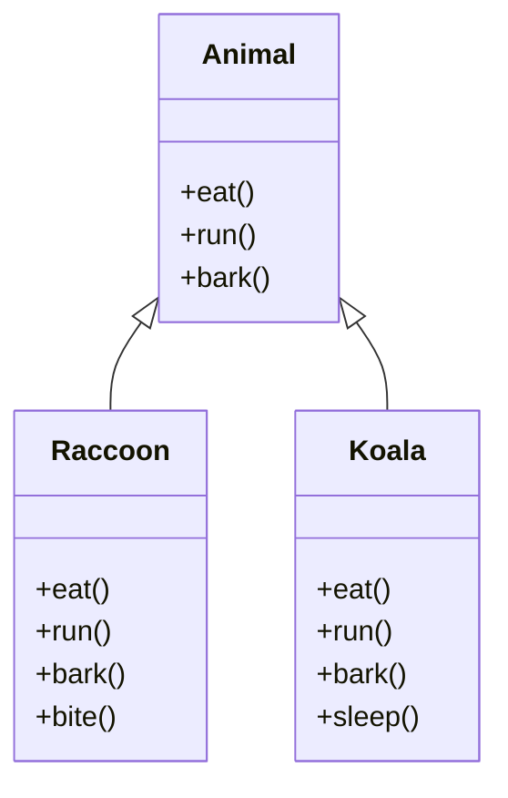
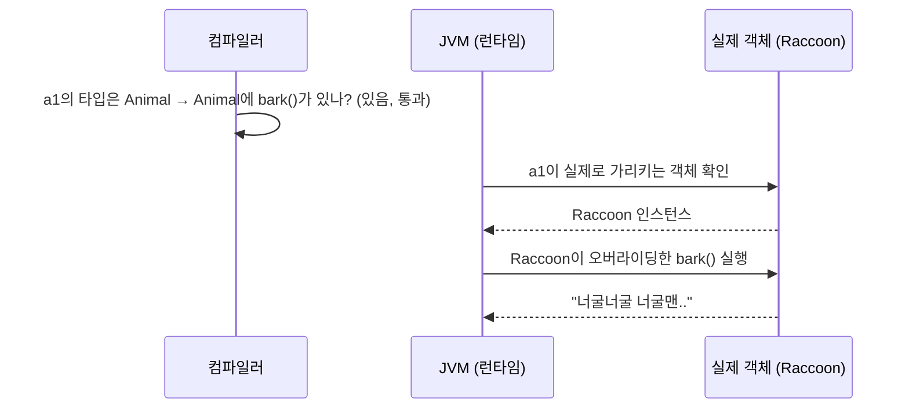
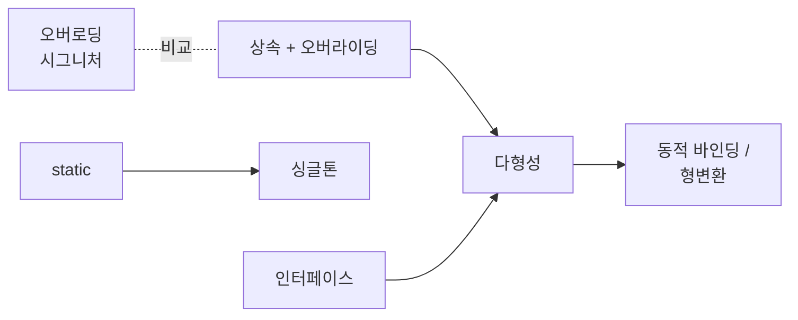

## 들어가며

| 패키지 | 주제 |
|--------|------|
| `b_opp.e_overloading` | 메소드 오버로딩, 메소드 시그니처 |
| `b_opp.f_keyword.a_static` | `static` 키워드 |
| `b_opp.f_keyword.b_singleton` | 싱글톤 패턴 (Eager / Lazy) |
| `b_opp.f_keyword.c_final` | `final` 키워드 |
| `c_inheritance` | 상속(`extends`), 오버라이딩 |
| `d_polymorphism` | 다형성, 동적 바인딩, 형변환, 인터페이스 |


## 해결 과정 (Action)

### 1. 오버로딩 — 메소드는 "시그니처"로 구분된다

오버로딩(Overloading)은 **같은 이름의 메소드를 매개변수만 다르게 여러 개 정의하는 것**이다. 기준이 되는 것은 메소드 시그니처, 즉 `메소드명 + 매개변수 목록(타입·개수·순서)`이다.

```java
public void test() {}
public void test(int num) {}               // 매개변수 유무 → 성립
public void test(int num, String str) {}   // 매개변수 개수 → 성립
public void test(String str, int num) {}   // 매개변수 순서 → 성립

// public void test(int num2) {}  // 매개변수 "이름"만 다름 → 에러
// private void test() {}         // 접근제한자만 다름 → 에러
// private int test() { return 0; } // 반환타입만 다름 → 에러
```

| 변경한 것 | 오버로딩 성립? | 이유 |
|-----------|---------------|------|
| 매개변수 타입 / 개수 / 순서 | O | 시그니처가 달라짐 |
| 매개변수 이름 | X | 시그니처에 포함되지 않음 |
| 접근제한자 | X | 시그니처에 포함되지 않음 |
| 반환 타입 | X | 시그니처에 포함되지 않음 |

Java 언어 명세(JLS)도 메소드 시그니처를 "이름과 매개변수 타입"으로 정의한다. 반환 타입이 빠져 있다는 점이 핵심이다.

### 2. static — 객체가 아니라 클래스에 붙는다

`static`이 붙은 필드는 **인스턴스마다 따로 생기지 않고, 클래스에 딱 하나만 존재**한다. 그래서 모든 인스턴스가 같은 값을 공유한다.

```java
public class StaticFieldTest {
    private int nonStaticInt;          // 인스턴스마다 따로
    private static int staticInt;      // 클래스에 하나

    public void increaseNonStatic() { this.nonStaticInt++; }
    public void increaseStatic() { StaticFieldTest.staticInt++; } // this 대신 클래스명
}
```

```java
StaticFieldTest st1 = new StaticFieldTest();
st1.increaseNonStatic();
st1.increaseStatic();

StaticFieldTest st2 = new StaticFieldTest();
st2.getNonStaticInt();            // 0 → st2는 새 인스턴스라 처음부터
StaticFieldTest.getStaticInt();   // 1 → st1이 올린 값이 그대로 남아 있음
```

| 구분 | non-static (인스턴스 변수) | static (클래스 변수) |
|------|---------------------------|---------------------|
| 개수 | 인스턴스마다 1개 | 클래스당 1개 |
| 초기화 시점 | `new`로 객체를 만들 때 | 클래스가 처음 로드·초기화될 때 |
| 접근 방법 | `참조변수.필드`, `this.필드` | `클래스명.필드` |
| st2에서 본 값 | 0 | 1 |

수업에서는 "어플리케이션 시작 시점에 초기화된다"고 배웠다. 좀 더 정확히 말하면 **해당 클래스가 처음 사용될 때** 초기화된다(JLS 12.4). 객체 생명주기와 다르다는 점이 핵심이다.

### 3. 싱글톤 — static으로 인스턴스를 하나만 만들기

static의 "클래스에 하나만 존재한다"는 성질을 이용한 디자인 패턴이 싱글톤이다. 수업에서는 **리모컨**에 비유했다. 집에 리모컨이 하나면 모두가 그걸 같이 쓰는 것처럼, 인스턴스를 하나만 만들어 공유한다.

핵심 장치는 세 가지다.

1. 생성자를 `private`으로 막아 외부에서 `new`를 못 하게 한다.
2. 자기 자신의 인스턴스를 `private static` 필드로 가진다.
3. `public static getInstance()`로만 꺼내 쓰게 한다.

```java
// 이른 초기화 (Eager) — 클래스가 초기화될 때 바로 생성
public class EagerSingleton {
    private static EagerSingleton eager = new EagerSingleton();
    private EagerSingleton() {}
    public static EagerSingleton getInstance() { return eager; }
}

// 게으른 초기화 (Lazy) — 처음 요청할 때 생성
public class LazySingleton {
    private static LazySingleton lazy;
    private LazySingleton() {}
    public static LazySingleton getInstance() {
        if (lazy == null) {
            lazy = new LazySingleton();
        }
        return lazy;
    }
}
```



`getInstance()`로 두 번 꺼낸 객체의 `hashCode()`를 찍어 보면 Eager, Lazy 모두 **두 값이 같다**. 같은 인스턴스라는 뜻이다.

| 구분 | Eager (이른 초기화) | Lazy (게으른 초기화) |
|------|--------------------|---------------------|
| 생성 시점 | 클래스 초기화 시 | `getInstance()` 첫 호출 시 |
| 장점 | 구현이 단순, 멀티스레드에서도 안전 | 안 쓰면 아예 만들지 않음 |
| 단점 | 안 써도 메모리를 차지 | 위 코드는 멀티스레드 환경에서 2개가 생길 수 있음 |

### 4. final — 한 번 정하면 못 바꾼다

`final` 필드는 **최초 초기화 이후 값을 다시 대입할 수 없다.** 그래서 초기화 방법이 딱 두 가지로 정해진다.

```java
public class FinalFieldTest {
    // private final int NON_STATIC_NUM;   // 초기화 안 하면 컴파일 에러

    private final int NON_STATIC_NUM = 1;  // 1) 선언과 동시에 초기화
    private final int NON_STATIC_NUM2;     // 2) 생성자에서 반드시 초기화

    public FinalFieldTest(int num) {
        this.NON_STATIC_NUM2 = num;
    }

    // public void setNON_STATIC_NUM(int num) {
    //     this.NON_STATIC_NUM = num;      // 재대입 → 컴파일 에러
    // }
}
```

`final` 변수 이름은 상수라는 걸 바로 알아보도록 `대문자 + _` 형식으로 쓴다. 그래서 final 필드에는 setter를 만들 수 없다.

### 5. 상속과 오버라이딩 — 다형성의 재료

여기서부터가 다형성의 재료다. `CapsCar extends Car`는 **"경찰차는 차다(IS-A)"** 관계를 코드로 표현한 것이다. 자식은 부모의 필드와 메소드를 물려받고, 다르게 동작해야 하는 메소드만 **오버라이딩(재정의)**한다.

```java
public class CapsCar extends Car {
    @Override
    public void run() {
        System.out.println("경찰차는 삐용삐용~~ 하면서 달립니다!!🚨🚨🚨");
    }

    @Override
    public void soundHorn() {
        System.out.println("빠~~~~~~~~~~~용~~~~~~~~삐~~~~~~~~~~용~~~~~~~~~~🚨🚨🚨");
    }

    public void 무전하기() {   // 자식만의 고유 기능
        System.out.println("치지ㅣ지.......");
    }
}
```

`new CapsCar()`를 실행하면 생성자 출력이 이렇게 찍힌다.

```text
Car 클래스의 기본생성자 호출됨...
CapsCar 의 기본 생성자 호출됨...
```

자식 객체를 만들면 **부모 생성자가 먼저 호출된다.** 자식 생성자 첫 줄에 `super()`가 생략되어 있기 때문이다. 즉 자식 인스턴스 안에는 부모 부분이 함께 들어 있다. 이 사실이 다형성을 이해하는 열쇠가 된다.

오버로딩과 오버라이딩은 이름이 비슷해서 자주 헷갈린다.

| 구분 | 오버로딩 (Overloading) | 오버라이딩 (Overriding) |
|------|----------------------|------------------------|
| 위치 | 같은 클래스 안 | 부모 → 자식 클래스 |
| 시그니처 | 이름 같고 매개변수 **달라야** 함 | 이름·매개변수 **같아야** 함 |
| 목적 | 같은 기능을 여러 입력으로 | 물려받은 기능을 다르게 동작 |
| 결정 시점 | 컴파일 시점 | 런타임 시점 (동적 바인딩) |

### 6. 다형성 — 내 첫 정의가 틀린 이유

다시 처음 문장으로 돌아가 보자.

> ❌ 다형성은 하나의 클래스에 여러 개의 인스턴스가 있는 것

이건 **클래스와 인스턴스의 관계**를 설명한 문장이다. `new Member()`를 세 번 하면 Member 클래스의 인스턴스가 3개 생긴다. 이건 다형성이 없어도 항상 성립한다. 다형성의 "여러 형태(poly + morph)"는 **인스턴스 개수**가 아니라 **타입**에 관한 이야기다.

수업 코드의 주석은 이렇게 정의했다.

> 하나의 인스턴스가 여러 가지 타입을 가질 수 있는 것. 그렇기 때문에 하나의 타입으로 여러 타입의 인스턴스를 처리할 수 있고, 하나의 메소드 호출로 객체별로 다른 방법으로 동작하게 할 수 있다.

이 정의를 코드로 하나씩 확인했다.



#### (1) 하나의 인스턴스가 여러 타입을 가진다

`new Raccoon()`으로 만든 객체는 Raccoon이면서 동시에 Animal이다. "너구리는 동물이다"가 참이기 때문이다. 반대는 성립하지 않는다.

```java
Animal a1 = new Raccoon();      // O — 너구리는 동물이다
// Raccoon r1 = new Animal();   // X — 동물은 너구리다? (거짓) → 컴파일 에러
```

#### (2) 하나의 메소드 호출이 객체별로 다르게 동작한다 — 동적 바인딩

```java
Animal a1 = new Raccoon();
a1.bark();   // "너굴너굴 너굴맨.."  ← Animal의 bark()가 아니다!
```

변수 타입은 `Animal`인데 실행된 건 `Raccoon`의 `bark()`다. 이것이 **동적 바인딩**이다.



- **컴파일 시점**: 변수 타입(`Animal`) 기준으로 "이 메소드를 호출할 수 있나?"만 검사한다.
- **런타임 시점**: 실제 객체(`Raccoon`)가 오버라이딩한 메소드가 실행된다.

#### (3) 그래서 자식 고유 기능은 바로 못 쓴다 — 형변환

```java
// a1.bite();              // 컴파일 에러 — Animal 타입에는 bite()가 없다
((Raccoon) a1).bite();     // O — Raccoon으로 다운캐스팅 후 호출
```

컴파일러는 `a1`을 Animal로만 알기 때문에 `bite()`를 모른다. 실제 객체가 Raccoon이라는 걸 개발자가 알려주는 것이 형변환(다운캐스팅)이다.

| 코드 | 결과 | 이유 |
|------|------|------|
| `Animal a1 = new Raccoon();` | O | 자식은 부모 타입에 담을 수 있다 (업캐스팅, 자동) |
| `a1.bark();` | Raccoon의 bark() 실행 | 동적 바인딩 |
| `a1.bite();` | 컴파일 에러 | 변수 타입 Animal에 bite()가 없다 |
| `((Raccoon) a1).bite();` | O | 다운캐스팅 (명시적) |
| `Raccoon r1 = new Animal();` | 컴파일 에러 | 동물이 다 너구리는 아니다 |

#### (4) 그래서 다형성이 왜 좋은가

수업 코드에서는 객체를 하나씩 따로 만들었지만, 다형성의 진짜 장점은 **여러 타입을 하나의 타입으로 묶어 처리할 때** 드러난다. 아래는 이해를 돕기 위한 **예시 코드**다.

```java
// 예시 코드
Animal[] animals = { new Raccoon(), new Koala() };

for (Animal a : animals) {
    a.bark();   // "너굴너굴 너굴맨..", "코알코알"
}
```

호출하는 쪽 코드는 `a.bark()` 한 줄인데, 객체마다 다른 소리가 난다. 나중에 `Tiger extends Animal`이 추가돼도 이 반복문은 **한 줄도 고칠 필요가 없다.**

### 7. 인터페이스 — "할 수 있어야 하는 것(Can-Do)"을 강제

인터페이스는 구현 클래스가 **반드시 구현해야 할 메소드 목록**을 정한다. 클래스 상속이 IS-A라면 인터페이스는 Can-Do다.

```java
public interface Animal {
    void run();
    void eat();
    void bark();
}

public class Raccoon implements Animal {   // extends가 아니라 implements
    @Override
    public void run() { System.out.println(" 너구리가 폴짝폴짝 뛰어댕깁니다..."); }
    @Override
    public void eat() {}
    @Override
    public void bark() {}
}
```

```java
// Animal animal = new Animal();   // X — 인터페이스는 new로 생성 불가
Animal animal = new Raccoon();     // O — 다형성 적용
```

| 구분 | 클래스 상속 (`extends`) | 인터페이스 구현 (`implements`) |
|------|------------------------|------------------------------|
| 관계 | IS-A (~는 ~이다) | Can-Do (~를 할 수 있다) |
| `new`로 생성 | 가능 | 불가능 |
| 생성자 | 있음 | 없음 |
| 메소드 구현 | 물려받아 그대로 쓰거나 재정의 | 추상 메소드는 반드시 구현 |
| 다중 상속 | 클래스는 1개만 | 여러 개 구현 가능 |

> 수업 코드 주석에는 "인터페이스는 구현부가 있는 메소드를 못 쓴다"고 되어 있다. 일반 메소드는 맞지만, **Java 8부터는 `default` 메소드와 `static` 메소드로 구현부를 가질 수 있다.** 더 공부할 거리로 남겨둔다.

## 결과 (Result)

다형성 정의를 이렇게 고쳤다.

| | 정의 |
|---|------|
| Before | 하나의 클래스에 여러 개의 인스턴스가 있는 것 |
| After | **부모 타입(또는 인터페이스) 하나로 여러 자식 객체를 다룰 수 있고, 같은 메소드를 호출해도 실제 객체에 따라 다르게 동작하는 것** |


1. **상속(IS-A)** 덕분에 `Animal a = new Raccoon();`이 가능하다.
2. **오버라이딩** 덕분에 자식마다 같은 메소드를 다르게 구현할 수 있다.
3. **동적 바인딩** 덕분에 실행할 때 실제 객체의 메소드가 호출된다.

이 세 가지를 순서대로 말하면 다형성 설명이 된다. 오늘 배운 키워드도 하나로 연결됐다.



**배운 점**: 코드가 돌아간다고 이해한 게 아니었다. "왜 `a1.bite()`는 안 되지?"처럼 안 되는 코드를 설명할 수 있어야 개념을 이해한 것이다.

## 더 학습하면 좋은 개념

- **`instanceof`와 패턴 매칭** — 다운캐스팅 전에 실제 타입을 확인하지 않으면 `ClassCastException`이 날 수 있다. 안전한 형변환을 위해 꼭 필요하다.
- **추상 클래스 (abstract class)** — 일반 클래스 상속과 인터페이스의 중간이다. "공통 구현은 물려주되 일부는 강제"하고 싶을 때 쓴다. 인터페이스와 비교해 보면 언제 무엇을 쓸지 감이 잡힌다.
- **인터페이스의 default / static 메소드 (Java 8+)** — 수업에서 배운 "인터페이스에는 구현부가 없다"의 예외다. 최신 Java 코드를 읽으려면 알아야 한다.
- **스레드 안전한 싱글톤 (synchronized, Holder 패턴, enum 싱글톤)** — 수업의 Lazy 싱글톤은 여러 스레드가 동시에 호출하면 인스턴스가 2개 생길 수 있다. 실무에서 쓰는 방식은 따로 있다.
- **SOLID 원칙 중 OCP / LSP** — "새 동물이 추가돼도 반복문을 안 고친다"는 다형성의 장점이 바로 개방-폐쇄 원칙(OCP)이다. 리스코프 치환 원칙(LSP)은 "자식은 부모 자리에 들어가도 문제없어야 한다"는 다형성의 전제다.

## 참고 자료

- [Oracle Java Tutorials - Defining Methods (Overloading)](https://docs.oracle.com/javase/tutorial/java/javaOO/methods.html)
- [JLS 8.4.2 - Method Signature](https://docs.oracle.com/javase/specs/jls/se21/html/jls-8.html#jls-8.4.2)
- [Oracle Java Tutorials - Understanding Class Members (static)](https://docs.oracle.com/javase/tutorial/java/javaOO/classvars.html)
- [JLS 12.4 - Initialization of Classes and Interfaces](https://docs.oracle.com/javase/specs/jls/se21/html/jls-12.html#jls-12.4)
- [Oracle Java Tutorials - Writing Final Classes and Methods](https://docs.oracle.com/javase/tutorial/java/IandI/final.html)
- [Oracle Java Tutorials - Inheritance](https://docs.oracle.com/javase/tutorial/java/IandI/subclasses.html)
- [Oracle Java Tutorials - Overriding and Hiding Methods](https://docs.oracle.com/javase/tutorial/java/IandI/override.html)
- [Oracle Java Tutorials - Polymorphism](https://docs.oracle.com/javase/tutorial/java/IandI/polymorphism.html)
- [Oracle Java Tutorials - Interfaces](https://docs.oracle.com/javase/tutorial/java/IandI/createinterface.html)
- [Oracle Java Tutorials - Default Methods](https://docs.oracle.com/javase/tutorial/java/IandI/defaultmethods.html)
